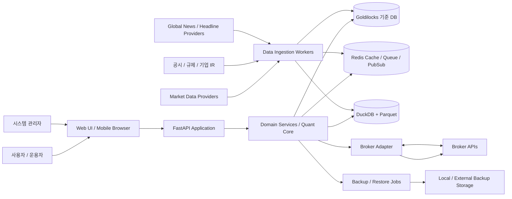
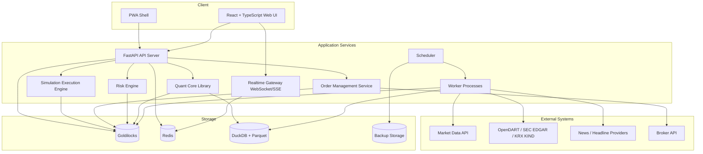

# 퀀트 기반 주식 자동매매 프로그램 전체 시스템 아키텍처 설계서

- 작성일: 2026-05-22
- 문서 버전: 0.1
- 저장 위치: `/home/jhkim5/silver_platter`
- 선행 문서: `01_quant_auto_trading_requirements_definition_20260522.md`

## 1. 문서 목적

이 문서는 퀀트 기반 주식 자동매매 프로그램의 전체 시스템 구조를 정의한다. 목표는 단순한 매매 신호 생성기가 아니라 데이터 수집, 품질 검증, 포트폴리오 회계, 리스크 통제, 백테스트, 시뮬레이션, 수동 승인, 제한적 자동주문까지 하나의 운영 흐름으로 연결되는 투자 운영 시스템이다.

이 설계서는 다음 산출물의 기준 구조로 사용한다.

- 도메인 데이터 모델 및 ERD
- Goldilocks 초기 스키마
- 데이터 수집 파이프라인
- 리스크 엔진
- 주문 상태 기계
- Web UI 화면 설계
- 백업/복구 운영 절차

## 2. 설계 원칙

1. Goldilocks를 기준 DBMS로 사용한다.
   PostgreSQL 또는 TimescaleDB 전용 기능에 의존하지 않는다.

2. 외부 provider와 broker는 adapter로 격리한다.
   데이터 제공자, 뉴스, 공시, broker API 교체가 내부 도메인 로직을 흔들지 않게 한다.

3. 자동 주문은 마지막 단계다.
   분석, 주문 후보, 리스크 체크, 수동 승인, paper trading, 소액 실거래 검증을 거친 뒤 제한적으로 허용한다.

4. 리스크 엔진은 하드 제약이다.
   모델 신호가 강해도 리스크 체크 실패 시 주문을 생성하거나 전송하지 않는다.

5. 모든 판단은 재현 가능해야 한다.
   데이터 버전, 모델 버전, 전략 버전, 리스크 규칙, 주문 승인자, 실행 결과를 감사 가능하게 기록한다.

6. 실거래, paper trading, 실시간 테스트 모드는 분리한다.
   `account_mode`와 adapter 계층으로 가상 주문이 실거래로 전송되지 않도록 한다.

7. 데이터 시간 기준을 분리한다.
   `event_ts`, `receive_ts`, `loaded_at`, `available_to_model_at`을 분리해 미래정보 누수를 막는다.

## 3. 전체 컨텍스트



## 4. 논리 계층

| 계층 | 책임 |
| --- | --- |
| Client | Web UI, 모바일 브라우저, 실시간 알림, 주문 승인, 가상 계좌 테스트 화면 |
| API | 인증, 권한, REST/WebSocket/SSE, 요청 검증, 서비스 orchestration |
| Domain Services | 포트폴리오, 회계, 리스크, 주문, 전략, 세금, 공시/뉴스 이벤트 도메인 로직 |
| Quant Core | 팩터 계산, 모델 학습/예측, 백테스트, 시나리오 테스트, 변동성/위험도 지수 |
| Adapter | market data, broker, 공시, 뉴스, 환율, macro provider 격리 |
| Worker/Scheduler | 데이터 수집, 정규화, 품질 검사, 모델 작업, 백업, reconciliation |
| Storage | Goldilocks, Redis, DuckDB/Parquet, 백업 저장소 |
| Observability | 로그, metric, trace, 운영 알림, 감사 로그 |

## 5. 컨테이너 구성



## 6. 주요 컴포넌트

### 6.1 Client

Client는 React + TypeScript 기반 Web UI를 기본으로 한다. 초기에는 같은 LAN의 모바일 브라우저 접근을 지원하고, 외부 접근은 VPN 또는 터널 방식으로 확장한다.

주요 화면:

- 포트폴리오 요약
- 보유 종목 리스크
- 종목별 매매 기록과 FIFO 손익
- 해외 주식 양도소득세 예상
- 종목별 ML 분석
- 공시 영향 예측
- 글로벌 헤드라인과 국제 정세 급변 알림
- 사업 그룹 리스크와 변동성 비교
- 주문 후보와 주문 승인
- 실시간 테스트 모드와 가상 계좌
- 데이터 품질과 운영 상태

Client는 현재 모드를 항상 표시해야 한다.

- `live`: 실거래
- `paper`: paper trading
- `simulation`: 가상 계좌 실시간 테스트

### 6.2 API Server

FastAPI 서버는 외부 Client와 내부 서비스 사이의 진입점이다.

책임:

- 인증과 세션 관리
- 권한 검사
- REST API 제공
- WebSocket/SSE 연결 관리
- 요청 validation
- domain service 호출
- 감사 로그 생성

대표 interface:

```text
get_security_master
get_historical_bars
subscribe_trades
get_headlines
subscribe_headlines
subscribe_disclosures
get_disclosure_impact_prediction
subscribe_global_risk_events
get_account
get_positions
get_tax_estimate
place_order
cancel_order
stream_order_events
create_simulation_session
reset_virtual_account
stream_simulation_events
```

### 6.3 Data Ingestion Workers

데이터 수집 worker는 provider별 adapter를 통해 데이터를 수집한다. 원본 응답을 먼저 보존하고, 정규화 후 Goldilocks 또는 Parquet로 적재한다.

수집 대상:

- 종목 마스터
- historical price bar
- 실시간 체결/호가
- 환율
- 재무제표
- 기업 이벤트
- 공시와 거래소 공지
- 글로벌 헤드라인
- 국제 정세 급변 이벤트

수집 pipeline:

```text
Provider Adapter
  -> Raw Manifest
  -> Normalizer
  -> Canonical Writer
  -> Data Quality Checker
  -> Redis Event Publish
```

### 6.4 Data Quality Service

데이터 품질 서비스는 전략, 모델, 주문 후보 생성 전에 데이터 사용 가능 여부를 판단한다.

검사 항목:

- 결측
- 중복
- 가격 0 또는 음수
- `high < low`
- 상장 전/폐지 후 데이터
- timezone 오류
- 기업 이벤트 반영 오류
- 공시 사용 가능 시각 오류
- provider 간 가격 괴리

중대한 품질 오류가 있으면 주문 후보 생성과 자동 주문을 차단한다.

### 6.5 Portfolio Accounting Service

포트폴리오 회계 서비스는 계좌, 거래 원장, 현금 원장, 보유 lot, 손익을 관리한다.

책임:

- append-only 거래 원장
- 현금 원장
- position lot 생성
- FIFO 매수 lot-매도 체결 매칭
- 실현/미실현손익 계산
- 외화 자산 원화 환산
- 증권사 잔고 대사
- 해외 주식 연간 양도소득세 예상

FIFO 매칭은 별도 `fifo_lot_match` 결과로 저장하고 원본 거래 원장은 수정하지 않는다.

### 6.6 Risk Engine

리스크 엔진은 모든 주문 후보와 주문 전송 전에 호출되는 hard gate다.

검사 항목:

- 단일 종목 투자금액 100,000원 이상 1,000,000,000원 이하
- 종목/사업 그룹/섹터/국가/통화 한도
- 현금과 증거금
- 유동성
- 저유동성 종목 3배 슬리피지
- 포트폴리오 VaR/CVaR
- 변동성/위험도 지수
- 공시/헤드라인/국제 정세 이벤트 리스크
- 중복 주문
- broker/API 장애

리스크 엔진 결과는 `risk_check_result`에 저장하고 주문 후보와 주문 로그에 연결한다.

### 6.7 Quant Core

Quant Core는 API 서버와 분리된 계산 모듈로 둔다. API 서버는 계산을 직접 구현하지 않고 Quant Core를 호출한다.

주요 기능:

- 팩터 계산
- 종목별 ML 분석
- 가격/거래량/변동성/위험도 예측
- 종목별 변동성 지수와 위험도 지수
- 사업 그룹 변동성 비교
- 공시 이벤트 영향 분석
- 주문창 기간별 예상 주가 범위
- 백테스트
- 시나리오 테스트

대량 분석은 Goldilocks에 직접 부하를 주지 않고 DuckDB + Parquet를 우선 사용한다.

### 6.8 Disclosure Impact Service

공시 영향 서비스는 공식 공시와 이후 가격 반응을 연결해 신규 공시의 영향을 예측한다.

흐름:

```text
공시 수집
  -> 공시 유형 분류
  -> 공시 전후 가격/거래량/변동성 window 계산
  -> 유사 과거 공시 검색
  -> 영향 모델 예측
  -> 주가 범위 / 영향 기간 / 신뢰도 생성
  -> Client 알림 / 주문창 경고 / 리스크 대시보드 반영
```

이 서비스는 자동 주문을 직접 발생시키지 않는다.

### 6.9 News And Global Risk Service

글로벌 헤드라인과 국제 정세 이벤트는 가격 데이터와 별도 pipeline으로 처리한다.

책임:

- source 신뢰도 관리
- headline deduplication
- 종목/사업 그룹 매핑
- event type 분류
- 글로벌 리스크 이벤트 심각도 산출
- Client 실시간 알림
- 주문창과 리스크 대시보드 경고

뉴스 본문 전문 저장은 라이선스가 허용된 경우에만 가능하다. 기본은 headline, metadata, source link 중심이다.

### 6.10 Order Management Service

주문 관리 서비스는 주문 후보, 수동 승인, 주문 상태 기계, broker 전송, 체결 반영을 관리한다.

주문 흐름:

```text
signal
  -> order candidate
  -> risk check
  -> manual approval or policy approval
  -> order request
  -> broker adapter or simulation adapter
  -> execution event
  -> ledger update
  -> reconciliation
```

주문 상태:

```text
created
approved
rejected
submitted
accepted
partially_filled
filled
cancel_requested
cancelled
expired
failed
```

`idempotency_key`로 재시도 중복 주문을 방지한다.

### 6.11 Simulation Execution Engine

실시간 테스트 모드는 실제 broker API와 분리된 simulation adapter를 사용한다.

기능:

- 가상 계좌 생성/초기화
- 가상 현금과 초기 보유 종목 설정
- 시장가/지정가 체결 모의
- 부분체결과 지연 체결
- 저유동성 슬리피지 확대
- 가상 체결 후 FIFO 손익 반영
- 해외 주식 세금 예상 반영
- session snapshot 저장

`account_mode = simulation`인 주문은 broker adapter로 전달될 수 없다.

### 6.12 Backup And Restore Service

Goldilocks 기준 DB는 매주 토요일 10:00 KST에 정기 백업한다.

책임:

- 백업 정책 관리
- 백업 실행 기록
- backup manifest 기록
- 백업 파일 크기와 checksum 관리
- 실패 알림
- 월간 복구 검증

백업 대상:

- Goldilocks 기준 DB
- migration 이력
- 설정 파일
- 필요한 경우 Parquet dataset manifest

## 7. 저장소 아키텍처

| 저장소 | 역할 | 주요 데이터 |
| --- | --- | --- |
| Goldilocks | 기준 운영 DB | 종목, 계좌, 주문, 체결, 포트폴리오, 리스크, 공시, 세금, 감사 로그 |
| Redis | 실시간 상태와 queue | 세션, cache, worker queue, WebSocket pub/sub |
| DuckDB + Parquet | 연구/분석 저장소 | 백테스트 dataset, 팩터 matrix, 모델 학습 데이터 |
| Backup Storage | 복구용 저장소 | Goldilocks backup, manifest, restore test 결과 |
| ClickHouse/QuestDB | 미래 확장 | tick/orderbook 대용량 분석 |

Goldilocks에는 운영 기준 데이터와 감사 가능한 상태를 저장한다. 모델 학습용 대량 feature matrix와 백테스트용 대용량 dataset은 DuckDB + Parquet로 분리한다.

## 8. 배포 아키텍처

초기 배포는 단일 Linux 서버 또는 개발 PC에서 Docker Compose 중심으로 구성한다. Goldilocks는 현재 작업 디렉토리에 있는 로컬 Goldilocks를 기준 DB로 사용한다.

```text
Host Linux
  ├─ Goldilocks service
  ├─ Docker Compose
  │   ├─ api
  │   ├─ web
  │   ├─ worker
  │   ├─ scheduler
  │   ├─ redis
  │   ├─ nginx 또는 caddy
  │   └─ prometheus / grafana
  ├─ Parquet data directory
  └─ Backup directory
```

초기 모바일 접근은 같은 LAN에서 검증한다. 외부 접근은 VPN, Tailscale, WireGuard, Cloudflare Tunnel 중 하나를 별도 설계 후 허용한다.

## 9. 데이터 흐름

### 9.1 Historical Data Flow

```text
Provider bulk/API
  -> raw_data_manifest
  -> normalization
  -> price_bar / fundamental_statement / corporate_action
  -> data_quality_run
  -> Parquet export
  -> factor/model/backtest
```

### 9.2 Realtime Market Flow

```text
Provider WebSocket
  -> realtime adapter
  -> Redis pub/sub
  -> trade_tick / quote_tick
  -> realtime risk snapshot
  -> Client update
```

실시간 데이터는 장 종료 후 공식 데이터와 reconciliation한다.

### 9.3 Disclosure And Headline Flow

```text
공시 / 뉴스 provider
  -> source adapter
  -> raw metadata
  -> entity mapping
  -> event classification
  -> impact/risk scoring
  -> Client alert
  -> Risk Engine input
```

### 9.4 Portfolio And Tax Flow

```text
execution
  -> transaction_ledger
  -> cash_ledger
  -> position_lot
  -> fifo_lot_match
  -> realized_pnl
  -> annual_capital_gains_tax_estimate
  -> Client portfolio / tax view
```

### 9.5 Order Flow

```text
strategy signal
  -> order candidate
  -> risk check
  -> order approval
  -> live broker adapter 또는 simulation adapter
  -> execution event
  -> ledger update
  -> reconciliation
```

## 10. 모드 분리

| 모드 | 목적 | 주문 adapter | 계좌 데이터 | 사용 조건 |
| --- | --- | --- | --- | --- |
| `simulation` | 클라이언트 실시간 테스트 | Simulation adapter | 가상 계좌 | 개발/검증 |
| `paper` | 장기 모의운용 | Paper broker 또는 내부 simulator | paper 계좌 | 최소 3~6개월 검증 |
| `live` | 실거래 | Broker adapter | 실계좌 | 수동 승인 또는 제한 자동화 |

공통 규칙:

- 세 모드 모두 동일한 주문 상태 기계를 사용한다.
- 세 모드 모두 리스크 엔진을 통과해야 한다.
- `simulation`과 `paper` 성과는 실거래 성과와 분리 표시한다.
- `simulation` 주문은 broker adapter로 전달될 수 없다.

## 11. 보안 아키텍처

주요 통제:

- broker API key는 서버에만 저장한다.
- Client에는 secret을 노출하지 않는다.
- HTTPS를 사용한다.
- 실거래 주문 권한은 별도 권한으로 분리한다.
- 실거래 주문 전 재확인 절차를 둔다.
- Goldilocks와 Redis는 외부에 직접 노출하지 않는다.
- 운영 로그와 감사 로그를 분리한다.
- 외부 접근은 VPN 또는 터널 기반으로 시작한다.

## 12. 관측성과 운영

모니터링 대상:

- API 응답 시간과 에러율
- worker 성공/실패 수
- 데이터 수집 지연
- provider 장애
- DB 지연
- Redis queue 적체
- 주문 API 실패
- 리스크 한도 초과
- 공시/헤드라인 수집 지연
- 실시간 알림 전달 실패
- DB 백업 실패
- 복구 검증 실패

알림 대상:

- broker API 장애
- DB write 실패
- 계좌 대사 불일치
- 데이터 품질 중대 오류
- 주문 실패와 중복 주문 위험
- 국제 정세 급변 이벤트
- 공시 영향 예측 실패
- 백업 실패

## 13. 백업과 복구

정기 백업:

- 대상: Goldilocks 기준 DB
- 주기: 매주 토요일 10:00 KST
- 저장 위치: `/home/jhkim5/backup_sp/{backup_date}/`
- 보존 기간: 무기한
- 암호화: 적용하지 않음
- 기록: 시작 시각, 종료 시각, 성공/실패, 파일 위치, 파일 크기, checksum, 오류 메시지
- 관리 테이블: `db_backup_policy`, `db_backup_run`, `db_backup_manifest`, `db_restore_test_run`

복구 검증:

- 월 1회 테스트 환경에 복구한다.
- migration version과 핵심 테이블 row count를 확인한다.
- 최근 거래 원장, 주문, 포지션, 리스크 한도, 감사 로그가 조회되는지 확인한다.

## 14. 장애 대응 원칙

| 장애 | 기본 동작 |
| --- | --- |
| 시장 데이터 지연 | 신규 주문 후보 생성 중단 |
| 데이터 품질 중대 오류 | 전략 신호와 주문 후보 차단 |
| Goldilocks write 실패 | 자동 주문 중단 |
| Redis 장애 | 실시간 알림 degrade, 핵심 조회는 Goldilocks 기준으로 유지 |
| broker API 장애 | 신규 주문 중단, 기존 주문 상태 확인 우선 |
| 계좌 대사 불일치 | 자동 주문 중단, 수동 검토 |
| 공시/뉴스 지연 | 예측 신뢰도 하향 또는 표시 중단 |
| 백업 실패 | 운영 알림, 재시도, 다음 운영 점검 항목 등록 |

## 15. 개발 단계별 아키텍처 적용

### 15.1 1단계: 기반 구조와 데이터 모델

- FastAPI, React, Redis, Goldilocks 연결
- SQLAlchemy Goldilocks dialect 검증
- migration 체계 구성
- health check
- 기본 인증과 세션

### 15.2 2단계: Historical Data Pipeline

- provider adapter
- raw manifest
- 정규화 스키마
- 데이터 품질 검사
- Parquet export

### 15.3 3단계: 포트폴리오와 리스크 엔진

- 거래/현금 원장
- position lot
- FIFO 매칭
- 실현/미실현손익
- 해외 주식 세금 예상
- 리스크 한도

### 15.4 4단계: 백테스트와 시나리오 테스트

- point-in-time dataset
- 비용/세금/슬리피지 반영
- 리스크 지표
- 시장 충격 시나리오

### 15.5 5단계: 전략 신호와 주문 후보

- 전략 등록
- 팩터 계산
- 주문 후보 생성
- 주문 전 리스크 체크
- 수동 승인 workflow

### 15.6 6단계: Paper Trading과 실시간 테스트

- simulation adapter
- virtual account
- paper account
- 가상 체결
- 실시간 Client 상태 갱신

### 15.7 7단계: 소액 실거래와 제한적 자동화

- broker adapter
- 실거래 주문 상태 기계
- 계좌 대사
- kill switch
- 제한 금액 자동화

## 16. 핵심 기술 결정

| 항목 | 결정 |
| --- | --- |
| 기준 DBMS | Goldilocks |
| API | FastAPI |
| Frontend | React + TypeScript + Vite |
| 실시간 상태 | Redis pub/sub 또는 Streams |
| 연구/백테스트 | DuckDB + Parquet |
| migration | Alembic + Goldilocks dialect 검증 |
| 모델/분석 | Python, pandas, numpy, scikit-learn 기반부터 시작 |
| 배포 | Docker Compose v2 |
| 모니터링 | Prometheus + Grafana |
| 백업 | 매주 토요일 10:00 KST Goldilocks 정기 백업 |

## 17. 구현 기본 결정 사항

다음 항목은 24번 결정 레지스터의 MVP 기본값을 따른다.

1. Goldilocks 운영 방식: host service 직접 연결 또는 Compose service 연동
2. Goldilocks backup 명령과 파일 형식
3. historical data provider: 무료로 가능한 KRX/Koscom/공개 API 조합의 세부 우선순위
4. 실시간 시세 provider: 무료 API 조합의 실시간성/재배포 가능 범위
5. 인증 방식: 단일 사용자 세션 또는 다중 사용자 RBAC
6. 공시 영향 예측 MVP 범위
7. 실시간 테스트 모드 기본 가상 자산

## 17.1 결정 반영 사항

- 초기 시장 범위는 국내와 미국 동시로 한다.
- 초기 실거래 broker adapter는 한국투자증권 Open API로 한다.
- 별도 해외 브로커는 사용하지 않는다.
- PC 서버는 개발용과 장기 운영용을 겸한다.
- 외부 모바일 접속은 MVP에서 내부망 Web/PWA 조회만 허용하고, 모바일 신규 live 주문은 비활성화한다.
- 정기 백업은 `/home/jhkim5/backup_sp/{backup_date}/`에 무기한 보존하고 암호화하지 않는다.

## 18. 다음 작업

다음 산출물은 `03_도메인_데이터_모델_ERD_초안`이다. 이 문서에서는 본 아키텍처의 저장소 구조를 기준으로 핵심 entity, 관계, key, 시간 기준, audit field를 구체화한다.
