# 도메인 데이터 모델 및 ERD 초안

- 작성일: 2026-05-22
- 문서 버전: 0.1
- 저장 위치: `/home/jhkim5/silver_platter`
- 선행 문서:
  - `01_quant_auto_trading_requirements_definition_20260522.md`
  - `02_overall_system_architecture_design_20260522.md`

## 1. 문서 목적

이 문서는 퀀트 기반 주식 자동매매 프로그램의 핵심 도메인 데이터 모델과 ERD 초안을 정의한다. 목적은 Goldilocks 초기 스키마 설계 전에 entity, key, 관계, 시간 기준, 감사 기준을 정리하는 것이다.

이 문서의 ERD는 논리 모델이다. 실제 DDL은 다음 산출물인 Goldilocks 초기 스키마 설계서에서 확정한다.

## 2. 모델링 원칙

1. 운영 기준 데이터는 Goldilocks에 저장한다.
   종목, 계좌, 주문, 체결, 포트폴리오, 원장, 리스크, 공시, 세금, 감사 로그는 Goldilocks를 기준 저장소로 둔다.

2. 대량 분석 데이터는 DuckDB + Parquet로 분리한다.
   백테스트, factor matrix, 모델 학습용 feature dataset은 Goldilocks에 과도한 부하를 주지 않는다.

3. 원본 데이터와 정규화 데이터를 분리한다.
   외부 provider 응답은 `raw_data_manifest`와 원본 저장 위치로 추적하고, 내부 표준 테이블로 정규화한다.

4. 시간 기준을 명시한다.
   `event_ts`, `receive_ts`, `loaded_at`, `available_to_model_at`, `trade_ts`, `settlement_date`를 섞지 않는다.

5. append-only 원칙을 우선한다.
   거래 원장, 현금 원장, 감사 로그, 의사결정 로그는 원칙적으로 수정하지 않고 정정 이벤트로 보정한다.

6. 실거래, paper trading, simulation을 분리한다.
   `account_mode`와 `simulation_session_id`를 통해 가상 주문이 실거래 데이터와 섞이지 않게 한다.

7. 산식과 규칙은 버전 관리한다.
   리스크 지수, 세금, 슬리피지, 모델, 공시 영향 예측은 version id를 저장한다.

## 3. 공통 컬럼 규칙

대부분의 기준 테이블은 아래 공통 컬럼을 가진다.

| 컬럼 | 의미 |
| --- | --- |
| `created_at` | row 생성 시각 |
| `updated_at` | row 마지막 수정 시각 |
| `created_by` | 생성 주체. system, worker, user id 등 |
| `updated_by` | 수정 주체 |
| `is_active` | 현재 사용 여부 |
| `valid_from` | 유효 시작 시각 또는 일자 |
| `valid_to` | 유효 종료 시각 또는 일자 |

대량 event 테이블은 공통적으로 아래 시간 컬럼을 우선한다.

| 컬럼 | 의미 |
| --- | --- |
| `event_ts` | 거래소, provider, 발행기관 기준 이벤트 시각 |
| `receive_ts` | 시스템 수신 시각 |
| `loaded_at` | Goldilocks 또는 Parquet 적재 시각 |
| `available_to_model_at` | 모델이 실제 사용할 수 있었던 시각 |

Goldilocks 적용 원칙:

- 테이블과 컬럼은 `snake_case` 소문자를 기본으로 한다.
- surrogate key는 `identity` 또는 `sequence` 기반 bigint를 기본으로 한다.
- 외부 provider id는 natural key가 아니라 별도 unique constraint 후보로 관리한다.
- JSON 전용 타입에 의존하지 않고, 초기에는 정규 컬럼과 원본 참조 경로를 우선 사용한다.
- PostgreSQL 전용 타입, extension, TimescaleDB hypertable에 의존하지 않는다.

## 4. 전체 도메인 맵

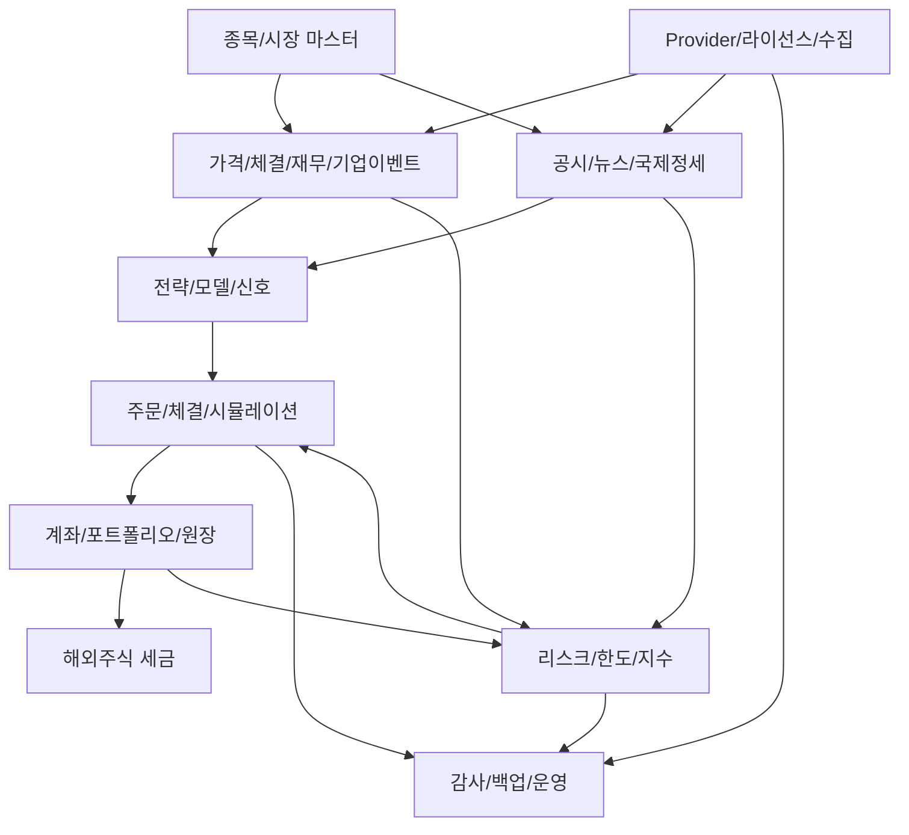

## 5. 종목과 시장 마스터

### 5.1 주요 테이블

| 테이블 | 목적 |
| --- | --- |
| `security_master` | 내부 종목 기준 마스터 |
| `provider_symbol_map` | provider별 symbol 매핑 |
| `business_group` | 내부 사업 유사도 그룹 |
| `security_business_group_map` | 종목과 사업 그룹 매핑 |
| `business_group_factor` | 사업 그룹별 factor/특성 |
| `exchange_calendar` | 거래소별 영업일 |
| `market_session` | 장전/정규장/장후 session |

### 5.2 핵심 컬럼

#### `security_master`

| 컬럼 | 설명 |
| --- | --- |
| `security_id` | 내부 종목 id, PK |
| `symbol` | 내부 표준 symbol |
| `isin` | ISIN |
| `exchange_code` | 거래소 코드 |
| `country_code` | 국가 |
| `currency_code` | 거래 통화 |
| `security_type` | common, preferred, etf, etn, reit, adr 등 |
| `company_name` | 회사명 |
| `listing_date` | 상장일 |
| `delisting_date` | 상장폐지일 |
| `trading_status` | normal, suspended, watch, delisted 등 |

#### `security_business_group_map`

| 컬럼 | 설명 |
| --- | --- |
| `security_business_group_map_id` | PK |
| `security_id` | FK |
| `business_group_id` | FK |
| `weight` | 복수 사업 편입 가중치 |
| `mapping_source` | 표준 산업분류, 수동 보정, 모델 추정 등 |
| `confidence_score` | 매핑 신뢰도 |
| `valid_from` / `valid_to` | 유효 기간 |

### 5.3 ERD

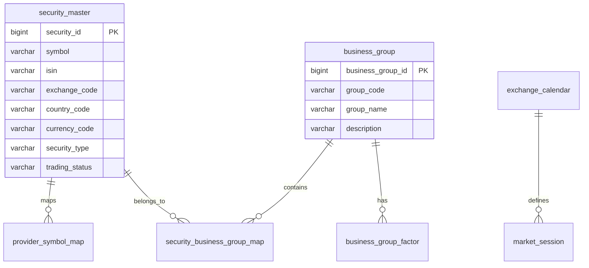

## 6. Provider, 라이선스, 수집 메타데이터

### 6.1 주요 테이블

| 테이블 | 목적 |
| --- | --- |
| `data_provider` | market data, 공시, 뉴스, broker 등 provider 등록 |
| `data_license` | 저장/표시/가공/재배포 권한 |
| `raw_data_manifest` | 원본 응답 또는 원본 파일의 위치와 checksum |
| `data_ingest_run` | 수집 실행 단위 |
| `data_ingest_checkpoint` | 재시작 지점 |
| `data_quality_run` | 데이터 품질 검사 실행 |
| `data_quality_issue` | 품질 이슈 |

### 6.2 관계

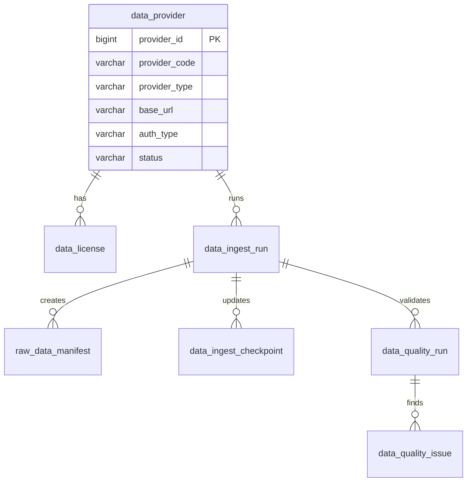

## 7. 가격, 체결, 재무, 기업 이벤트

### 7.1 주요 테이블

| 테이블 | 목적 |
| --- | --- |
| `price_bar` | 일봉/분봉 가격 |
| `trade_tick` | 실시간 체결 |
| `quote_tick` | 실시간 호가 |
| `fundamental_statement` | 재무제표/재무 항목 |
| `corporate_action` | 배당, 분할, 병합, 유상증자 등 |
| `adjustment_factor` | 수정주가 계수 |
| `factor_value` | 종목별 factor 값 |

### 7.2 핵심 컬럼

#### `price_bar`

| 컬럼 | 설명 |
| --- | --- |
| `price_bar_id` | PK |
| `security_id` | FK |
| `bar_interval` | 1d, 1m, 5m 등 |
| `bar_start_ts` | bar 시작 시각 |
| `bar_end_ts` | bar 종료 시각 |
| `open_price` | 시가 |
| `high_price` | 고가 |
| `low_price` | 저가 |
| `close_price` | 종가 |
| `volume` | 거래량 |
| `provider_id` | FK |
| `raw_data_manifest_id` | 원본 참조 |

### 7.3 ERD

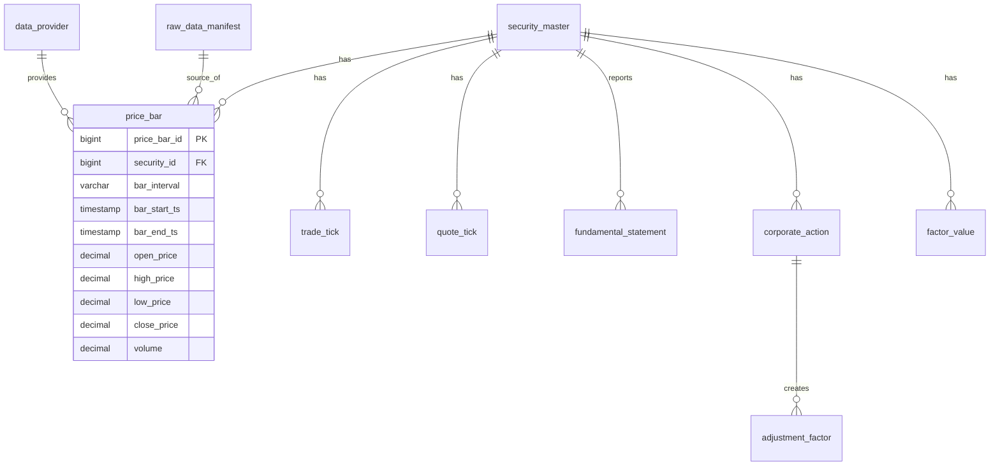

## 8. 공시, 뉴스, 국제 정세 이벤트

### 8.1 주요 테이블

| 테이블 | 목적 |
| --- | --- |
| `headline_source` | 뉴스/헤드라인 source |
| `headline_event` | 헤드라인 이벤트 |
| `headline_entity_map` | 헤드라인과 종목/회사 매핑 |
| `headline_business_group_map` | 헤드라인과 사업 그룹 매핑 |
| `headline_dedup_cluster` | 중복/재송신 기사 cluster |
| `disclosure_event` | 공식 공시 이벤트 |
| `disclosure_entity_map` | 공시와 종목/회사 매핑 |
| `disclosure_event_type` | 공시 유형 taxonomy |
| `disclosure_price_reaction` | 공시 이후 가격 반응 window |
| `disclosure_impact_feature` | 공시 영향 예측 feature |
| `disclosure_impact_model_run` | 공시 영향 모델 실행 |
| `disclosure_impact_prediction` | 신규 공시 영향 예측 결과 |
| `disclosure_comparable_case` | 유사 과거 공시 사례 |
| `global_risk_event` | 국제 정세 급변 이벤트 |
| `global_risk_event_source` | 국제 정세 이벤트 출처 |
| `global_risk_event_impact` | 영향 국가/시장/통화/사업 그룹 |
| `client_alert` | Client 알림 |
| `client_alert_ack` | 사용자 확인/무시 처리 |

### 8.2 공시 영향 분석 관계

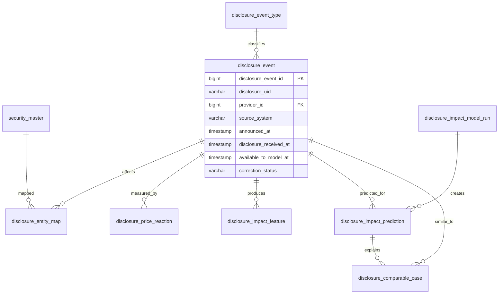

### 8.3 헤드라인과 국제 리스크 관계

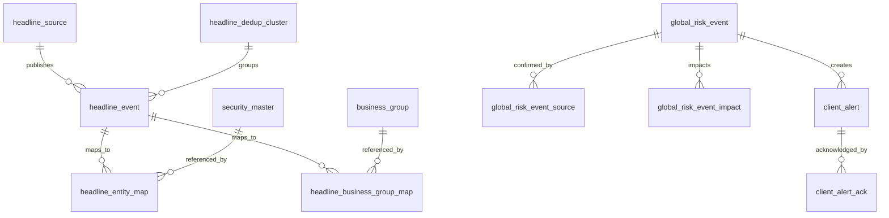

## 9. 전략, 모델, 예측, 백테스트

### 9.1 주요 테이블

| 테이블 | 목적 |
| --- | --- |
| `strategy` | 전략 정의 |
| `model_version` | 모델 버전 |
| `user_watchlist` | 사용자 지정 분석 대상 |
| `ml_analysis_job` | ML 분석 작업 |
| `ml_feature_set` | feature set 정의 |
| `ml_prediction_result` | 종목별 ML 예측 결과 |
| `ml_prediction_actual` | 예측 이후 실제 결과 |
| `signal` | 전략 신호 |
| `backtest_run` | 백테스트 실행 |
| `scenario_result` | 시나리오 테스트 결과 |

### 9.2 ERD

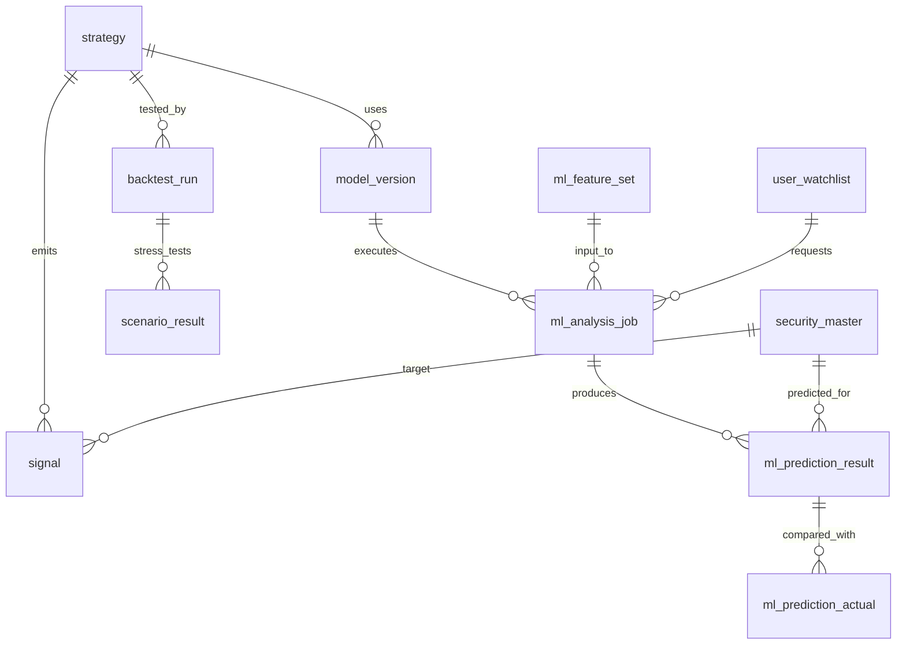

## 10. 계좌, 포트폴리오, 거래 원장, 세금

### 10.1 주요 테이블

| 테이블 | 목적 |
| --- | --- |
| `account` | 실계좌, paper 계좌, simulation 계좌 기준 |
| `virtual_account_profile` | 가상 계좌 템플릿 |
| `simulation_session` | 실시간 테스트 세션 |
| `simulation_event_log` | simulation 이벤트 |
| `portfolio` | 포트폴리오 |
| `transaction_ledger` | 거래 원장 |
| `cash_ledger` | 현금 원장 |
| `virtual_cash_ledger` | 가상 계좌 현금 원장 |
| `position_lot` | 매수 lot |
| `fifo_lot_match` | FIFO 매수 lot-매도 체결 매칭 |
| `realized_pnl` | 실현손익 |
| `security_trade_summary` | 종목별 매매 요약 |
| `tax_rule_version` | 세법 설정 버전 |
| `overseas_stock_tax_lot` | 해외 주식 세금 계산 lot |
| `annual_capital_gains_tax_estimate` | 연간 양도소득세 예상 |
| `tax_estimate_snapshot` | 세금 예상 snapshot |

### 10.2 핵심 관계

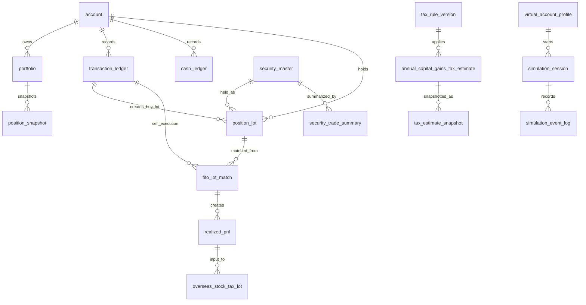

### 10.3 FIFO 매칭 모델

`transaction_ledger`는 원본 거래 사실을 보존한다. 매수 체결은 `position_lot`을 만들고, 매도 체결은 가장 오래된 미청산 lot부터 `fifo_lot_match`로 연결한다.

```text
buy transaction -> position_lot
sell transaction -> fifo_lot_match -> realized_pnl
remaining position_lot -> unrealized pnl
realized_pnl -> overseas_stock_tax_lot -> annual_capital_gains_tax_estimate
```

중요 제약:

- 원본 거래 원장은 수정하지 않는다.
- 정정 거래는 별도 transaction으로 기록한다.
- `fifo_lot_match`는 매칭 수량, 매수가, 매도가, 수수료/세금 배분액, 보유 기간을 가진다.
- 해외 주식 세금 계산은 원화 환산 금액과 `tax_rule_version`을 함께 저장한다.

## 11. 주문, 체결, 시뮬레이션

### 11.1 주요 테이블

| 테이블 | 목적 |
| --- | --- |
| `order_request` | 주문 요청과 주문 후보 |
| `execution` | 실거래 또는 paper 체결 |
| `simulated_execution` | simulation 체결 |
| `risk_check_result` | 주문 전 리스크 체크 결과 |
| `decision_log` | 주문 승인/거부 의사결정 |
| `audit_log` | 감사 로그 |

### 11.2 ERD

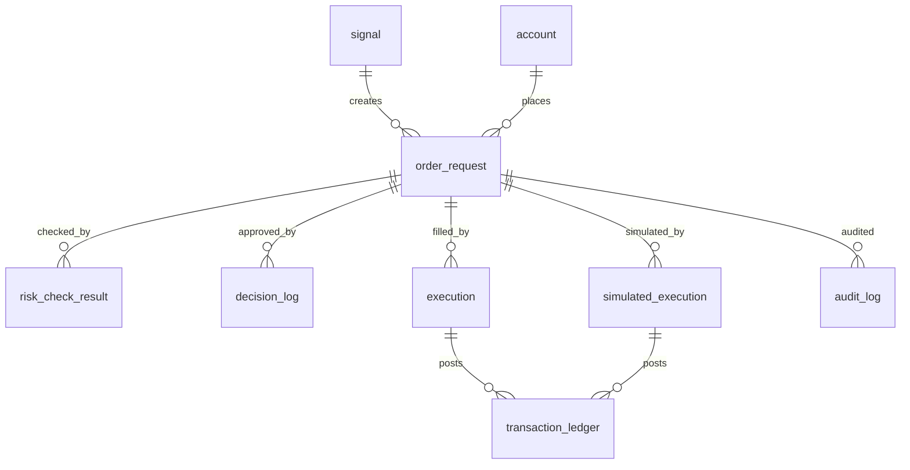

주문 모드:

| `account_mode` | 체결 테이블 | adapter |
| --- | --- | --- |
| `live` | `execution` | broker adapter |
| `paper` | `execution` | paper broker 또는 내부 paper adapter |
| `simulation` | `simulated_execution` | simulation adapter |

## 12. 리스크, 지수, 한도

### 12.1 주요 테이블

| 테이블 | 목적 |
| --- | --- |
| `risk_metric` | 포트폴리오/종목 리스크 지표 |
| `business_group_risk_metric` | 사업 그룹 리스크 지표 |
| `headline_risk_signal` | 헤드라인 기반 리스크 신호 |
| `risk_limit` | 리스크 한도 |
| `risk_check_result` | 주문 전 리스크 체크 결과 |
| `security_investment_amount_limit` | 단일 종목 투자금액 한도 |
| `slippage_rule` | 유동성별 슬리피지 규칙 |
| `security_volatility_index` | 종목별 변동성 지수 |
| `security_risk_index` | 종목별 위험도 지수 |
| `business_group_volatility_index` | 사업 그룹 변동성 지수 |
| `business_group_volatility_compare_view` | 그룹 변동성 비교 view |
| `risk_index_formula_version` | 위험/변동성 지수 산식 버전 |

### 12.2 ERD

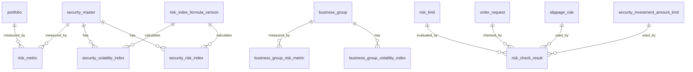

핵심 규칙:

- 단일 종목 투자금액은 원화 환산 기준 100,000원 이상 1,000,000,000원 이하로 제한한다.
- 저유동성 종목은 기준 슬리피지의 3배를 기본 적용한다.
- 공시, 헤드라인, 국제 정세 이벤트 신호는 자동 주문 직접 트리거가 아니라 주문 차단/경고/수동 검토에 사용한다.

## 13. 백업, 복구, 운영 로그

### 13.1 주요 테이블

| 테이블 | 목적 |
| --- | --- |
| `db_backup_policy` | 백업 정책 |
| `db_backup_run` | 백업 실행 이력 |
| `db_backup_manifest` | 백업 파일 manifest |
| `db_restore_test_run` | 복구 검증 이력 |
| `decision_log` | 의사결정 기록 |
| `audit_log` | 감사 로그 |

### 13.2 ERD

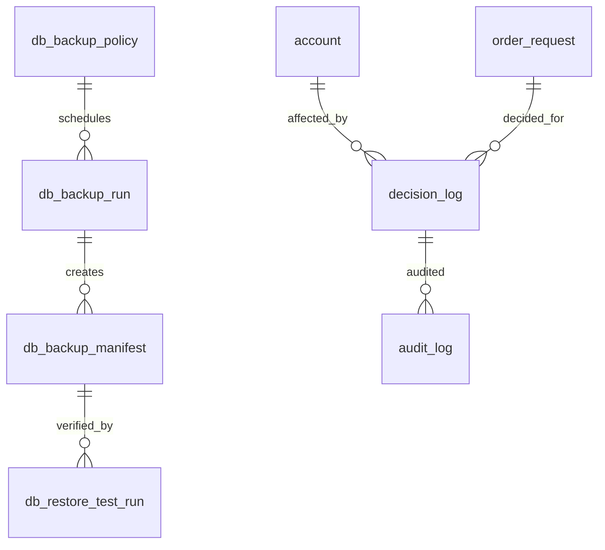

백업 정책:

- Goldilocks 기준 DB는 매주 토요일 10:00 KST에 정기 백업한다.
- 백업 파일 위치, 크기, checksum, 시작/종료 시각, 성공/실패를 기록한다.
- 월 1회 테스트 환경 복구 검증을 수행한다.

## 14. 핵심 관계 요약

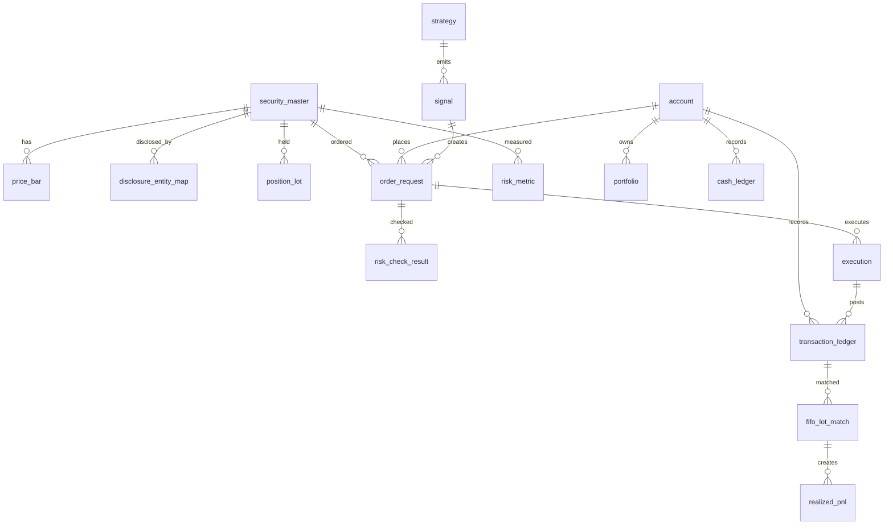

## 15. 주요 식별자와 unique constraint 후보

| 테이블 | unique 후보 |
| --- | --- |
| `security_master` | `isin`, `exchange_code + symbol`, 단 상장폐지/재상장 이력 고려 |
| `provider_symbol_map` | `provider_id + provider_symbol + valid_from` |
| `price_bar` | `security_id + bar_interval + bar_start_ts + provider_id` |
| `trade_tick` | `security_id + event_ts + provider_trade_id` |
| `headline_event` | `provider_id + raw_ref` |
| `disclosure_event` | `source_system + disclosure_uid` |
| `account` | `broker_id + broker_account_no + account_mode` |
| `order_request` | `idempotency_key` |
| `execution` | `broker_execution_id` |
| `simulated_execution` | `simulation_session_id + simulated_execution_seq` |
| `transaction_ledger` | `account_id + source_event_type + source_event_id + ledger_seq` |
| `fifo_lot_match` | `sell_transaction_id + buy_position_lot_id + match_seq` |
| `db_backup_run` | `backup_policy_id + scheduled_at` |

## 16. 삭제와 정정 정책

| 데이터 | 정책 |
| --- | --- |
| 거래 원장 | 삭제 금지. 정정 transaction으로 보정 |
| 현금 원장 | 삭제 금지. 정정 ledger row로 보정 |
| 주문/체결 | 삭제 금지. 상태 전이로 관리 |
| 공시/뉴스 | 원문 정책에 따라 보존. 정정/철회는 별도 상태로 관리 |
| 모델 예측 | 삭제 금지. 모델 버전과 산출 시각 보존 |
| 리스크 체크 | 삭제 금지. 주문 판단 근거로 보존 |
| 백업 이력 | 삭제 금지. 보존 기간 이후에도 manifest는 유지 검토 |

## 17. 후속 스키마 설계에서 확정할 사항

1. Goldilocks `identity`와 `sequence` 사용 기준
2. decimal precision과 scale
3. timestamp timezone 저장 방식
4. 대량 tick/orderbook 저장소 분리 시점
5. partitioning 대상 테이블
6. index 후보와 query pattern
7. audit column 적용 범위
8. soft delete와 이력 테이블 분리 방식
9. code table과 enum 관리 방식
10. migration rollback 정책

## 18. 다음 작업

다음 산출물은 `04_Goldilocks_초기_스키마_설계서`이다. 이 문서에서는 본 ERD 초안을 기준으로 실제 Goldilocks DDL 설계, key/index 전략, migration 순서, 초기 seed data를 정의한다.
