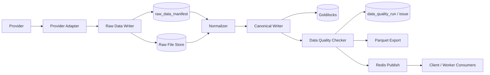

# 데이터 수집 파이프라인 상세 설계서

- 작성일: 2026-05-22
- 문서 버전: 0.1
- 저장 위치: `/home/jhkim5/silver_platter`
- 선행 문서:
  - `01_quant_auto_trading_requirements_definition_20260522.md`
  - `02_overall_system_architecture_design_20260522.md`
  - `03_domain_data_model_erd_draft_20260522.md`
  - `04_goldilocks_initial_schema_design_20260522.md`

## 1. 문서 목적

이 문서는 퀀트 기반 주식 자동매매 프로그램의 데이터 수집 파이프라인을 상세 설계한다. 대상은 historical data, 실시간 시세, 환율, 재무, 기업 이벤트, 공시, 글로벌 헤드라인, 국제 정세 이벤트이다.

목표는 외부 provider 응답을 재현 가능하게 보존하고, 내부 표준 모델로 정규화하며, 데이터 품질 검사를 통과한 데이터만 전략, 모델, 리스크, 주문 후보 생성에 사용하도록 만드는 것이다.

## 2. 설계 원칙

1. 원본 우선 저장
   외부 응답은 정규화 전에 raw storage와 `raw_data_manifest`에 먼저 기록한다.

2. provider 격리
   모든 외부 API, 파일, WebSocket 연동은 adapter 계층으로 분리한다.

3. 재시작 가능성
   수집 작업은 checkpoint 기반으로 중단 지점부터 재시작할 수 있어야 한다.

4. point-in-time 보존
   `event_ts`, `receive_ts`, `loaded_at`, `available_to_model_at`을 분리한다.

5. 라이선스 통제
   저장, 가공, 화면 표시, 재배포 가능 여부를 provider별로 확인한 뒤 적재한다.

6. 품질 검증 우선
   중대한 데이터 품질 오류는 전략 신호, 주문 후보, 자동 주문을 차단한다.

7. 운영 DB 부하 분리
   Goldilocks는 기준 운영 데이터 저장소로 사용하고, 모델 학습/백테스트 대량 데이터는 DuckDB + Parquet로 export한다.

## 3. 전체 파이프라인

```text
Provider API / File / WebSocket
  -> Provider Adapter
  -> Raw Data Writer
  -> raw_data_manifest
  -> Normalizer
  -> Canonical Writer
  -> Data Quality Checker
  -> Goldilocks Canonical Tables
  -> Parquet Export
  -> Redis Publish / Client Update
```



## 4. 수집 대상과 저장 위치

| 데이터 | 수집 방식 | 기준 저장소 | 분석 저장소 | 비고 |
| --- | --- | --- | --- | --- |
| 종목 마스터 | API, 파일, 수동 보정 | Goldilocks | Parquet snapshot | 내부 `security_id` 기준 |
| 일봉 가격 | bulk/API | Goldilocks `price_bar` | Parquet | MVP 핵심 |
| 분봉 가격 | API | Goldilocks 또는 Parquet | Parquet | MVP 이후 |
| 실시간 체결 | WebSocket/feed | Goldilocks `trade_tick`, Redis | Parquet optional | 장중 요약 중심 |
| 실시간 호가 | WebSocket/feed | Goldilocks `quote_tick`, Redis | Parquet optional | 전체 orderbook은 초기 제외 |
| 환율 | API | Goldilocks price/fx 확장 테이블 | Parquet | 해외주식 세금/평가 |
| 재무 | API/bulk | Goldilocks `fundamental_statement` | Parquet | `available_to_model_at` 필수 |
| 기업 이벤트 | API/bulk | Goldilocks `corporate_action` | Parquet | 수정주가 계산 |
| 공시 | API/RSS/bulk | Goldilocks `disclosure_event` | Parquet | 영향 분석 입력 |
| 헤드라인 | API/feed | Goldilocks `headline_event`, Redis | Parquet metadata | 라이선스 통제 |
| 국제 정세 이벤트 | 뉴스/공식 발표 feed | Goldilocks `global_risk_event`, Redis | Parquet metadata | Client 긴급 알림 |

## 5. Provider Adapter 설계

### 5.1 공통 인터페이스

```python
class ProviderAdapter:
    provider_code: str

    def health_check(self) -> ProviderHealth:
        ...

    def fetch_security_master(self, request: SecurityMasterRequest) -> RawBatch:
        ...

    def fetch_historical_bars(self, request: HistoricalBarRequest) -> RawBatch:
        ...

    def fetch_corporate_actions(self, request: CorporateActionRequest) -> RawBatch:
        ...

    def fetch_disclosures(self, request: DisclosureRequest) -> RawBatch:
        ...

    def stream_realtime(self, request: RealtimeSubscribeRequest) -> EventStream:
        ...
```

### 5.2 Adapter 책임

- 인증과 토큰 갱신
- rate limit 준수
- request parameter 표준화
- provider 응답 원본 반환
- provider error code 보존
- retry 가능 오류와 불가능 오류 구분
- source timestamp 추출
- page/cursor/checkpoint 추출

### 5.3 Adapter가 하지 않는 일

- 내부 표준 테이블 직접 insert
- 전략 또는 리스크 판단
- 자동 주문 판단
- 라이선스 우회 저장
- provider별 원본 응답 임의 손실

## 6. Raw Data 관리

### 6.1 Raw 저장 원칙

Raw data는 파일 또는 object path에 저장하고 Goldilocks에는 manifest를 저장한다. 뉴스/헤드라인은 headline, metadata, source link만 저장한다.

Raw path 후보:

```text
/home/jhkim5/silver_platter_data/raw/{provider_code}/{data_type}/{yyyy}/{mm}/{dd}/{request_hash}.{ext}
```

Parquet export path 후보:

```text
/home/jhkim5/silver_platter_data/parquet/{dataset_name}/{partition_key}/
```

### 6.2 `raw_data_manifest`

필수 필드:

| 필드 | 설명 |
| --- | --- |
| `provider_id` | provider |
| `source_type` | market_price, disclosure, headline 등 |
| `source_ref` | raw file path 또는 provider object ref |
| `request_hash` | 요청 파라미터 hash |
| `checksum` | raw payload checksum |
| `row_count` | 원본 row 수 |
| `received_at` | 수신 시각 |
| `loaded_at` | manifest 적재 시각 |
| `status` | loaded, normalized, rejected, error |
| `error_message` | 오류 메시지 |

### 6.3 Request Hash

`request_hash`는 아래 값을 정렬된 JSON으로 직렬화한 뒤 hash한다.

```text
provider_code
endpoint_name
request_params
data_type
from_ts
to_ts
symbol_or_universe
license_scope
```

같은 요청이 재실행되면 같은 `request_hash`를 사용해 중복 수집과 재시작을 통제한다.

## 7. 정규화 설계

### 7.1 Normalizer 공통 흐름

```text
raw_data_manifest 조회
  -> raw payload load
  -> provider schema validation
  -> internal schema mapping
  -> timezone/currency/symbol normalization
  -> canonical row 생성
  -> idempotent upsert 또는 append
  -> data_quality_run 생성
```

### 7.2 Symbol Resolve

provider symbol은 직접 전략/주문에 사용하지 않는다.

```text
provider_id + provider_symbol + provider_exchange_code
  -> provider_symbol_map
  -> security_id
```

매핑 실패 시:

- `data_quality_issue` 생성
- 해당 row는 canonical insert 보류
- 운영 화면에 unresolved symbol 표시
- 자동 주문 관련 pipeline에는 전달 금지

### 7.3 Time Normalize

시간 컬럼 기준:

| 표준 컬럼 | 설명 |
| --- | --- |
| `event_ts` | provider/거래소/공시 발행기관 기준 이벤트 시각 |
| `receive_ts` | 수집 worker 수신 시각 |
| `loaded_at` | Goldilocks 적재 시각 |
| `available_to_model_at` | 모델/전략이 사용할 수 있었던 시각 |
| `timezone_code` | 원본 시장 또는 provider timezone |

장후 발표 공시, 지연 수신 재무 데이터는 `available_to_model_at`을 보수적으로 산정한다.

### 7.4 Currency Normalize

해외 주식과 세금 계산을 위해 금액 데이터에는 다음을 연결한다.

- 거래 통화
- 기준 통화
- 환율 provider
- 환율 적용 시각
- 원화 환산 금액

## 8. Historical Price Pipeline

### 8.1 Backfill 흐름

```text
universe selection
  -> provider capability check
  -> date range split
  -> fetch batch
  -> raw manifest write
  -> normalize to price_bar
  -> data quality check
  -> parquet export
  -> checkpoint update
```

### 8.2 Batch 분할 기준

| 기준 | 기본값 |
| --- | --- |
| 일봉 backfill | 종목별 1년 단위 |
| 분봉 backfill | 종목별 1개월 단위 |
| retry 단위 | provider request 단위 |
| checkpoint 단위 | provider + dataset + security_id + date range |

### 8.3 Idempotency

`price_bar`는 아래 unique key로 중복을 방지한다.

```text
security_id + bar_interval + bar_start_ts + provider_id
```

동일 key 재적재 정책:

- 원본 checksum이 같으면 skip
- 원본 checksum이 다르면 provider revision으로 판단하고 기존 row와 차이를 기록
- 공식 수정주가 또는 corporate action 반영 변경은 `adjustment_factor`와 재계산 이력으로 관리

## 9. 실시간 시세 Pipeline

### 9.1 흐름

```text
Provider WebSocket
  -> realtime adapter
  -> heartbeat monitor
  -> sequence/gap detector
  -> symbol resolver
  -> Redis publish
  -> trade_tick / quote_tick append
  -> realtime bar builder
  -> Client / Risk Engine update
```

### 9.2 장애 처리

| 장애 | 처리 |
| --- | --- |
| heartbeat timeout | reconnect, resubscribe |
| sequence gap | gap issue 기록, 해당 구간 신뢰도 하향 |
| symbol resolve 실패 | Redis publish 차단, data quality issue |
| provider throttling | subscription 축소 또는 backoff |
| Redis 장애 | Goldilocks append 우선, Client realtime degrade |
| Goldilocks write 실패 | 자동 주문 중단 |

### 9.3 장 종료 Reconciliation

실시간으로 생성한 bar와 공식 장종료 bar를 비교한다.

검사 항목:

- OHLC 차이
- 거래량 차이
- 누락 구간
- timezone/session boundary 오류
- corporate action 반영 여부

차이가 임계값을 넘으면 전략 신호와 주문 후보 생성을 차단한다.

## 10. 재무, 기업 이벤트, 수정주가 Pipeline

### 10.1 재무 데이터

재무 데이터는 발표일과 사용 가능 시각을 엄격히 분리한다.

```text
financial provider
  -> raw manifest
  -> statement parser
  -> fundamental_statement
  -> available_to_model_at 산정
  -> factor_value 재계산 후보 생성
```

### 10.2 기업 이벤트

대상:

- 배당
- 액면분할
- 병합
- 무상증자
- 유상증자
- 스핀오프
- 상장폐지
- 거래정지

기업 이벤트는 `corporate_action`에 저장하고, 가격 보정 계수는 `adjustment_factor`로 관리한다.

### 10.3 수정주가 재계산

수정주가 재계산은 기존 원시 가격을 덮어쓰지 않는다.

```text
corporate_action 변경
  -> adjustment_factor 생성
  -> adjusted_close_price 재산출
  -> affected price_bar 범위 기록
  -> factor/model 재계산 task 생성
```

## 11. 공시 Pipeline

### 11.1 수집 대상

- OpenDART
- KRX/KIND
- SEC EDGAR
- 거래소 공지
- 기업 IR 보도자료

### 11.2 흐름

```text
disclosure adapter
  -> raw metadata 저장
  -> disclosure_event upsert
  -> disclosure_entity_map 생성
  -> disclosure_event_type 분류
  -> disclosure_price_reaction window 계산 예약
  -> disclosure_impact_prediction 생성
  -> Client alert / Risk input
```

### 11.3 시간 기준

| 컬럼 | 의미 |
| --- | --- |
| `announced_at` | 공시 발표 또는 접수 시각 |
| `disclosure_received_at` | provider에서 수신한 시각 |
| `loaded_at` | DB 적재 시각 |
| `available_to_model_at` | 모델이 사용할 수 있었던 시각 |
| `reaction_window_start_at` | 가격 반응 window 시작 |
| `reaction_window_end_at` | 가격 반응 window 종료 |

### 11.4 정정/철회 처리

정정 공시는 원공시를 삭제하지 않고 연결한다.

```text
original disclosure
  -> correction disclosure
  -> correction_status update
  -> impact prediction recalc
  -> previous prediction retained
```

## 12. 헤드라인과 국제 정세 Pipeline

### 12.1 헤드라인 수집

```text
headline provider
  -> headline_source 확인
  -> license entitlement 확인
  -> headline_event 저장
  -> dedup cluster 생성
  -> entity/business group mapping
  -> headline_risk_signal 생성
```

뉴스/헤드라인의 원문 전문과 요약은 MVP에서 저장하지 않는다. 기본값은 headline, source, timestamp, URL, metadata 저장이다.

### 12.2 국제 정세 급변 이벤트

대상:

- 전쟁/군사 충돌
- 제재
- 무역 제한
- 에너지 공급 차질
- 해상 운송 차질
- 사이버 공격
- 팬데믹
- 중앙은행/정부 긴급 발표

흐름:

```text
trusted global source
  -> event detection
  -> source confirmation count
  -> severity classification
  -> impacted country/currency/sector/business group mapping
  -> global_risk_event
  -> client_alert
  -> order window warning
```

국제 정세 이벤트는 자동 주문을 직접 발생시키지 않는다.

## 13. Data Quality Checker

### 13.1 검사 분류

| 분류 | 예 |
| --- | --- |
| schema | 필수 컬럼 누락, 타입 오류 |
| completeness | 결측 row, 누락 날짜 |
| uniqueness | 중복 bar, 중복 공시 |
| validity | 가격 0/음수, `high < low` |
| consistency | provider 간 종가 괴리 |
| timeliness | 수집 지연, 공시 지연 |
| survivorship | 상장 전/폐지 후 데이터 |
| point-in-time | 발표 전 재무 데이터 사용 |
| license | 저장/표시 불가 데이터 적재 시도 |

### 13.2 심각도

| severity | 처리 |
| --- | --- |
| `info` | 기록만 |
| `warning` | 운영 화면 표시 |
| `risk` | 해당 dataset 전략 사용 보류 |
| `block` | 주문 후보/자동 주문 차단 |

### 13.3 주요 rule

| rule | 대상 | block 조건 |
| --- | --- | --- |
| `price_non_positive` | `price_bar` | 종가, 고가, 저가가 0 이하 |
| `ohlc_inconsistent` | `price_bar` | high < low 또는 close가 범위 밖 |
| `missing_trading_day` | `price_bar` | 거래일 누락 |
| `duplicate_bar` | `price_bar` | unique key 중복 |
| `unresolved_symbol` | 전체 | 내부 `security_id` 매핑 실패 |
| `future_financial_used` | 재무 | `available_to_model_at` 이전 사용 |
| `disclosure_time_missing` | 공시 | 공시 발표/수신 시각 누락 |
| `license_violation` | 뉴스/헤드라인 | 저장 불가 본문 저장 시도 |
| `realtime_gap` | 실시간 | sequence gap 미복구 |

## 14. Checkpoint와 재시도

### 14.1 `data_ingest_checkpoint`

checkpoint key:

```text
provider_code
dataset_name
security_id or universe_id
from_ts
to_ts
cursor
page
last_success_event_ts
```

### 14.2 재시도 정책

| 오류 | 재시도 |
| --- | --- |
| HTTP 429 | exponential backoff, rate limit 하향 |
| HTTP 5xx | 제한 횟수 재시도 |
| 인증 실패 | 재시도 중단, 운영 알림 |
| schema 변경 | 재시도 중단, adapter 수정 필요 |
| symbol 미매핑 | row 보류, 운영 처리 |
| DB write 실패 | worker 중단, 자동 주문 중단 |

### 14.3 Idempotent write

- manifest는 `request_hash`와 checksum으로 중복을 감지한다.
- canonical table은 natural unique key로 중복 insert를 차단한다.
- append-only 로그성 테이블은 provider event id 또는 source id로 중복을 차단한다.
- 재처리는 기존 row를 무조건 덮어쓰지 않고 revision 또는 재계산 이력을 남긴다.

## 15. Parquet Export

### 15.1 목적

Parquet export는 백테스트, factor 계산, ML 학습, 대량 분석을 Goldilocks 부하 없이 수행하기 위한 경로다.

### 15.2 dataset 후보

| dataset | partition |
| --- | --- |
| `price_bar_1d` | `market/year` |
| `price_bar_1m` | `market/year/month` |
| `fundamental_statement` | `market/year` |
| `corporate_action` | `market/year` |
| `disclosure_event` | `market/year` |
| `factor_value` | `factor_code/year` |
| `ml_feature_matrix` | `feature_set_version/year` |

### 15.3 Export 원칙

- export manifest를 남긴다.
- 동일 dataset/version은 재현 가능해야 한다.
- point-in-time cutoff를 metadata에 포함한다.
- 수정주가 산식 버전과 corporate action 반영 버전을 포함한다.
- 모델 학습용 dataset에는 `available_to_model_at` 기준 필터를 적용한다.

## 16. Redis Publish와 실시간 Consumer

### 16.1 channel 후보

| channel | payload |
| --- | --- |
| `market.trade.{security_id}` | 최신 체결 |
| `market.quote.{security_id}` | 최신 호가 |
| `portfolio.summary.{account_id}` | 포트폴리오 요약 |
| `risk.alert` | 리스크 경고 |
| `disclosure.alert` | 신규 공시 영향 예측 |
| `headline.alert` | 헤드라인 이벤트 |
| `global_risk.alert` | 국제 정세 급변 |
| `simulation.event.{session_id}` | 가상 체결/가상 계좌 이벤트 |

### 16.2 publish 원칙

- Redis publish는 Goldilocks canonical write 성공 후 수행한다.
- UI는 Redis 이벤트를 빠르게 표시하되, 새로고침 시 Goldilocks 기준 상태를 조회한다.
- Redis 장애 시 Client는 polling으로 degrade한다.
- 주문/체결의 최종 source of truth는 Goldilocks다.

## 17. Scheduler 설계

### 17.1 주기 작업

| 작업 | 주기 |
| --- | --- |
| 종목 마스터 갱신 | 일 1회 또는 주 1회 |
| 일봉 backfill | 장 종료 후 |
| 환율 수집 | 일 1회, 해외장 종료 후 보정 |
| 공시 수집 | 장중/장후 반복 |
| 헤드라인 수집 | 실시간 또는 1분 주기 |
| 데이터 품질 검사 | 수집 batch 직후 |
| Parquet export | 장 종료 후 또는 batch 직후 |
| 장종료 reconciliation | 장 종료 후 |
| DB 백업 | 매주 토요일 10:00 KST |

### 17.2 작업 상태

작업 상태:

```text
created
running
retrying
success
partial_success
failed
cancelled
```

## 18. 관측성과 운영 알림

### 18.1 metric

| metric | 설명 |
| --- | --- |
| `ingest_run_count` | 수집 실행 수 |
| `ingest_success_rate` | 성공률 |
| `ingest_lag_seconds` | 이벤트 발생 후 적재까지 지연 |
| `provider_error_count` | provider 오류 |
| `raw_manifest_error_count` | raw 저장 실패 |
| `normalization_error_count` | 정규화 실패 |
| `data_quality_block_count` | block 품질 이슈 |
| `realtime_gap_count` | 실시간 gap |
| `redis_publish_failure_count` | Redis publish 실패 |
| `parquet_export_failure_count` | Parquet export 실패 |

### 18.2 알림 대상

- provider 인증 실패
- 호출 제한 초과 지속
- 수집 지연 임계값 초과
- 중대한 데이터 품질 오류
- symbol mapping 실패 증가
- DB write 실패
- Redis publish 실패
- 실시간 feed gap
- 공시 수집 지연
- 라이선스 위반 가능성

## 19. 보안과 라이선스 통제

### 19.1 Secret 관리

- API key와 secret은 서버 환경변수 또는 secret store에 저장한다.
- Client로 provider credential을 전달하지 않는다.
- worker 로그에 credential을 남기지 않는다.

### 19.2 라이선스 gate

수집 전 확인:

```text
provider_id
  -> data_license
  -> can_store / can_transform / can_display_realtime / can_redistribute
  -> allowed storage mode 결정
```

뉴스/헤드라인은 headline과 metadata만 저장/표시한다. 전문 본문과 전문 기반 요약은 기본 저장 대상에서 제외한다.

데이터 provider 기본 정책:

- 시장/가격/거시/공시 데이터는 무료로 가능한 KRX/Koscom/공개 API 조합을 우선한다.
- 실시간 헤드라인은 별도 정책에 따라 공식 공시와 LSEG/Bloomberg/FactSet/Dow Jones 등 전문 뉴스 계약을 포함할 수 있다.
- 무료 API라도 운영 사용, 저장, 표시, 재배포 권한이 확인되지 않으면 자동 주문 입력으로 사용하지 않는다.

## 20. 테스트 계획

### 20.1 단위 테스트

- provider request hash 생성
- symbol resolve
- timezone normalize
- price bar schema mapping
- corporate action normalize
- 공시 정정 연결
- data quality rule
- checkpoint update
- idempotent write decision

### 20.2 통합 테스트

- 일봉 backfill end-to-end
- raw manifest에서 price_bar 적재까지
- data quality issue 발생 시 주문 후보 차단 flag 전달
- 공시 수집에서 공시 영향 예측 trigger까지
- 실시간 feed reconnect와 resubscribe
- Parquet export 후 DuckDB 조회
- Redis publish 후 Client polling fallback

### 20.3 운영 리허설

- provider 장애 mock
- schema 변경 mock
- rate limit mock
- DB write failure mock
- Redis 장애 mock
- 누락 거래일 재수집
- 장종료 reconciliation 차이 발생

## 21. 초기 구현 순서

1. `data_provider`, `data_license`, `raw_data_manifest` 기반 구현
2. provider adapter base class와 mock provider
3. `security_master`, `provider_symbol_map` 적재
4. 일봉 `price_bar` backfill
5. data quality checker
6. checkpoint와 retry
7. Parquet export
8. 공시 수집 MVP
9. 실시간 feed gateway skeleton
10. Redis publish와 Client 상태 조회 연동

이 순서로 진행하면 주문/리스크 구현 전에 데이터 신뢰성의 최소 기반을 먼저 확보할 수 있다.

## 22. 미결정 사항

1. raw data 저장 루트와 파일 보존 기간
2. provider별 초기 우선순위: 무료로 가능한 KRX/Koscom/공개 API 조합의 세부 API 선정
3. 환율 provider와 세금 계산용 환율 기준
4. 실시간 시세 provider와 재배포 권한
5. Parquet dataset versioning 방식
6. data quality issue가 주문 차단으로 전파되는 API 계약
7. Redis Streams와 pub/sub 중 MVP 기본값
8. worker queue 구현: Redis queue, RQ, Celery, custom scheduler 중 선택
9. 공시 영향 예측 trigger를 동기/비동기 중 어디에 둘지
10. provider별 schema 변경 감지 자동화 수준

## 23. 다음 작업

다음 산출물은 `06_종목별_거래_원장_FIFO_lot_매칭_실현손익_관리_설계서`이다. 이 문서에서는 거래 원장, 현금 원장, position lot, FIFO 매칭, 실현/미실현손익, 해외 주식 세금 입력 데이터의 처리 흐름을 구체화한다.
