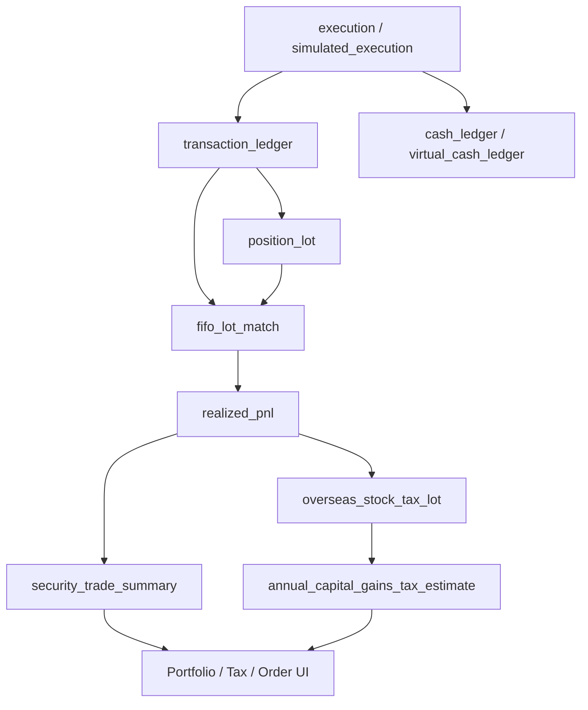

# 종목별 거래 원장, FIFO lot 매칭, 실현손익 관리 설계서

- 작성일: 2026-05-22
- 문서 버전: 0.1
- 저장 위치: `/home/jhkim5/silver_platter`
- 선행 문서:
  - `01_quant_auto_trading_requirements_definition_20260522.md`
  - `02_overall_system_architecture_design_20260522.md`
  - `03_domain_data_model_erd_draft_20260522.md`
  - `04_goldilocks_initial_schema_design_20260522.md`
  - `05_data_collection_pipeline_detail_design_20260522.md`

## 1. 문서 목적

이 문서는 종목별 거래 원장, 현금 원장, position lot, FIFO 매수 lot-매도 체결 매칭, 실현/미실현손익, 해외 주식 세금 입력 데이터의 처리 구조를 정의한다.

목표는 주문/체결 이후 계좌와 포트폴리오 상태를 재현 가능하게 계산하고, 종목별 매매 기록과 세후 손익을 정확하게 추적하는 것이다.

## 2. 설계 원칙

1. 원장은 append-only로 관리한다.
   원본 거래와 현금 흐름은 삭제하거나 덮어쓰지 않고 정정/취소/역분개 row로 보정한다.

2. 모든 계좌의 원가 계산은 FIFO를 강제 적용한다.
   매도 체결은 같은 계좌와 종목의 가장 오래된 미청산 매수 lot부터 순서대로 연결한다.

3. 원본 체결과 회계 계산 결과를 분리한다.
   `transaction_ledger`는 원본 거래 사실을 보존하고, FIFO 결과는 `fifo_lot_match`, 손익 결과는 `realized_pnl`에 저장한다.

4. 외화와 원화를 모두 보존한다.
   해외 주식은 거래 통화 기준 손익과 원화 환산 손익을 모두 저장한다.

5. 세금 계산은 버전 관리한다.
   세율, 기본공제, 필요경비, 환율 기준은 `tax_rule_version`과 계산 버전으로 추적한다.

6. 실거래, paper, simulation은 같은 계산 로직을 사용하되 데이터는 분리한다.
   `account_mode`와 `simulation_session_id`를 통해 가상 체결이 실거래 손익과 섞이지 않게 한다.

## 3. 전체 흐름

```text
order_request
  -> execution 또는 simulated_execution
  -> transaction_ledger
  -> cash_ledger
  -> position_lot
  -> fifo_lot_match
  -> realized_pnl
  -> security_trade_summary
  -> overseas_stock_tax_lot
  -> annual_capital_gains_tax_estimate
  -> portfolio / tax / order window UI
```



## 4. 핵심 테이블

| 테이블 | 책임 |
| --- | --- |
| `account` | 계좌와 계좌 모드 관리 |
| `portfolio` | 포트폴리오 묶음 |
| `transaction_ledger` | 매수/매도/배당/수수료/세금/환전/정정 거래 원장 |
| `cash_ledger` | 실계좌/paper 계좌 현금 원장 |
| `virtual_cash_ledger` | simulation 계좌 현금 원장 |
| `position_lot` | 매수 체결로 생성된 보유 lot |
| `fifo_lot_match` | 매도 체결과 매수 lot의 FIFO 매칭 |
| `realized_pnl` | 매칭 결과 기반 실현손익 |
| `security_trade_summary` | 종목별 매매 요약 |
| `tax_rule_version` | 세법/계산 규칙 버전 |
| `overseas_stock_tax_lot` | 해외 주식 세금 계산 입력 lot |
| `annual_capital_gains_tax_estimate` | 과세연도별 예상 양도소득세 |
| `tax_estimate_snapshot` | 주문창/화면 표시용 예상세액 snapshot |

## 5. 거래 원장 모델

### 5.1 `transaction_ledger`의 역할

`transaction_ledger`는 모든 유가증권 관련 거래 사실의 기준 원장이다.

기록 대상:

- 매수 체결
- 매도 체결
- 배당
- 분배금
- 수수료
- 세금
- 환전
- 권리 이벤트 반영
- broker correction
- 취소 또는 정정 보정 row

### 5.2 거래 유형

| `transaction_type` | 설명 | `security_id` | 수량 |
| --- | --- | --- | --- |
| `buy` | 매수 체결 | 필수 | 양수 |
| `sell` | 매도 체결 | 필수 | 양수 |
| `dividend` | 배당 | 필수 | 선택 |
| `distribution` | ETF/펀드 분배금 | 필수 | 선택 |
| `fee` | 수수료 단독 기록 | 선택 | 없음 |
| `tax` | 세금 단독 기록 | 선택 | 없음 |
| `fx_buy` | 외화 매수 | 없음 | 없음 |
| `fx_sell` | 외화 매도 | 없음 | 없음 |
| `corporate_action` | 분할/병합/무상증자 반영 | 필수 | 변경 수량 |
| `correction` | 정정 | 선택 | 원거래에 따름 |
| `reversal` | 역분개 | 선택 | 원거래 반대 |

### 5.3 원장 금액 부호

현금 관점의 부호를 명확히 유지한다.

| 거래 | `gross_amount` | `cash_ledger.amount` |
| --- | --- | --- |
| 매수 | 양수 거래대금 | 음수 |
| 매도 | 양수 거래대금 | 양수 |
| 배당/분배금 | 양수 | 양수 |
| 수수료 | 양수 | 음수 |
| 세금 | 양수 | 음수 |
| 환전 매수 | 대상 통화 증가 | 통화별 row 2개 |
| 환전 매도 | 대상 통화 감소 | 통화별 row 2개 |

## 6. 현금 원장 모델

### 6.1 `cash_ledger`

현금 원장은 계좌, 통화, 거래 원장 또는 주문/체결 이벤트와 연결된다.

필수 항목:

- `account_id`
- `currency_code`
- `amount`
- `balance_after`
- `cash_event_type`
- `transaction_ledger_id`
- `execution_id`
- `booked_at`
- `settlement_date`

### 6.2 현금 원장 원칙

- append-only로 기록한다.
- 계좌/통화별 잔액은 row 누적합 또는 snapshot으로 재구성 가능해야 한다.
- 실계좌와 paper 계좌는 `cash_ledger`를 사용한다.
- simulation 계좌는 `virtual_cash_ledger`를 사용하되 계산 로직은 동일하게 유지한다.
- 환전은 두 통화의 현금 흐름을 분리해서 기록한다.

## 7. Position Lot 생성

### 7.1 매수 체결 처리

매수 체결이 원장에 반영되면 `position_lot`을 생성한다.

```text
buy execution
  -> transaction_ledger(type=buy)
  -> cash_ledger(cash decrease)
  -> position_lot(original_quantity = filled_quantity)
```

`position_lot` 필수 계산:

- `original_quantity`
- `remaining_quantity`
- `unit_cost`
- `unit_cost_krw`
- `currency_code`
- `opened_at`
- `lot_status = open`

### 7.2 단가 계산

기본 단가:

```text
unit_cost = (gross_amount + buy_fee + buy_tax) / quantity
unit_cost_krw = (gross_amount_krw + buy_fee_krw + buy_tax_krw) / quantity
```

해외 주식은 매수 거래일 기준 환율과 수수료 원화 환산액을 보존한다.

## 8. FIFO 매칭

### 8.1 매도 체결 처리

매도 체결이 발생하면 같은 계좌와 종목의 미청산 매수 lot을 오래된 순서로 조회한다.

```sql
SELECT
    position_lot_id,
    remaining_quantity,
    unit_cost,
    unit_cost_krw,
    opened_at
FROM position_lot
WHERE account_id = ?
  AND security_id = ?
  AND lot_status = 'open'
  AND remaining_quantity > 0
ORDER BY opened_at, position_lot_id;
```

### 8.2 매칭 알고리즘

```text
sell_remaining = sell_quantity
match_seq = 1

for lot in open_lots_fifo_order:
    match_qty = min(sell_remaining, lot.remaining_quantity)
    create fifo_lot_match
    lot.remaining_quantity -= match_qty
    if lot.remaining_quantity == 0:
        lot.lot_status = closed
        lot.closed_at = sell_trade_ts
    sell_remaining -= match_qty
    match_seq += 1
    if sell_remaining == 0:
        break

if sell_remaining > 0:
    reject or create exception for short/oversell
```

초기 범위에서는 공매도와 음수 보유를 허용하지 않는다. 보유 수량보다 큰 매도 체결은 broker 대사 오류 또는 수동 입력 오류로 보고 `data_quality_issue` 또는 운영 알림을 생성한다.

### 8.3 수수료/세금 배분

매도 체결 하나가 여러 lot에 매칭될 수 있으므로 수수료와 세금은 매칭 수량 비율로 배분한다.

```text
allocation_ratio = matched_quantity / sell_quantity
allocated_sell_fee = sell_fee * allocation_ratio
allocated_sell_tax = sell_tax * allocation_ratio
allocated_sell_fee_krw = sell_fee_krw * allocation_ratio
allocated_sell_tax_krw = sell_tax_krw * allocation_ratio
```

매수 수수료/세금은 lot의 원가에 이미 포함한다. 매도 수수료/세금은 실현손익 계산 시 차감한다.

## 9. 실현손익 계산

### 9.1 lot별 손익

거래 통화 기준:

```text
gross_proceeds = matched_quantity * sell_unit_price
cost_basis = matched_quantity * buy_unit_price
realized_gross_pnl = gross_proceeds - cost_basis
realized_net_pnl = realized_gross_pnl - allocated_sell_fee - allocated_sell_tax
```

원화 기준:

```text
gross_proceeds_krw = matched_quantity * sell_unit_price * sell_fx_rate_to_krw
cost_basis_krw = matched_quantity * buy_unit_cost_krw
realized_gross_pnl_krw = gross_proceeds_krw - cost_basis_krw
realized_net_pnl_krw = realized_gross_pnl_krw - allocated_sell_fee_krw - allocated_sell_tax_krw
```

### 9.2 수익률

```text
return_pct = realized_net_pnl / cost_basis
return_pct_krw = realized_net_pnl_krw / cost_basis_krw
holding_days = sell_trade_date - lot_opened_date
```

### 9.3 `realized_pnl`

`realized_pnl`은 `fifo_lot_match`의 계산 결과를 손익 조회와 세금 계산에 적합한 형태로 보존한다.

필수 항목:

- `fifo_lot_match_id`
- `account_id`
- `security_id`
- `sell_transaction_id`
- `buy_transaction_id`
- `matched_quantity`
- `currency_code`
- `cost_basis`
- `proceeds`
- `realized_gross_pnl`
- `realized_net_pnl`
- `cost_basis_krw`
- `proceeds_krw`
- `realized_net_pnl_krw`
- `return_pct`
- `holding_days`
- `tax_year`
- `calculation_version`

## 10. 미실현손익 계산

미실현손익은 남아 있는 `position_lot`과 최신 평가 가격을 기준으로 계산한다.

```text
unrealized_gross_pnl = remaining_quantity * (mark_price - unit_cost)
unrealized_gross_pnl_krw =
    remaining_quantity * mark_price * current_fx_rate_to_krw
    - remaining_quantity * unit_cost_krw
```

표시 기준:

- lot별 미실현손익
- 종목별 합산 미실현손익
- 계좌별 합산 미실현손익
- 원화 환산 손익
- 평가 가격 기준 시각
- 환율 기준 시각

미실현손익은 주문 전 리스크와 포트폴리오 화면에 사용하지만 세금 예상에는 실현손익만 반영한다.

## 11. 권리 이벤트 반영

### 11.1 분할/병합

분할 또는 병합은 기존 lot의 원가 총액을 유지하고 수량과 단가를 조정한다.

```text
new_quantity = old_quantity * split_ratio
new_unit_cost = old_total_cost / new_quantity
```

정책:

- 원본 lot을 직접 덮어쓸지, adjustment event와 lot version을 만들지는 후속 스키마에서 확정한다.
- MVP에서는 `corporate_action`과 계산 version을 보존하고, 재계산 가능한 방식으로 처리한다.

### 11.2 무상증자/주식배당

추가 수량은 원가 총액 배분 방식으로 반영한다.

### 11.3 유상증자

청약으로 취득한 주식은 별도 매수 lot으로 생성한다.

### 11.4 거래정지/상장폐지

평가 가격 부재, 유동성 위험, 세금 처리 이슈를 리스크 엔진과 운영 알림에 전달한다.

## 12. 해외 주식 세금 입력

### 12.1 기본 흐름

```text
realized_pnl
  -> overseas_stock_tax_lot
  -> annual_capital_gains_tax_estimate
  -> tax_estimate_snapshot
```

### 12.2 과세연도 산정

거래일과 결제일은 모두 저장한다. 세금 계산의 기본 과세연도는 매도 거래일 기준으로 시작하되, 결제일 기준 보조 필드를 함께 보존하고 `tax_rule_version`에 적용 기준을 명시한다.

### 12.3 예상세액 계산 입력

필수 입력:

- `tax_year`
- `account_id`
- `security_id`
- `sell_transaction_id`
- `fifo_lot_match_id`
- `realized_net_pnl_krw`
- `fee_amount_krw`
- `tax_amount_krw`
- `fx_rate_source`
- `trade_date`
- `settlement_date`
- `tax_rule_version_id`

### 12.4 예상세액 산식

2026-05-22 기준 기본값:

```text
annual_gain_loss = sum(overseas_stock_tax_lot.realized_net_pnl_krw)
taxable_gain = max(0, annual_gain_loss - basic_deduction)
national_tax = taxable_gain * 20%
local_income_tax = national_tax * 10%
total_estimated_tax = national_tax + local_income_tax
```

기본공제는 국내/국외 주식 합산 연 2,500,000원을 기본값으로 두되, 실제 적용 범위는 `tax_rule_version`에서 관리한다.

## 13. 주문창 사전 계산

매도 주문창은 주문이 체결될 경우의 FIFO 매칭과 예상 손익, 예상세액 변화를 사전 계산한다.

```text
input: account_id, security_id, sell_quantity, expected_sell_price
  -> open position_lot FIFO 조회
  -> hypothetical fifo match
  -> expected realized pnl
  -> expected tax delta
  -> order window display
```

표시 항목:

- 소진될 매수 lot 목록
- lot별 매수일, 매수가, 수량
- 예상 매도가
- 예상 실현손익
- 예상 수익률
- 보유 기간
- 예상 과세표준 변화
- 예상 양도소득세 변화
- 세후 예상손익

사전 계산 결과는 주문 판단 보조 정보이며, 실제 체결 가격과 수수료가 확정되면 다시 계산한다.

## 14. Simulation과 Paper Trading

Simulation과 paper trading은 실거래와 동일한 회계 계산 로직을 사용한다.

| 모드 | 체결 원천 | 원장 | 현금 원장 |
| --- | --- | --- | --- |
| `live` | broker execution | `transaction_ledger` | `cash_ledger` |
| `paper` | paper execution | `transaction_ledger` | `cash_ledger` |
| `simulation` | `simulated_execution` | `transaction_ledger` | `virtual_cash_ledger` |

통제:

- `simulation` 주문은 broker adapter로 전달될 수 없다.
- `simulation_session_id`를 모든 가상 이벤트에 연결한다.
- simulation 성과는 실거래 성과와 분리 표시한다.
- simulation도 단일 종목 투자금액 한도와 저유동성 3배 슬리피지를 적용한다.

## 15. Reconciliation

### 15.1 대사 대상

| 대상 | 비교 기준 |
| --- | --- |
| 보유 수량 | broker 잔고 vs `position_lot.remaining_quantity` 합계 |
| 현금 잔액 | broker 현금 vs `cash_ledger` 누적 잔액 |
| 체결 | broker 체결 id vs `execution` |
| 실현손익 | broker 제공 손익 vs `realized_pnl` |
| 세금 예상 | 증권사/신고자료 vs `annual_capital_gains_tax_estimate` |

### 15.2 대사 실패 처리

| 실패 | 처리 |
| --- | --- |
| 체결 누락 | broker 체결 재조회, 원장 반영 보류 |
| 수량 불일치 | 자동 주문 중단, 수동 검토 |
| 현금 불일치 | 자동 주문 중단, 현금 원장 재계산 |
| 손익 불일치 | FIFO 매칭 재계산, 계산 version 기록 |
| 세금 불일치 | 예상 정보 경고, 신고용 확정 자료 아님 표시 |

## 16. Batch와 실시간 처리

### 16.1 실시간 처리

체결 이벤트 수신 직후:

1. `execution` 저장
2. `transaction_ledger` 생성
3. `cash_ledger` 또는 `virtual_cash_ledger` 생성
4. 매수면 `position_lot` 생성
5. 매도면 FIFO 매칭과 `realized_pnl` 생성
6. 해외 주식이면 세금 예상 갱신
7. portfolio/risk Redis event publish

### 16.2 장종료 batch

장 종료 후:

1. broker 체결/잔고 재조회
2. 원장과 체결 대사
3. FIFO 매칭 누락 확인
4. 종목별 매매 요약 재계산
5. 해외 주식 세금 예상 재계산
6. 포트폴리오 snapshot 생성
7. 리스크 지표 재계산

## 17. Locking과 동시성

동시 매도 주문이 같은 lot을 동시에 소진하지 않도록 계좌+종목 단위로 직렬화한다.

초기 구현 옵션:

- application-level lock: `account_id + security_id`
- DB transaction 안에서 open lot 조회와 갱신 수행
- 주문 상태가 최종 체결되기 전까지 reservation lot을 둘지는 후속 구현에서 결정

주의:

- 부분체결이 여러 번 들어오면 각 체결 단위로 FIFO 매칭한다.
- 동일 주문의 체결 이벤트 중복 수신은 `execution` unique key로 방지한다.
- 재처리 시 기존 `fifo_lot_match`와 `realized_pnl`을 중복 생성하지 않는다.

## 18. 오류와 예외

| 오류 | 처리 |
| --- | --- |
| 보유 수량 부족 매도 | 매칭 중단, 주문/원장 예외 상태, 운영 알림 |
| 환율 누락 | 원화 손익 계산 보류, 세금 예상 보류 |
| 수수료 누락 | broker 재조회 또는 기본 수수료 정책 적용 여부 검토 |
| corporate action 미반영 | lot 재계산 보류, 리스크 경고 |
| 중복 체결 이벤트 | idempotency key로 skip |
| 정정 체결 | 원거래 reversal 후 정정 거래 반영 |
| 음수 cash 허용 불가 | 주문 전 리스크 체크에서 차단 |

## 19. API 계약 후보

### 19.1 종목별 매매 기록 조회

```text
GET /accounts/{account_id}/securities/{security_id}/trades
```

응답:

- 거래 원장 목록
- FIFO 매칭 목록
- realized P&L
- open lots
- dividends/distributions
- corporate action adjustments

### 19.2 매도 주문 사전 손익 계산

```text
POST /accounts/{account_id}/securities/{security_id}/sell-preview
```

입력:

- `quantity`
- `expected_price`
- `order_type`
- `account_mode`

응답:

- hypothetical FIFO matches
- expected realized P&L
- expected tax delta
- post-trade remaining lots
- warnings

### 19.3 세금 예상 조회

```text
GET /accounts/{account_id}/tax/overseas-stock-estimate?tax_year=2026
```

응답:

- 연간 실현손익
- 손익통산 대상 금액
- 기본공제 적용액
- 과세표준
- 국세
- 지방소득세
- 총 예상세액
- 남은 공제 한도

## 20. UI 표시 기준

### 20.1 종목별 매매 기록

필수 표시:

- 매수/매도 체결
- 매도와 연결된 매수 lot
- lot별 수익금액과 수익률
- 보유 기간
- 수수료/세금 배분
- 배당/분배금
- 실현/미실현손익
- 원화 환산 손익

### 20.2 주문창

매도 주문창:

- FIFO 예상 소진 lot
- 예상 실현손익
- 예상 세후 손익
- 해외 주식 예상 양도소득세 변화
- 보유 수량 부족 여부
- 수수료/세금 가정

### 20.3 세금 화면

해외 주식:

- 과세연도별 실현손익
- 기본공제 사용액과 잔여액
- 국세/지방소득세 분리
- 거래별 근거 drill-down
- 신고용 확정 자료가 아니라 예상 정보임을 표시

## 21. 테스트 계획

### 21.1 단위 테스트

- 단일 매수 후 부분 매도 FIFO 매칭
- 여러 매수 lot 후 단일 매도 분할 매칭
- 여러 부분체결 매도 이벤트
- 수수료/세금 비례 배분
- 원화 환산 손익
- 보유 기간 계산
- 권리 이벤트 후 lot 수량/단가 조정
- 해외 주식 예상 양도소득세 계산
- 정정 거래와 reversal

### 21.2 통합 테스트

- execution 수신부터 원장, lot, FIFO, realized P&L 생성까지
- 매도 주문 사전 preview와 실제 체결 후 결과 비교
- broker 잔고 대사와 원장 대사
- simulation 체결의 virtual cash 반영
- 해외 주식 매도 후 세금 화면 갱신
- 장종료 batch 재계산

### 21.3 검산 케이스

| 케이스 | 기대 결과 |
| --- | --- |
| 10주 매수 후 4주 매도 | lot remaining 6주 |
| 10주, 20주 매수 후 25주 매도 | 1번 lot 전량, 2번 lot 15주 매칭 |
| 손실 매도 | 연간 손익통산 금액 감소 |
| 기본공제 이하 이익 | 예상세액 0 |
| 저유동성 매도 | 주문 preview에 3배 슬리피지 반영 |
| 환율 누락 | 원화 손익과 세금 예상 보류 |

## 22. 운영 점검

일간:

- 미매칭 매도 체결
- 음수 lot
- 음수 현금
- broker 잔고와 lot 합계 불일치
- 세금 예상 계산 실패

주간:

- 수수료/세금 배분 오차
- 종목별 매매 요약 재계산
- simulation 성과와 paper 성과 괴리

월간:

- 해외 주식 예상세액과 증권사 제공 자료 비교
- 장기 미해결 reconciliation issue
- corporate action 반영 결과 확인

## 23. 구현 기본 결정 사항

1. 국내 주식 세금/수수료는 broker 실제 응답을 우선 저장하고, preview는 configurable fee/tax rule을 사용한다.
2. 환율은 실제 체결 broker 환율을 우선하고, 없으면 서울외국환중개 매매기준율, 한국은행 ECOS 순으로 fallback한다.
3. 수수료/세금 배분은 수량 비례 배분 후 KRW 1원 단위 half-up, USD 0.01 단위 half-up으로 반올림한다.
4. corporate action은 원본 lot을 수정하지 않고 `lot_adjustment_event`와 새 lot version으로 반영한다.
5. 주문 체결 전 reservation lot은 MVP에서 도입하지 않는다.
6. broker 제공 실현손익은 참고값으로 저장하고 내부 FIFO 손익을 기준값으로 사용한다.
7. simulation 계좌도 실계좌와 동일한 세금 preview를 표시하되 신고용 flag는 항상 false로 둔다.
8. 미실현손익 snapshot은 장 종료 후 1회와 주문/체결 후 on-demand로 저장한다.

## 23.1 결정 반영 사항

- 모든 계좌에 FIFO 원가 계산을 강제한다.
- 해외 주식 세금 계산은 거래일과 결제일을 모두 보존하고, 기본 과세연도는 매도 거래일 기준으로 시작한다.
- 세금 리포트는 신고 확정 자료가 아니라 단순 보조 리포트로 제공한다.

## 24. 다음 작업

다음 산출물은 `07_해외_주식_양도소득세_예상_계산_및_세금_리포트_설계서`이다. 이 문서에서는 해외 주식 세금 계산의 세법 설정 버전, 기본공제, 손익통산, 환율 기준, 주문창 예상세액, 세금 화면과 리포트 구조를 상세화한다.
