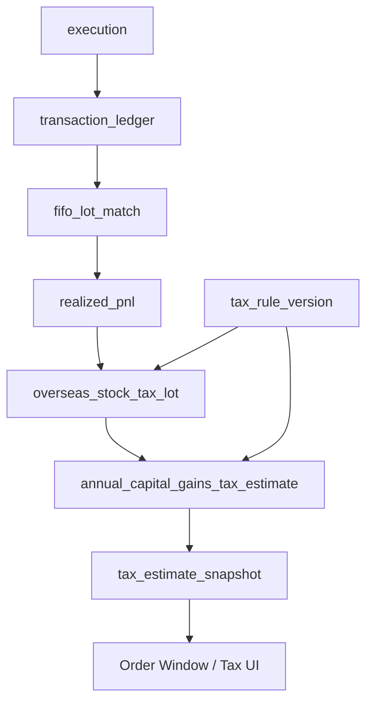

# 해외 주식 양도소득세 예상 계산 및 세금 리포트 설계서

- 작성일: 2026-05-22
- 문서 버전: 0.1
- 저장 위치: `/home/jhkim5/silver_platter`
- 선행 문서:
  - `01_quant_auto_trading_requirements_definition_20260522.md`
  - `02_overall_system_architecture_design_20260522.md`
  - `03_domain_data_model_erd_draft_20260522.md`
  - `04_goldilocks_initial_schema_design_20260522.md`
  - `06_trade_ledger_fifo_realized_pnl_design_20260522.md`

## 1. 문서 목적

이 문서는 해외 주식 매매로 발생한 연간 실현손익을 기준으로 양도소득세 예상 정보를 실시간 계산하고, 주문창과 세금 화면에 표시하는 구조를 정의한다.

이 기능은 투자 의사결정과 세후 손익 추정을 돕는 단순 보조 리포트 기능이다. 실제 세금 신고와 납부는 사용자가 증권사 자료, 홈택스, 세무 전문가 검토를 통해 확정해야 한다.

## 2. 설계 원칙

1. 예상 정보와 신고 확정 자료를 분리한다.
   화면과 API 응답에는 항상 `is_final_for_filing = false`를 기본 표시한다.

2. 계산 규칙은 버전 관리한다.
   세율, 기본공제, 신고 기간, 손익통산 범위, 환율 기준은 `tax_rule_version`으로 관리한다.

3. FIFO 실현손익을 입력으로 사용한다.
   매도 체결의 과세 입력은 `fifo_lot_match`와 `realized_pnl` 결과에서 생성한다.

4. 원화 기준 계산 근거를 보존한다.
   취득가액, 양도가액, 필요경비, 환율, 수수료, 세금의 원화 환산 근거를 남긴다.

5. 주문 전 preview와 체결 후 확정 입력을 분리한다.
   주문창은 가정값으로 예상세액 변화를 보여주고, 실제 체결 후 다시 계산한다.

6. live, paper, simulation을 분리 표시한다.
   simulation 계좌 세금은 학습/검증용 예상 정보로만 표시한다.

## 3. 공식 기준과 기본값

2026-05-22 기준 기본 설정값:

| 항목 | 기본값 |
| --- | --- |
| 과세 대상 | 해외 주식 양도차익 |
| 계산 통화 | 원화 |
| 기본공제 | 국내/국외 주식 합산 연 2,500,000원 |
| 국세 세율 | 20% |
| 지방소득세 | 국세의 10%, 실효 2% |
| 총 기본 세율 | 22% |
| 확정신고/납부 기간 | 양도한 해의 다음 해 5월 |
| 기본 과세연도 기준 | 매도 거래일 기준 연도 |

공식 근거:

- 국세청 양도소득세 세액계산요령: 국외주식등 과세대상, 국내/국외주식 손익통산, 합산 기본공제
- 국세청 해외주식과 세금 안내: 해외주식 양도소득세 계산구조, 기본공제, 주식 기본 세율, 다음 해 5월 확정신고
- 지방소득세는 양도소득세의 10%로 별도 관리한다.

주의:

- 세법은 변경될 수 있으므로 모든 수치는 `tax_rule_version`에서 기준일과 함께 관리한다.
- 증권사별 원화 환산, 수수료 필요경비 반영 방식, 거래일/결제일 기준은 차이가 날 수 있다.
- 본 시스템의 값은 예상 정보이며 신고용 확정 자료가 아니다.

## 4. 전체 계산 흐름

```text
execution
  -> transaction_ledger
  -> position_lot
  -> fifo_lot_match
  -> realized_pnl
  -> overseas_stock_tax_lot
  -> annual_capital_gains_tax_estimate
  -> tax_estimate_snapshot
  -> order window / tax report UI
```



## 5. 핵심 테이블

### 5.1 `tax_rule_version`

세법과 계산 기준의 버전을 관리한다.

필수 컬럼:

| 컬럼 | 설명 |
| --- | --- |
| `tax_rule_version_id` | PK |
| `rule_code` | 예: `kr_overseas_stock_2026` |
| `country_code` | 납세 기준 국가. 초기값 `KR` |
| `asset_scope` | overseas_stock, domestic_stock 등 |
| `effective_from` | 적용 시작일 |
| `effective_to` | 적용 종료일 |
| `basic_deduction_krw` | 기본공제 |
| `national_tax_rate` | 국세 세율 |
| `local_tax_rate_on_national_tax` | 지방소득세율 |
| `tax_year_basis` | trade_date 또는 settlement_date |
| `gain_loss_netting_scope` | 손익통산 범위 |
| `filing_period_rule` | 신고/납부 기간 규칙 |
| `rounding_rule` | 원 단위 반올림/절사 정책 |
| `is_active` | 활성 여부 |

### 5.2 `overseas_stock_tax_lot`

FIFO 실현손익을 세금 계산용 lot으로 변환한 테이블이다.

필수 컬럼:

| 컬럼 | 설명 |
| --- | --- |
| `overseas_stock_tax_lot_id` | PK |
| `tax_year` | 과세연도 |
| `account_id` | 계좌 |
| `security_id` | 종목 |
| `sell_transaction_id` | 매도 거래 원장 id |
| `fifo_lot_match_id` | FIFO 매칭 id |
| `realized_pnl_id` | 실현손익 id |
| `sell_trade_date` | 매도 거래일 |
| `settlement_date` | 결제일 |
| `currency_code` | 거래 통화 |
| `sell_fx_rate_to_krw` | 매도 환율 |
| `buy_fx_rate_to_krw` | 매수 환율 또는 매수 원화 원가 |
| `proceeds_krw` | 양도가액 |
| `cost_basis_krw` | 취득가액 |
| `expense_krw` | 필요경비 |
| `taxable_gain_loss_krw` | 세금 계산용 손익 |
| `tax_rule_version_id` | 적용 세법 버전 |
| `calculation_status` | calculated, pending_fx, excluded, error |

### 5.3 `annual_capital_gains_tax_estimate`

과세연도별 예상세액 집계 테이블이다.

필수 컬럼:

| 컬럼 | 설명 |
| --- | --- |
| `annual_capital_gains_tax_estimate_id` | PK |
| `tax_year` | 과세연도 |
| `account_id` | 계좌. 전체 통합 집계 row도 허용 가능 |
| `account_mode` | live, paper, simulation |
| `tax_rule_version_id` | 적용 세법 버전 |
| `realized_gain_krw` | 이익 합계 |
| `realized_loss_krw` | 손실 합계 |
| `net_gain_loss_krw` | 손익통산 후 금액 |
| `basic_deduction_applied_krw` | 기본공제 적용액 |
| `remaining_basic_deduction_krw` | 남은 기본공제 |
| `taxable_income_krw` | 과세표준 |
| `national_tax_krw` | 국세 예상 |
| `local_income_tax_krw` | 지방소득세 예상 |
| `total_estimated_tax_krw` | 총 예상세액 |
| `is_final_for_filing` | 신고 확정 자료 여부. MVP 기본 false |
| `estimated_at` | 계산 시각 |

### 5.4 `tax_estimate_snapshot`

주문창 또는 화면 표시 시점의 예상세액 snapshot이다.

사용처:

- 매도 주문 사전 preview
- 실시간 세금 화면
- 월간 검토 리포트
- simulation 결과 비교

필수 컬럼:

| 컬럼 | 설명 |
| --- | --- |
| `tax_estimate_snapshot_id` | PK |
| `snapshot_type` | current, order_preview, simulation, monthly_report |
| `account_id` | 계좌 |
| `order_request_id` | 주문 preview인 경우 |
| `simulation_session_id` | simulation인 경우 |
| `tax_year` | 과세연도 |
| `before_total_tax_krw` | 주문 전 예상세액 |
| `after_total_tax_krw` | 주문 후 예상세액 |
| `tax_delta_krw` | 증가/감소 예상 |
| `after_tax_pnl_krw` | 세후 예상손익 |
| `assumption_summary` | 가정 요약 |
| `estimated_at` | 계산 시각 |

## 6. 세금 계산 산식

### 6.1 lot별 양도차익

```text
proceeds_krw = sell_quantity * sell_price * sell_fx_rate_to_krw
cost_basis_krw = matched_quantity * buy_unit_cost_krw
expense_krw = allocated_sell_fee_krw + other_allowable_expense_krw
taxable_gain_loss_krw = proceeds_krw - cost_basis_krw - expense_krw
```

매수 수수료가 `buy_unit_cost_krw`에 포함되어 있으면 필요경비에서 중복 차감하지 않는다.

### 6.2 연간 집계

```text
realized_gain_krw = sum(max(taxable_gain_loss_krw, 0))
realized_loss_krw = sum(min(taxable_gain_loss_krw, 0))
net_gain_loss_krw = realized_gain_krw + realized_loss_krw
basic_deduction_applied_krw = min(max(net_gain_loss_krw, 0), basic_deduction_krw)
taxable_income_krw = max(0, net_gain_loss_krw - basic_deduction_applied_krw)
national_tax_krw = taxable_income_krw * national_tax_rate
local_income_tax_krw = national_tax_krw * local_tax_rate_on_national_tax
total_estimated_tax_krw = national_tax_krw + local_income_tax_krw
```

### 6.3 손실 처리

- 같은 과세연도 내 손실은 이익과 통산한다.
- 손익통산 후 순손실이면 예상세액은 0으로 표시한다.
- 손실 이월공제 여부는 초기 MVP 범위에서 제외하고 세법 설정에서 확장 가능하도록 둔다.

### 6.4 반올림

초기 UI에서는 원 단위로 표시한다. 실제 세금 신고 단위의 절사/반올림은 `tax_rule_version.rounding_rule`에서 관리하고, 신고용 리포트 확장 시 확정한다.

## 7. 환율 기준

### 7.1 환율 입력

환율은 세금 계산에서 가장 중요한 외부 입력이다.

필수 속성:

- `fx_provider_id`
- `fx_rate_to_krw`
- `fx_rate_date`
- `fx_rate_ts`
- `fx_rate_type`: close, trade_time, broker_applied, manual
- `fx_source_ref`

### 7.2 기본 정책

초기 기본값:

- 매수 원가는 매수 체결 시점 또는 broker 제공 원화 원가를 우선한다.
- 매도 금액은 매도 거래일 기준 환율을 사용한다.
- broker가 제공한 원화 환산 금액이 있으면 원본으로 보존하고 내부 환율 계산값과 대사한다.
- 환율 누락 시 세금 예상은 `pending_fx`로 표시하고 주문창에는 경고한다.

### 7.3 환율 대사

대사 항목:

- broker 제공 원화 손익
- 내부 계산 원화 손익
- 환율 source
- 환율 적용 일자
- 오차 금액

오차가 임계값을 넘으면 예상세액 confidence를 낮추고 운영 알림을 생성한다.

## 8. 주문창 예상세액 계산

### 8.1 입력

```text
account_id
security_id
sell_quantity
expected_sell_price
expected_fee
expected_tax
expected_fx_rate_to_krw
order_type
account_mode
tax_year
```

### 8.2 흐름

```text
open position_lot FIFO 조회
  -> hypothetical fifo match
  -> lot별 예상 taxable_gain_loss_krw
  -> 현재 annual estimate 조회
  -> 주문 후 annual estimate 재계산
  -> tax_estimate_snapshot 생성
  -> 주문창 표시
```

### 8.3 표시 항목

- 주문 전 연간 실현손익
- 주문 후 예상 연간 실현손익
- 남은 기본공제
- 예상 과세표준
- 예상 국세
- 예상 지방소득세
- 총 예상세액 변화
- 세후 예상손익
- 적용 환율
- 적용 세법 버전
- 신고 확정 자료가 아니라는 경고

## 9. 세금 리포트 화면

### 9.1 요약 화면

과세연도별 표시:

- 실현 이익 합계
- 실현 손실 합계
- 손익통산 후 금액
- 기본공제 적용액
- 남은 기본공제
- 과세표준
- 국세 예상
- 지방소득세 예상
- 총 예상세액
- 신고 예정 기간
- 마지막 계산 시각

### 9.2 거래별 상세

거래별 drill-down:

- 종목
- 매도일
- 매도 수량
- 매도 금액
- 연결된 매수 lot
- 매수일
- 취득가액
- 필요경비
- 양도차익
- 적용 환율
- FIFO 매칭 id
- 계산 상태

### 9.3 신뢰도 표시

신뢰도 상태:

| 상태 | 의미 |
| --- | --- |
| `complete` | FIFO, 환율, 수수료, 세법 버전 모두 있음 |
| `estimated_fee` | 수수료가 예상값 |
| `pending_fx` | 환율 누락 또는 미확정 |
| `broker_mismatch` | broker 원화 손익과 차이 큼 |
| `rule_expired` | 세법 설정 버전 만료 |
| `error` | 계산 실패 |

## 10. API 설계 후보

### 10.1 현재 예상세액 조회

```text
GET /accounts/{account_id}/tax/overseas-stock-estimate?tax_year=2026
```

응답 필드:

- `tax_year`
- `account_id`
- `account_mode`
- `tax_rule_version`
- `net_gain_loss_krw`
- `basic_deduction_applied_krw`
- `remaining_basic_deduction_krw`
- `taxable_income_krw`
- `national_tax_krw`
- `local_income_tax_krw`
- `total_estimated_tax_krw`
- `estimated_at`
- `is_final_for_filing`
- `confidence_status`

### 10.2 주문 전 예상세액 preview

```text
POST /accounts/{account_id}/tax/overseas-stock-preview
```

입력:

- `security_id`
- `sell_quantity`
- `expected_sell_price`
- `expected_fee`
- `expected_fx_rate_to_krw`
- `order_request_id` optional

응답:

- hypothetical FIFO matches
- before tax estimate
- after tax estimate
- tax delta
- after-tax expected P&L
- warnings

### 10.3 거래별 근거 조회

```text
GET /accounts/{account_id}/tax/overseas-stock-lots?tax_year=2026
```

응답:

- `overseas_stock_tax_lot` 목록
- FIFO 매칭 근거
- 환율 근거
- 수수료/세금 근거
- 계산 상태

### 10.4 세법 버전 조회

```text
GET /tax/rules/overseas-stock?as_of=2026-05-22
```

응답:

- 적용 세법 버전
- 기본공제
- 세율
- 신고 기간
- 손익통산 범위
- 유효기간
- source reference

## 11. 계산 trigger

| 이벤트 | 처리 |
| --- | --- |
| 해외 주식 매도 체결 | tax lot 생성, 연간 예상세액 재계산 |
| FIFO 매칭 재계산 | 관련 tax lot과 연간 예상세액 재계산 |
| 환율 적재/수정 | pending tax lot 재계산 |
| 수수료/세금 정정 | tax lot 재계산 |
| 세법 버전 변경 | 해당 연도 전체 재계산 |
| 주문창 preview 요청 | snapshot-only 계산 |
| simulation 체결 | simulation 세금 예상 재계산 |

## 12. Batch 재계산

### 12.1 일간 batch

- 당일 해외 주식 매도 체결 확인
- pending_fx tax lot 확인
- 연간 예상세액 재계산
- broker 원화 손익과 내부 손익 대사
- 세금 화면 snapshot 갱신

### 12.2 월간 batch

- 과세연도 전체 tax lot 재계산
- 세법 버전 만료 여부 확인
- 증권사 제공 자료와 차이 비교
- 장기 pending_fx 또는 broker_mismatch 정리

### 12.3 연말/신고 전 batch

- 과세연도 전체 거래 재검산
- 기본공제 사용액 검증
- 국내/국외 손익통산 범위 점검
- 신고용 참고 리포트 생성
- `is_final_for_filing`은 기본 false 유지

## 13. 오류 처리

| 오류 | 처리 |
| --- | --- |
| 환율 누락 | `pending_fx`, 예상세액 보류 또는 낮은 신뢰도 표시 |
| FIFO 매칭 누락 | 세금 계산 중단, 원장 오류 알림 |
| 수수료 누락 | 예상값 표시, broker 재조회 |
| 세법 버전 없음 | 계산 중단, 운영 알림 |
| 세법 버전 만료 | `rule_expired`, UI 경고 |
| broker 손익 불일치 | `broker_mismatch`, 상세 비교 제공 |
| 음수 과세표준 | 예상세액 0, 손실 상태 표시 |
| simulation 데이터 혼입 | 계산 범위에서 분리, 운영 알림 |

## 14. 보안과 감사

감사 로그 대상:

- 세법 버전 생성/수정
- 수동 환율 입력/수정
- 수수료/세금 수동 보정
- tax lot 재계산
- 연간 예상세액 재계산
- 신고 참고 리포트 다운로드

보안 원칙:

- 세금 리포트는 개인 금융정보이므로 인증된 사용자에게만 제공한다.
- 외부 공유용 export는 기본 비활성화한다.
- export 파일에는 생성 시각, 기준 세법 버전, 예상 정보 disclaimer를 포함한다.

## 15. UI 문구 기준

모든 해외 주식 세금 화면에는 아래 취지의 문구를 표시한다.

```text
이 화면의 세금은 내부 거래 원장과 현재 세법 설정을 기준으로 계산한 예상 정보입니다.
실제 신고 및 납부 금액은 증권사 자료, 홈택스, 세무 전문가 검토 결과와 다를 수 있습니다.
```

주문창에는 더 짧게 표시한다.

```text
세금은 예상치이며 실제 체결가, 환율, 수수료, 신고 기준에 따라 달라질 수 있습니다.
```

## 16. 테스트 계획

### 16.1 단위 테스트

- lot별 양도차익 계산
- 수수료 필요경비 차감
- 손익통산
- 기본공제 적용
- 국세/지방소득세 계산
- 순손실 예상세액 0 처리
- 환율 누락 상태 처리
- 세법 버전 만료 처리
- 주문 전 preview 계산

### 16.2 통합 테스트

- 해외 주식 매도 체결에서 tax lot 생성까지
- FIFO 재계산 후 tax lot 재계산
- 환율 수집 후 pending tax lot 갱신
- 주문창 preview와 실제 체결 후 예상세액 비교
- simulation 계좌와 live 계좌 세금 분리
- annual estimate와 거래별 drill-down 합계 일치

### 16.3 검산 케이스

| 케이스 | 기대 결과 |
| --- | --- |
| 연간 순이익 2,000,000원 | 기본공제 이하, 예상세액 0 |
| 연간 순이익 5,000,000원 | 과세표준 2,500,000원 |
| 연간 이익 10,000,000원, 손실 -3,000,000원 | 순이익 7,000,000원 기준 |
| 순손실 -1,000,000원 | 예상세액 0 |
| 환율 누락 거래 포함 | confidence `pending_fx` |
| 세법 버전 없음 | 계산 실패와 운영 알림 |

## 17. 운영 점검

일간:

- 해외 주식 매도 체결의 tax lot 생성 여부
- 환율 누락 tax lot
- 세법 버전 만료 여부
- broker 원화 손익 불일치

월간:

- 연간 예상세액 전체 재계산
- 증권사 제공 자료와 차이 확인
- 오래된 `pending_fx`, `broker_mismatch` 정리

신고 전:

- 과세연도 전체 거래 대사
- 기본공제 적용 검산
- 환율 source 확인
- 신고 참고 리포트 생성

## 18. 미결정 사항

1. 환율 source: broker 제공 환율, 서울외국환중개, 한국은행, provider 환율 중 우선순위
2. 수수료와 제세금의 필요경비 인정 범위
3. 국내 주식 손익과 해외 주식 손익통산을 MVP에서 함께 구현할지 여부
4. 단순 보조 리포트의 법적 문구와 export 형식
5. 원 단위 절사/반올림 규칙
6. 여러 증권사 계좌 통합 집계 방식
7. 양도소득세 예정/확정 신고 구분 표시 범위
8. 세법 개정 시 과거 예상세액 snapshot 재계산 여부
9. simulation 계좌 세금 화면의 기본 노출 여부

## 18.1 결정 반영 사항

- 세금 리포트 범위는 신고 확정 자료가 아니라 단순 보조 리포트다.
- 거래일과 결제일은 모두 저장하고 계산 기준은 `tax_rule_version`에 명시한다.
- 지방소득세 표시, 환율 source, 수수료 필요경비 범위, 신고 자료 수준 관련 필드를 포함한다.

## 19. 다음 작업

다음 산출물은 `08_클라이언트_실시간_테스트_모드와_가상_계좌_시뮬레이션_설계서`이다. 이 문서에서는 가상 계좌, simulation adapter, 가상 체결 정책, 실시간 테스트 화면, 실거래 분리 통제를 상세화한다.

## 20. 참고 자료

- 국세청, 양도소득세 세액계산요령: https://www.nts.go.kr/nts/cm/cntnts/cntntsView.do?cntntsId=8800&mi=12274
- 국세청, 해외주식과 세금 안내 PDF: https://taxlaw.nts.go.kr/downloadPDFFile.do?fleId=300000000001047678&fleSn=923559
