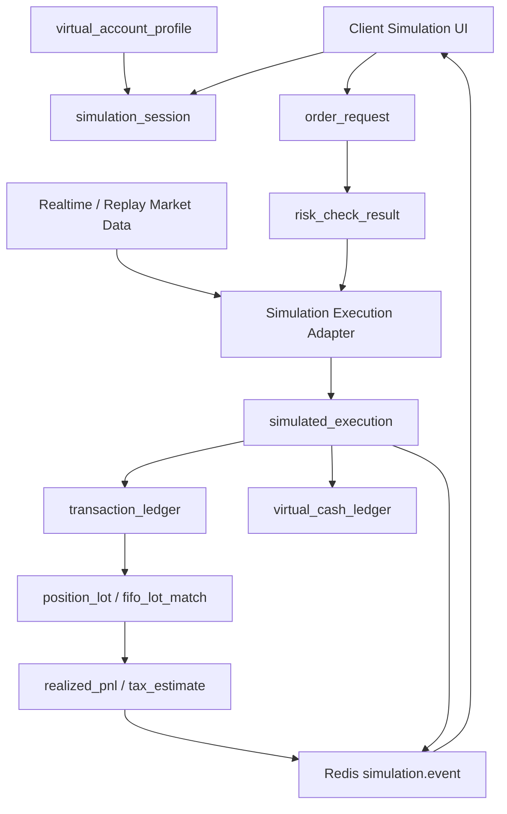

# 클라이언트 실시간 테스트 모드와 가상 계좌 시뮬레이션 설계서

- 작성일: 2026-05-22
- 문서 버전: 0.1
- 저장 위치: `/home/jhkim5/silver_platter`
- 선행 문서:
  - `01_quant_auto_trading_requirements_definition_20260522.md`
  - `02_overall_system_architecture_design_20260522.md`
  - `03_domain_data_model_erd_draft_20260522.md`
  - `04_goldilocks_initial_schema_design_20260522.md`
  - `06_trade_ledger_fifo_realized_pnl_design_20260522.md`
  - `07_overseas_stock_capital_gains_tax_design_20260522.md`

## 1. 문서 목적

이 문서는 클라이언트에서 실제 시장 데이터를 보면서 가상 계좌로 주문, 체결, 포지션, 현금, 손익, 리스크 변화를 검증하는 실시간 테스트 모드의 설계를 정의한다.

핵심 목표는 실거래와 같은 주문/리스크/회계 흐름을 사용하되, broker API와 물리적으로 분리된 simulation adapter를 사용해 실제 주문이 발생하지 않도록 하는 것이다.

## 2. 범위

포함 범위:

- 가상 계좌 생성/초기화
- 실시간 테스트 세션 생성/일시정지/재개/종료
- 실제 시장 데이터 기반 가상 체결
- replay 데이터 기반 시뮬레이션
- 시장가/지정가/부분체결/미체결/거부/지연 체결 모의
- 저유동성 3배 슬리피지 반영
- 가상 현금, 포지션, FIFO 손익, 해외 주식 세금 예상 반영
- 리스크 체크와 주문 전 차단 규칙 적용
- session snapshot 저장과 결과 비교
- Client 실시간 화면과 알림
- 감사 로그와 실거래 분리 통제

제외 범위:

- 실거래 broker 주문 전송
- 고빈도 체결 시뮬레이션
- 실제 시장 impact 모델
- 옵션/선물/공매도 simulation
- 기관급 다중 사용자 운용 권한 체계

## 3. 설계 원칙

1. simulation 주문은 broker adapter로 전달될 수 없다.
   `account_mode = simulation`이면 routing layer에서 simulation adapter만 허용한다.

2. 주문 상태 기계는 실거래와 동일하게 사용한다.
   단, 체결 원천은 `simulated_execution`이다.

3. 리스크 엔진은 simulation에도 동일하게 적용한다.
   단일 종목 투자금액 한도, 저유동성 3배 슬리피지, 사업 그룹 한도, 주문 전 체크를 모두 수행한다.

4. 회계 계산 로직은 실거래와 동일하게 사용한다.
   가상 체결은 `transaction_ledger`, `virtual_cash_ledger`, `position_lot`, `fifo_lot_match`, `realized_pnl`로 이어진다.

5. 결과는 실거래 성과와 분리 표시한다.
   simulation 성과는 검증/학습용이며 실거래 리포트에 합산하지 않는다.

6. 세션은 재현 가능해야 한다.
   초기 자산, 시장 데이터 source, 체결 정책, 슬리피지 정책, 리스크 규칙 버전을 저장한다.

## 4. 전체 흐름

```text
Client
  -> create_simulation_session
  -> virtual_account_profile 선택/생성
  -> 시장 데이터 source 선택
  -> 가상 주문 생성
  -> risk_check_result
  -> simulation execution adapter
  -> simulated_execution
  -> transaction_ledger
  -> virtual_cash_ledger
  -> position_lot / fifo_lot_match / realized_pnl
  -> tax estimate / risk metric
  -> Redis publish
  -> Client realtime update
```



## 5. 핵심 테이블

| 테이블 | 역할 |
| --- | --- |
| `virtual_account_profile` | 가상 계좌 템플릿과 초기 조건 |
| `simulation_session` | 실시간 테스트 세션 |
| `simulation_event_log` | 세션 내 이벤트 로그 |
| `order_request` | simulation 주문 요청 |
| `risk_check_result` | 주문 전 리스크 체크 |
| `simulated_execution` | 가상 체결 |
| `transaction_ledger` | 가상 거래 원장 포함 |
| `virtual_cash_ledger` | 가상 현금 원장 |
| `position_lot` | 가상 매수 lot 포함 |
| `fifo_lot_match` | 가상 매도 FIFO 매칭 포함 |
| `realized_pnl` | 가상 실현손익 포함 |
| `tax_estimate_snapshot` | 가상 세금 예상 snapshot |
| `audit_log` | 사용자 조작/모드 변경 감사 |

## 6. 가상 계좌 프로필

### 6.1 `virtual_account_profile`

가상 계좌 프로필은 반복 사용할 수 있는 시뮬레이션 초기 조건이다.

필수 항목:

| 항목 | 설명 |
| --- | --- |
| `profile_name` | 가상 계좌 템플릿 이름 |
| `base_currency_code` | 기준 통화 |
| `initial_cash_krw` | 초기 원화 현금 |
| `initial_cash_usd` | 초기 USD 현금 |
| `market_scope` | 국내, 미국, 국내+미국 등 |
| `initial_positions` | 초기 보유 종목 목록 |
| `fee_policy_id` | 수수료 정책 |
| `tax_rule_version_id` | 세금 정책 |
| `slippage_rule_id` | 슬리피지 정책 |
| `execution_policy_id` | 체결 정책 |
| `risk_profile_id` | 리스크 한도 |

### 6.2 초기 보유 종목

초기 보유 종목은 실제 체결이 아니므로 synthetic buy transaction으로 원장화한다.

```text
initial position
  -> synthetic transaction_ledger(type=buy, source_event_type=simulation_seed)
  -> position_lot 생성
  -> virtual_cash_ledger 초기 조정
```

초기 lot에는 `simulation_session_id`와 `source_event_type = simulation_seed`를 연결한다.

## 7. Simulation Session

### 7.1 상태

```text
created
running
paused
completed
cancelled
failed
archived
```

### 7.2 세션 필수 속성

| 항목 | 설명 |
| --- | --- |
| `simulation_session_id` | 세션 id |
| `profile_id` | 가상 계좌 프로필 |
| `session_name` | 사용자가 지정한 이름 |
| `market_data_mode` | realtime 또는 replay |
| `replay_start_at` | replay 시작 시각 |
| `replay_end_at` | replay 종료 시각 |
| `replay_speed` | 1x, 5x 등 |
| `execution_policy_version` | 체결 정책 버전 |
| `risk_rule_version` | 리스크 규칙 버전 |
| `tax_rule_version_id` | 세금 규칙 버전 |
| `started_at` | 시작 시각 |
| `ended_at` | 종료 시각 |
| `status` | 상태 |

### 7.3 세션 제어

| 동작 | 처리 |
| --- | --- |
| 시작 | 초기 현금/보유 종목 반영, market subscription 시작 |
| 일시정지 | 신규 가상 체결 중단, 시장 데이터 수신은 선택 유지 |
| 재개 | 체결 engine 재개 |
| 초기화 | 기존 session 종료 후 새 session 생성 |
| 종료 | 최종 snapshot 생성 |
| archive | 조회 전용 상태로 전환 |

## 8. 시장 데이터 입력

### 8.1 Realtime 모드

실제 수신 중인 현재가/체결/호가를 사용한다.

```text
market.trade.{security_id}
market.quote.{security_id}
  -> simulation market cache
  -> execution engine
  -> Client update
```

Realtime 모드는 현재 시장 상태를 이용한 연습에 적합하지만, 재현성은 replay보다 낮다. 세션 metadata에 market data source와 수신 시각을 기록한다.

### 8.2 Replay 모드

과거 `price_bar`, `trade_tick`, `quote_tick` 또는 Parquet dataset을 시간순으로 재생한다.

Replay 모드 장점:

- 같은 조건 반복 실행
- 전략 파라미터 비교
- 체결 정책 비교
- 공시/헤드라인 이벤트 replay
- 장애 시나리오 재현

### 8.3 데이터 지연/결측 처리

| 상황 | 처리 |
| --- | --- |
| 현재가 없음 | 주문 preview만 제공, 체결 보류 |
| 호가 없음 | last trade 기반 체결 또는 보수적 슬리피지 적용 |
| 데이터 지연 | 화면 경고, 체결 engine 일시정지 가능 |
| replay gap | gap 이벤트 기록, 해당 구간 성과 신뢰도 하향 |

## 9. 체결 정책

### 9.1 정책 구성

| 정책 | 설명 |
| --- | --- |
| `fill_model` | market, quote_based, bar_based |
| `latency_ms` | 주문 제출 후 체결 지연 |
| `partial_fill_enabled` | 부분체결 허용 |
| `max_fill_ratio_per_tick` | tick당 최대 체결 비율 |
| `slippage_model` | fixed, liquidity_based, spread_based |
| `low_liquidity_multiplier` | 기본 3 |
| `reject_on_price_gap` | 가격 괴리 시 거부 |
| `allow_after_hours` | 시간외 체결 허용 여부 |

### 9.2 시장가 체결

기본 산식:

```text
execution_price = reference_price + side_sign * slippage
```

`side_sign`:

- buy: +1
- sell: -1

저유동성 종목:

```text
effective_slippage = base_slippage * 3
```

### 9.3 지정가 체결

매수:

```text
fillable = market_ask_price <= limit_price
```

매도:

```text
fillable = market_bid_price >= limit_price
```

호가가 없는 경우:

- last trade 기준 보수적 판단
- 지정가 체결 확률 하향
- 체결 보류 정책 선택 가능

### 9.4 부분체결

부분체결은 거래량과 설정된 최대 체결 비율을 반영한다.

```text
max_fill_quantity = observed_volume * max_fill_ratio_per_tick
fill_quantity = min(order_remaining_quantity, max_fill_quantity)
```

부분체결이 여러 번 발생하면 각 `simulated_execution`이 독립적으로 원장/FIFO를 갱신한다.

## 10. 주문 처리 흐름

### 10.1 생성

Client에서 가상 주문을 생성해도 `order_request`는 실거래와 같은 구조로 생성한다.

필수 값:

- `account_mode = simulation`
- `simulation_session_id`
- `idempotency_key`
- `order_side`
- `order_type`
- `quantity`
- `limit_price`
- `expected_amount_krw`

### 10.2 리스크 체크

Simulation 주문도 리스크 엔진을 통과해야 한다.

검사 항목:

- 가상 현금 잔액
- 보유 수량
- 단일 종목 투자금액 100,000원~1,000,000,000원
- 사업 그룹 한도
- 유동성 점수
- 저유동성 3배 슬리피지
- 공시/헤드라인/국제 정세 이벤트 경고
- 중복 주문

### 10.3 Routing 통제

```text
if account_mode == "simulation":
    route_to = simulation_execution_adapter
elif account_mode == "paper":
    route_to = paper_adapter
elif account_mode == "live":
    route_to = broker_adapter
```

추가 통제:

- `simulation_session_id` 없는 simulation 주문은 거부한다.
- simulation 주문이 broker credential에 접근하면 audit error를 기록하고 중단한다.
- UI는 session 상태가 running이 아니면 신규 주문을 막는다.

## 11. 원장 반영

### 11.1 매수 체결

```text
simulated_execution
  -> transaction_ledger(type=buy, account_mode=simulation)
  -> virtual_cash_ledger(cash decrease)
  -> position_lot 생성
  -> portfolio/risk snapshot 갱신
```

### 11.2 매도 체결

```text
simulated_execution
  -> transaction_ledger(type=sell, account_mode=simulation)
  -> virtual_cash_ledger(cash increase)
  -> open position_lot FIFO 조회
  -> fifo_lot_match 생성
  -> realized_pnl 생성
  -> tax_estimate_snapshot 갱신
```

### 11.3 주문 취소

미체결 잔량은 취소 가능하다. 이미 체결된 수량은 원장에 남기며 되돌리지 않는다.

## 12. 성과와 리스크 지표

### 12.1 세션 성과

필수 지표:

- 초기 자산
- 현재 자산
- 누적수익률
- 실현손익
- 미실현손익
- 수수료/세금
- 슬리피지 비용
- 회전율
- 승률
- 평균 이익/손실
- MDD
- 변동성
- VaR/CVaR
- 리스크 한도 위반 횟수

### 12.2 비교 기능

비교 축:

- 같은 전략, 다른 체결 정책
- 같은 전략, 다른 슬리피지
- 같은 전략, 다른 리스크 한도
- replay 기간별 비교
- simulation vs paper trading

비교 결과는 실거래 성과와 합산하지 않는다.

## 13. Client UI 설계

### 13.1 화면 구성

주요 화면:

- 모드 표시 banner
- 가상 계좌 선택/생성
- 초기 자산 설정
- 세션 시작/일시정지/재개/종료
- 가상 주문창
- 가상 체결/미체결 목록
- 가상 현금과 포지션
- FIFO 손익
- 해외 주식 예상세액
- 리스크 경고
- 성과 요약
- session snapshot 비교

### 13.2 모드 표시

Simulation 모드에서는 화면 전체에서 식별 가능해야 한다.

표시 기준:

- 상단 고정 banner
- 주문 버튼 주변 mode label
- 주문 확인 modal에 `simulation 주문` 명시
- 실거래 주문과 다른 색상/문구
- session id 표시

### 13.3 주문창

Simulation 주문창 필수 표시:

- 현재 가격/호가
- 예상 체결 가격
- 예상 슬리피지
- 저유동성 3배 슬리피지 여부
- 주문 전 리스크 체크
- 매도 시 FIFO 예상 손익
- 해외 주식 예상세액 변화
- 체결 정책 버전
- simulation 주문이며 실거래가 아니라는 문구

## 14. API 설계 후보

### 14.1 세션 생성

```text
POST /simulation/sessions
```

입력:

- `profile_id`
- `session_name`
- `market_data_mode`
- `replay_start_at`
- `replay_end_at`
- `replay_speed`
- `execution_policy`

응답:

- `simulation_session_id`
- `status`
- `account_id`
- 초기 현금/포지션

### 14.2 세션 제어

```text
POST /simulation/sessions/{session_id}/pause
POST /simulation/sessions/{session_id}/resume
POST /simulation/sessions/{session_id}/complete
POST /simulation/sessions/{session_id}/reset
```

### 14.3 가상 주문

```text
POST /simulation/sessions/{session_id}/orders
```

입력:

- `security_id`
- `order_side`
- `order_type`
- `quantity`
- `limit_price`
- `client_order_key`

응답:

- `order_request_id`
- `risk_check_result`
- `expected_execution`
- `warnings`

### 14.4 이벤트 스트림

```text
GET /simulation/sessions/{session_id}/events/stream
```

또는 WebSocket:

```text
WS /ws/simulation/{session_id}
```

event type:

- `session_status_changed`
- `order_created`
- `risk_checked`
- `execution_created`
- `ledger_updated`
- `position_updated`
- `tax_estimate_updated`
- `risk_alert_created`
- `snapshot_created`

### 14.5 snapshot

```text
POST /simulation/sessions/{session_id}/snapshots
GET /simulation/sessions/{session_id}/snapshots
GET /simulation/snapshots/compare?left={snapshot_id}&right={snapshot_id}
```

## 15. Redis와 이벤트

### 15.1 Channel

```text
simulation.event.{session_id}
simulation.order.{session_id}
simulation.position.{session_id}
simulation.risk.{session_id}
simulation.tax.{session_id}
```

### 15.2 이벤트 원칙

- Goldilocks write 성공 후 publish한다.
- UI는 실시간 이벤트를 표시하되 새로고침 시 Goldilocks를 기준으로 복구한다.
- Redis 장애 시 polling으로 degrade한다.
- 이벤트 payload에는 `simulation_session_id`와 `account_mode`를 포함한다.

## 16. 감사와 보안 통제

### 16.1 감사 로그

기록 대상:

- 세션 생성/초기화/종료
- 가상 계좌 설정 변경
- 체결 정책 변경
- replay 기간 변경
- 가상 주문 생성/취소
- 리스크 체크 실패 후 재시도
- snapshot 생성/삭제
- simulation 주문의 broker adapter 접근 차단

### 16.2 실거래 분리 통제

필수 통제:

- `account_mode = simulation`이면 broker adapter 호출 금지
- simulation account에는 broker credential 연결 금지
- routing layer에서 mode별 adapter allowlist 검사
- 실거래 주문 API는 simulation session token을 거부
- simulation UI에서 live 계좌 선택 불가
- audit log로 mode 전환과 주문 routing을 추적

## 17. 오류 처리

| 오류 | 처리 |
| --- | --- |
| session 없음 | 주문 거부 |
| session paused/completed | 신규 주문 거부 |
| market data 없음 | 체결 보류, UI 경고 |
| 가상 현금 부족 | 리스크 체크 block |
| 보유 수량 부족 매도 | 리스크 체크 block |
| 체결 정책 오류 | session failed, 운영 알림 |
| Redis 장애 | polling degrade |
| Goldilocks write 실패 | session 일시정지 |
| broker adapter 접근 시도 | 즉시 차단, audit error |

## 18. 테스트 계획

### 18.1 단위 테스트

- session 상태 전이
- simulation routing allowlist
- 시장가 체결 가격 계산
- 지정가 fill 조건
- 부분체결 계산
- 저유동성 3배 슬리피지
- 가상 현금 부족 차단
- 보유 수량 부족 매도 차단
- FIFO 손익 반영
- snapshot 생성

### 18.2 통합 테스트

- 세션 생성부터 가상 주문/체결/원장 반영까지
- replay 데이터 기반 반복 실행 재현성
- simulation 체결 후 `virtual_cash_ledger` 갱신
- 매도 체결 후 FIFO와 세금 예상 갱신
- Redis 이벤트 수신 후 UI 상태 갱신
- Redis 장애 시 polling fallback
- simulation 주문이 broker adapter로 전달되지 않는지 검증

### 18.3 UI 테스트

- simulation banner 표시
- live/paper/simulation 모드 구분
- 가상 계좌 생성 wizard
- 세션 pause/resume/reset
- 가상 주문창
- 체결/미체결 목록
- 포지션/FIFO/세금 화면
- snapshot 비교 화면
- 모바일 viewport smoke test

## 19. 운영 점검

일간:

- 실패한 simulation session
- broker adapter 접근 차단 로그
- 가상 계좌 불일치
- simulation event publish 실패

주간:

- simulation과 paper trading 성과 괴리
- 체결 정책별 슬리피지 비용 차이
- replay 재현성 검증

월간:

- 오래된 simulation session archive
- 가상 계좌 데이터 정리 정책 검토
- simulation 결과가 실거래 의사결정에 사용된 이력 검토

## 20. 미결정 사항

1. 기본 가상 계좌 초기 자산 세부값
2. simulation replay 데이터 범위 세부값
3. 체결 지연 기본값
4. 부분체결 정책과 부분체결 모델의 거래량 사용 비율
5. 호가 데이터 부재 시 지정가 체결 판단 방식
6. simulation 세금 화면 기본 노출 여부
7. snapshot 보존 기간
8. session archive와 삭제 정책
9. simulation 결과를 전략 승격 기준에 반영하는 방식
10. multi-session 동시 실행 허용 여부

## 20.1 결정 반영 사항

- 실시간 테스트 모드는 가상 계좌 초기 자산, 체결 지연, 부분체결 정책, replay 데이터 제공 범위를 기본 설정으로 가져야 한다.
- 위 기본 설정의 구체적인 숫자와 범위는 후속 단계에서 다시 확인한다.

## 21. 다음 작업

다음 산출물은 `09_공시_이벤트_영향_분석_및_신규_공시_예측_설계서`이다. 이 문서에서는 과거 공시와 주가 반응 window를 학습하고, 신규 공시 발생 시 예상 주가 범위와 영향 기간을 예측하는 구조를 상세화한다.
