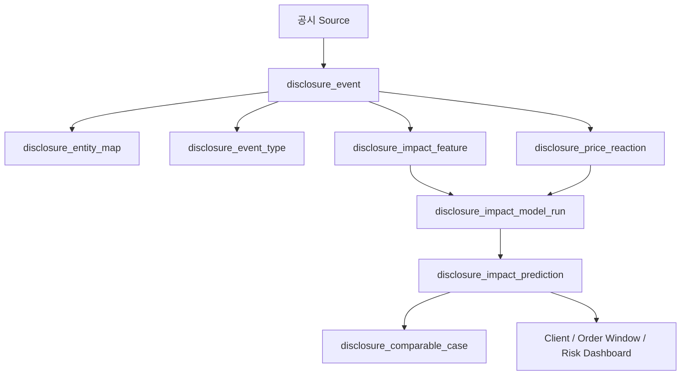

# 공시 이벤트 영향 분석 및 신규 공시 예측 설계서

- 작성일: 2026-05-22
- 문서 버전: 0.1
- 저장 위치: `/home/jhkim5/silver_platter`
- 선행 문서:
  - `01_quant_auto_trading_requirements_definition_20260522.md`
  - `02_overall_system_architecture_design_20260522.md`
  - `03_domain_data_model_erd_draft_20260522.md`
  - `05_data_collection_pipeline_detail_design_20260522.md`

## 1. 문서 목적

이 문서는 기업 공시와 이후 주가 반응의 관계를 분석하고, 신규 공시 발생 시 예상 주가 범위, 방향 확률, 영향 기간을 예측하는 기능의 상세 설계를 정의한다.

이 기능은 투자 판단 보조 정보다. 공시 영향 예측 결과는 주문 후보 점수, 주문창 경고, 리스크 대시보드, 실시간 테스트 모드에 제공할 수 있지만 자동 주문을 직접 발생시키지 않는다.

## 2. 설계 원칙

1. 공식 공시를 우선한다.
   OpenDART, KRX/KIND, SEC EDGAR, 거래소 공지, 기업 IR 등 출처가 확인 가능한 정보를 사용한다.

2. 시간 기준을 분리한다.
   `announced_at`, `disclosure_received_at`, `loaded_at`, `available_to_model_at`, `reaction_window_start_at`, `reaction_window_end_at`을 구분한다.

3. 미래정보 누수를 차단한다.
   공시 영향 모델의 feature는 `available_to_model_at` 이전에 알 수 있었던 데이터만 사용한다.

4. 예측은 범위와 확률로 제공한다.
   단일 목표가 대신 horizon별 하한/중앙값/상한, 방향 확률, 신뢰도를 표시한다.

5. 유사 사례를 함께 제공한다.
   모델 예측만 표시하지 않고, 과거 유사 공시와 당시 가격 경로를 함께 보여준다.

6. 정정 공시는 예측을 재계산한다.
   이전 예측은 삭제하지 않고 변경 사유와 함께 보존한다.

7. 자동 주문 직접 트리거로 사용하지 않는다.
   공시 예측은 주문 전 경고, 신규 매수 제한, 수동 검토 입력으로 사용한다.

## 3. 전체 흐름

```text
disclosure_event 수집
  -> entity mapping
  -> event type classification
  -> feature extraction
  -> historical reaction window calculation
  -> comparable case retrieval
  -> impact model prediction
  -> prediction persistence
  -> client alert / order window / risk dashboard
```



## 4. 수집 대상과 공시 유형

### 4.1 수집 대상

| source | 대상 |
| --- | --- |
| OpenDART | 국내 상장사 공시 |
| KRX/KIND | 거래소 공시, 거래정지, 투자유의 등 |
| SEC EDGAR | 미국 상장사 공시 |
| 거래소 공지 | 시장/상품/거래제도 관련 공지 |
| 기업 IR | 실적 발표, 가이던스, 주요 경영 발표 |

### 4.2 공시 유형 taxonomy

| 대분류 | 세부 유형 |
| --- | --- |
| 실적 | 잠정실적, 정기보고서, 실적 발표, 매출/영업이익 변경 |
| 전망 | 가이던스, 전망 상향/하향, 수주 전망 |
| 자본정책 | 배당, 자사주 매입/소각, 유상증자, 무상증자, 감자 |
| 자금조달 | 전환사채, 신주인수권부사채, 교환사채 |
| M&A | 합병, 분할, 영업양수도, 지분취득 |
| 계약 | 대규모 공급계약, 수주, 계약 해지 |
| 법률/규제 | 소송, 제재, 조사, 허가, 리콜 |
| 감사/회계 | 감사의견, 회계정정, 내부회계 |
| 거래상태 | 거래정지, 관리종목, 투자유의 |
| 경영 | 대표이사/임원 변경, 최대주주 변경 |

## 5. 핵심 테이블

| 테이블 | 역할 |
| --- | --- |
| `disclosure_event` | 공식 공시 이벤트 |
| `disclosure_entity_map` | 공시와 종목/회사 매핑 |
| `disclosure_event_type` | 공시 유형 taxonomy |
| `disclosure_price_reaction` | 공시 전후 가격/거래량/변동성 반응 |
| `disclosure_impact_feature` | 공시 영향 예측 feature |
| `disclosure_impact_model_run` | 모델 실행 이력 |
| `disclosure_impact_prediction` | 신규 공시 영향 예측 결과 |
| `disclosure_comparable_case` | 유사 과거 공시 사례 |
| `client_alert` | 신규 공시 영향 알림 |

## 6. 공시 이벤트 정규화

### 6.1 `disclosure_event`

필수 항목:

| 항목 | 설명 |
| --- | --- |
| `disclosure_event_id` | 내부 공시 id |
| `disclosure_uid` | source별 공시 고유 id |
| `provider_id` | OpenDART, SEC EDGAR 등 |
| `source_system` | source system |
| `company_name` | 공시 회사명 |
| `security_id` | 대표 종목 |
| `title` | 공시 제목 |
| `language` | ko, en 등 |
| `announced_at` | 공시 발표/접수 시각 |
| `disclosure_received_at` | 시스템 수신 시각 |
| `loaded_at` | 적재 시각 |
| `available_to_model_at` | 모델 사용 가능 시각 |
| `correction_status` | original, correction, withdrawn |
| `original_disclosure_event_id` | 정정 공시의 원공시 |
| `source_url` | 원문 링크 |

### 6.2 Entity mapping

공시는 여러 종목과 연결될 수 있다.

예:

- 발행회사 보통주
- 우선주
- ADR
- ETF 구성종목
- 사업 그룹 peer

`disclosure_entity_map`은 직접 영향과 간접 영향을 구분한다.

| 영향 유형 | 설명 |
| --- | --- |
| `issuer` | 공시 발행회사 |
| `listed_security` | 해당 상장 종목 |
| `subsidiary` | 자회사/관계회사 |
| `counterparty` | 계약 상대방 |
| `peer` | 사업 그룹 peer |
| `etf_component` | ETF 구성종목 |

## 7. Feature 추출

### 7.1 공시 텍스트/메타 feature

초기 MVP는 원문 본문 전체 저장을 전제로 하지 않는다. 허용된 title, metadata, key value, 원문 링크, 제한된 요약을 중심으로 feature를 만든다.

feature 후보:

- 공시 유형
- 제목 keyword
- 정정 여부
- 장전/장중/장후 여부
- 공시 회사의 시가총액
- 최근 변동성
- 최근 거래량 변화
- 최근 수익률
- 사업 그룹
- 시장 국면
- 유동성 점수
- 공시 내 핵심 수치 변화율
- 기존 가이던스 대비 차이

### 7.2 수치 추출 feature

수치가 있는 공시는 가능한 structured feature로 변환한다.

| 공시 유형 | feature |
| --- | --- |
| 실적 | 매출, 영업이익, 순이익, 전년동기 대비, 컨센서스 대비 |
| 배당 | DPS, 배당수익률, 배당성향 |
| 자사주 | 매입 규모, 시가총액 대비 비율, 소각 여부 |
| 유상증자 | 발행 규모, 할인율, 희석률 |
| 전환사채 | 발행 규모, 전환가, 희석 가능성 |
| 공급계약 | 계약 금액, 매출 대비 비율, 기간 |
| 소송/제재 | 청구 금액, 자기자본 대비 비율 |

### 7.3 Point-in-time feature

모델 입력 feature는 `available_to_model_at` 이전 데이터만 사용한다.

금지:

- 공시 이후 가격 반응
- 공시 이후 수정된 재무 데이터
- 공시 이후 headline sentiment
- 정정 공시 내용의 원공시 시점 소급 적용

## 8. 가격 반응 window

### 8.1 Reaction window

기본 window:

| window | 설명 |
| --- | --- |
| `pre_1d` | 공시 전 1거래일 |
| `pre_5d` | 공시 전 5거래일 |
| `post_30m` | 공시 후 30분 |
| `post_1h` | 공시 후 1시간 |
| `post_1d` | 공시 후 1거래일 |
| `post_3d` | 공시 후 3거래일 |
| `post_5d` | 공시 후 5거래일 |
| `post_20d` | 공시 후 20거래일 |

분봉 데이터가 없는 MVP에서는 `post_30m`, `post_1h`를 계산 보류하고 일봉 window부터 시작한다.

### 8.2 계산 지표

`disclosure_price_reaction`에 저장할 지표:

- raw return
- market-adjusted return
- business-group-adjusted return
- peer-adjusted return
- abnormal return
- cumulative abnormal return
- max favorable excursion
- max adverse excursion
- realized volatility change
- volume ratio
- liquidity change
- recovery days

### 8.3 시장 보정

기본 보정:

```text
abnormal_return = security_return - benchmark_return
group_adjusted_return = security_return - business_group_return
peer_adjusted_return = security_return - median(peer_returns)
```

시장 지수, 사업 그룹, peer 기준은 예측 결과에 함께 표시한다.

## 9. 유사 사례 검색

### 9.1 유사도 구성

유사 공시는 아래 점수를 조합해 찾는다.

| 구성 요소 | 설명 |
| --- | --- |
| 공시 유형 유사도 | event type |
| 텍스트 유사도 | 제목/요약/keyword |
| 수치 유사도 | 실적 surprise, 계약 규모 등 |
| 종목 특성 유사도 | 시가총액, 변동성, 유동성 |
| 사업 그룹 유사도 | 같은 business_group |
| 시장 국면 유사도 | 정상/위험/위기 |
| 발표 timing 유사도 | 장전/장중/장후 |

### 9.2 유사 사례 저장

`disclosure_comparable_case` 필수 항목:

- `prediction_id`
- `historical_disclosure_event_id`
- `similarity_score`
- `similarity_reason`
- `historical_event_type`
- `historical_reaction_summary`
- `price_path_ref`
- `rank`

### 9.3 UI 표시

유사 사례는 예측 근거로 표시한다.

- 공시일
- 종목명
- 공시 유형
- 유사도
- 당시 1일/5일/20일 수익률
- 최대 하락/상승
- 회복 기간

## 10. 예측 모델

### 10.1 예측 대상

신규 공시 발생 시 산출:

- 1일 예상 주가 수익률 범위
- 3일 예상 주가 수익률 범위
- 5일 예상 주가 수익률 범위
- 20일 예상 주가 수익률 범위
- 상승/하락/중립 확률
- 예상 영향 기간
- 최대 반응 예상 시점
- 변동성 확대 기간
- 회복 가능 기간
- confidence score

### 10.2 모델 단계

MVP:

- 공시 유형별 historical distribution
- 유사 사례 기반 k-nearest cases
- market/group adjusted return distribution
- rule-based confidence

확장:

- gradient boosting
- calibrated classifier
- quantile regression
- text embedding similarity
- event study regression
- conformal prediction interval

### 10.3 예측 결과 저장

`disclosure_impact_prediction` 필수 항목:

| 항목 | 설명 |
| --- | --- |
| `prediction_id` | PK |
| `disclosure_event_id` | 신규 공시 |
| `model_run_id` | 모델 실행 |
| `horizon` | 1d, 3d, 5d, 20d |
| `expected_return_p50` | 중앙값 |
| `expected_return_p10` | 하한 |
| `expected_return_p90` | 상한 |
| `up_probability` | 상승 확률 |
| `down_probability` | 하락 확률 |
| `neutral_probability` | 중립 확률 |
| `expected_impact_days` | 영향 예상 기간 |
| `expected_peak_reaction_at` | 최대 반응 예상 시점 |
| `confidence_score` | 신뢰도 |
| `comparable_case_count` | 유사 사례 수 |
| `data_quality_status` | 데이터 품질 |
| `created_at` | 생성 시각 |

## 11. 정정 공시와 재계산

정정/철회 공시 처리:

```text
correction disclosure received
  -> original disclosure link
  -> correction_status update
  -> previous prediction status = superseded
  -> feature extraction rerun
  -> prediction rerun
  -> UI update with correction badge
```

이전 예측은 삭제하지 않는다.

보존 항목:

- 이전 예측값
- 새 예측값
- 변경 사유
- 정정 공시 수신 시각
- 사용 모델 버전

## 12. 주문창과 리스크 연동

### 12.1 주문창 표시

신규 공시가 있는 종목의 주문창에는 아래 정보를 표시한다.

- 최신 공시 제목
- 공시 유형
- 발표/수신 시각
- 예상 주가 범위
- 상승/하락 확률
- 영향 예상 기간
- 유사 사례 수
- confidence score
- 정정 가능성/정정 여부
- 데이터 지연 경고

### 12.2 리스크 엔진 입력

공시 영향 예측은 리스크 엔진에 아래 형태로 전달된다.

```text
event_risk_score
predicted_downside_p90
expected_impact_days
confidence_score
disclosure_event_type
is_correction
```

처리:

- 임계값 초과 시 신규 매수 경고
- 심각한 downside 예측 시 수동 확인 요구
- 정정/철회 공시 발생 시 주문창 경고
- 자동 주문 직접 트리거 금지

## 13. Client UI 설계

### 13.1 신규 공시 알림

알림 표시:

- 공시 제목
- 종목
- 공시 유형
- 발표 시각
- 예상 영향 방향
- 예상 주가 범위
- 영향 기간
- 신뢰도
- 원문 링크

### 13.2 종목 상세 화면

공시 영향 tab:

- 공시 목록
- 공시 전후 가격 차트
- 예측 범위 fan chart
- 실제 가격 경로
- 거래량 변화
- 변동성 변화
- 유사 과거 공시 사례
- 모델 버전과 예측 오차

### 13.3 사후 검증 화면

공시 이후 실제 결과가 쌓이면 예측과 비교한다.

- horizon별 실제 수익률
- 예측 범위 포함 여부
- 방향 예측 적중 여부
- 영향 기간 예측 오차
- 유사 사례 품질

## 14. API 설계 후보

### 14.1 공시 목록

```text
GET /securities/{security_id}/disclosures
```

필터:

- `from`
- `to`
- `event_type`
- `correction_status`

### 14.2 신규 공시 영향 예측 조회

```text
GET /disclosures/{disclosure_event_id}/impact-prediction
```

응답:

- 공시 metadata
- horizon별 예측 범위
- 방향 확률
- 영향 예상 기간
- 유사 사례
- confidence
- 데이터 품질

### 14.3 종목별 공시 영향 이력

```text
GET /securities/{security_id}/disclosure-impact-history
```

응답:

- 과거 공시 목록
- window별 실제 반응
- 모델 예측과 실제 결과
- event type별 통계

### 14.4 실시간 구독

```text
WS /ws/disclosures
```

event type:

- `disclosure_received`
- `disclosure_classified`
- `impact_prediction_created`
- `impact_prediction_updated`
- `correction_received`

## 15. 모델 검증

### 15.1 검증 지표

| 지표 | 설명 |
| --- | --- |
| coverage | 실제 수익률이 예측 구간에 포함된 비율 |
| direction_accuracy | 상승/하락 방향 적중률 |
| calibration | 확률 예측 보정 수준 |
| MAE | 중앙값 예측 오차 |
| interval_width | 예측 구간 폭 |
| impact_days_error | 영향 기간 예측 오차 |
| downside_breach | 하한보다 더 큰 손실 발생 빈도 |

### 15.2 검증 방식

- time-based train/validation/test split
- 공시 유형별 성능 분리
- 시장 국면별 성능 분리
- 사업 그룹별 성능 분리
- 대형주/중소형주 분리
- 장전/장중/장후 발표 분리
- 정정 공시 제외/포함 비교

### 15.3 모델 사용 중단 조건

- 최근 coverage가 목표보다 낮음
- downside breach 급증
- 공시 유형 분류 실패 증가
- 유사 사례 수 부족
- 데이터 수집 지연
- 정정 공시 비율 급증

## 16. Batch와 실시간 처리

### 16.1 실시간 처리

```text
new disclosure
  -> normalize
  -> classify
  -> feature extraction
  -> comparable case retrieval
  -> prediction
  -> client alert
```

목표:

- 공시 수신 후 가능한 빠르게 1차 예측 생성
- 정밀 feature가 늦게 계산되면 2차 예측으로 갱신
- 데이터 부족 시 낮은 confidence로 표시

### 16.2 Batch 처리

장 종료 후:

- 공시 이후 window별 실제 가격 반응 계산
- 예측 결과와 실제 결과 대사
- comparable case dataset 갱신
- 모델 성능 metric 갱신
- 다음 학습 dataset 후보 생성

## 17. 오류 처리

| 오류 | 처리 |
| --- | --- |
| 종목 매핑 실패 | 예측 보류, 운영 알림 |
| 공시 유형 분류 실패 | unknown type으로 저장, 낮은 confidence |
| 가격 데이터 부족 | 해당 horizon 예측 보류 |
| 공시 수신 지연 | 지연 표시, 주문창 경고 |
| 원문 접근 실패 | metadata 기반 예측, 원문 링크 오류 표시 |
| 정정 공시 수신 | 기존 예측 superseded, 재계산 |
| 모델 오류 | 예측 표시 중단, 유사 사례만 표시 |
| 라이선스 제한 | 허용된 metadata만 표시 |

## 18. 감사와 보존

보존 대상:

- 공시 원문 링크와 metadata
- 공시 유형 분류 결과
- feature version
- model version
- prediction output
- comparable case
- 사용자 확인/무시 이력
- 정정 공시 재계산 이력

삭제 금지:

- 예측 결과
- 정정 전 예측
- 사후 실제 결과
- 모델 검증 결과

## 19. 테스트 계획

### 19.1 단위 테스트

- 공시 유형 분류
- 장전/장중/장후 판단
- reaction window 계산
- abnormal return 계산
- 유사도 점수 계산
- 예측 범위 산출
- 정정 공시 연결
- 미래정보 누수 방지 필터

### 19.2 통합 테스트

- 공시 수집부터 예측 생성까지 end-to-end
- 신규 공시 알림과 UI 표시
- 주문창 경고 연동
- 장 종료 후 실제 반응 계산
- 예측과 실제 결과 비교
- 정정 공시 발생 후 재계산

### 19.3 검산 케이스

| 케이스 | 기대 결과 |
| --- | --- |
| 장중 실적 공시 | intraday 가능 시 30m/1h window 계산 |
| 장후 공시 | 다음 거래일 기준 reaction window |
| 유상증자 공시 | dilution feature 생성 |
| 공급계약 공시 | 계약금액/매출 비율 feature |
| 정정 공시 | 이전 예측 superseded |
| 가격 데이터 누락 | 해당 horizon 예측 보류 |

## 20. 운영 점검

일간:

- 신규 공시 수집 지연
- 공시 유형 unknown 비율
- 종목 매핑 실패
- 예측 생성 실패
- 주문창 경고 전달 실패

주간:

- 예측 coverage
- direction accuracy
- downside breach
- 유사 사례 품질
- 공시 유형별 성능

월간:

- 모델 재학습 필요 여부
- taxonomy 보정 필요 여부
- 정정 공시 처리 품질
- 사업 그룹별 성능 편차

## 21. 구현 기본 결정 사항

1. MVP 공시 source는 OpenDART, KRX/KIND, SEC EDGAR를 모두 포함한다.
2. 초기 taxonomy는 earnings, guidance, capital, M&A, contract, litigation, regulatory, buyback/dividend, ownership, listing/trading_halt, other로 둔다.
3. SEC filing type은 8-K, 10-Q, 10-K, S-1, 13D/G, Form 4를 내부 taxonomy에 우선 매핑한다.
4. 분봉 데이터가 없으면 intraday window는 계산하지 않고 일봉 window만 사용한다.
5. text embedding은 MVP P2로 두고 초기에는 taxonomy와 key numeric extraction을 우선한다.
6. 공시 본문은 공식 source 원문 링크와 metadata를 저장하고, 본문 전문 저장은 라이선스 허용 범위에서만 한다.
7. 유사 사례 최소 기준은 20건, 5~19건은 degraded, 5건 미만은 예측 보류다.
8. 주문창 경고는 예상 하락 하한 -5% 또는 risk score 70 이상이면 표시한다.
9. 공시 영향은 risk score에 최대 20점까지 가산한다.
10. 예측 결과는 5년 보존하고 실제 반응 관측 후 재학습 dataset에 편입한다.

## 21.1 결정 반영 사항

- 공시 영향 분석 MVP source는 OpenDART, KRX/KIND, SEC EDGAR 모두로 확정한다.
- MVP 설계에는 공시 유형 taxonomy, 가격 반응 window, 유사 사례 산정 방식을 반드시 포함한다.

## 22. 다음 작업

다음 산출물은 `10_리스크_엔진_상세_요구사항`이다. 이 문서에서는 종목, 포트폴리오, 사업 그룹, 유동성, 공시/뉴스 이벤트, 주문 전 체크를 통합하는 리스크 엔진의 세부 요구사항을 정의한다.
