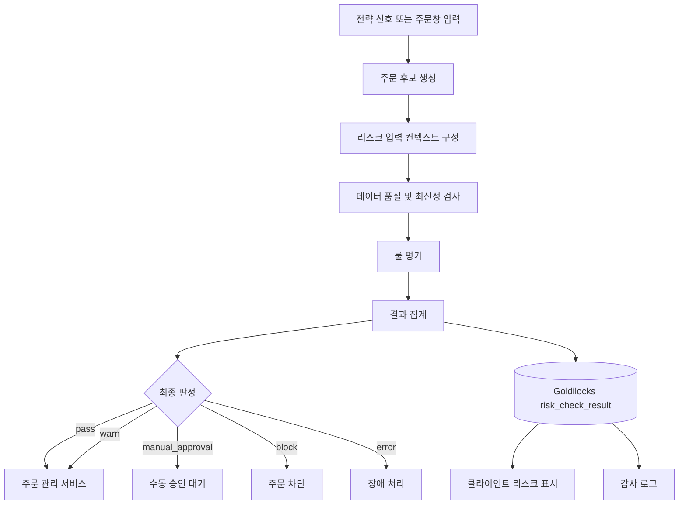

# 10. 리스크 엔진 상세 요구사항

작성일: 2026-05-22  
기준 문서:

- `01_quant_auto_trading_requirements_definition_20260522.md`
- `02_overall_system_architecture_design_20260522.md`
- `03_domain_data_model_erd_draft_20260522.md`
- `04_goldilocks_initial_schema_design_20260522.md`
- `05_data_collection_pipeline_detail_design_20260522.md`
- `06_trade_ledger_fifo_realized_pnl_design_20260522.md`
- `07_overseas_stock_capital_gains_tax_design_20260522.md`
- `08_client_realtime_test_virtual_account_simulation_design_20260522.md`
- `09_disclosure_event_impact_prediction_design_20260522.md`

## 1. 목적

리스크 엔진은 퀀트 기반 주식 자동매매 프로그램에서 모든 주문 후보와 주문 전송을 검증하는 hard gate다. 수익 모델, 전략 신호, 사용자 주문창 입력, 실시간 테스트 모드의 가상 주문은 모두 리스크 엔진을 통과해야 한다.

이 문서는 리스크 엔진이 평가해야 할 입력, 규칙, 산출물, 오류 처리, 감사 로그, 테스트 기준을 정의한다.

## 2. 적용 범위

### 2.1 포함 범위

- 주문 후보 생성 후 주문 요청 전 리스크 체크
- 사용자가 주문창에서 직접 입력한 주문의 사전 리스크 체크
- 실시간 테스트 모드와 가상 계좌 주문의 동일 리스크 체크
- 포트폴리오, 종목, 사업 그룹, 섹터, 국가, 통화 단위 한도 평가
- 단일 종목 투자금액 100,000원 이상 1,000,000,000원 이하 제한
- 저유동성 종목의 기준 슬리피지 3배 적용
- VaR, CVaR, MDD, beta, 상관관계, 회전율, 유동성 지표 평가
- 종목별 변동성 지수와 위험도 지수 기반 경고/차단
- 사업 그룹별 리스크와 변동성 비교 지표 평가
- 공시, 글로벌 헤드라인, 국제 정세 급변 이벤트 리스크 반영
- ML 예측 결과의 신뢰도, 데이터 품질, 예측 범위 기반 경고
- 주문 전 예측 주가 범위와 예상 손실 범위 제공
- 리스크 체크 결과의 Goldilocks 저장과 감사 추적

### 2.2 제외 범위

- 전략의 매수/매도 신호 생성 로직
- 모델 학습 파이프라인 자체
- broker 주문 전송 어댑터의 상세 구현
- 세무 신고 파일 생성
- 공시/뉴스 원문 라이선스 계약 관리

단, 제외 범위의 산출물이 주문 위험에 영향을 주는 경우 리스크 엔진의 입력으로 사용한다.

## 3. 설계 원칙

1. 리스크 우선  
   수익 모델과 리스크 모델이 충돌하면 리스크 모델을 우선한다.

2. 모든 주문 경로에 동일 적용  
   자동매매, 수동 주문, 실시간 테스트 모드, 재현 시뮬레이션은 같은 규칙 세트를 사용한다.

3. 차단 사유의 재현 가능성  
   리스크 체크 결과에는 입력 snapshot, 룰 버전, 산식 버전, 데이터 기준 시각, 차단 사유를 저장한다.

4. 데이터 품질 우선  
   가격, 환율, 보유 수량, 공시, 헤드라인, 변동성 지수의 최신성이나 품질이 기준 미달이면 주문을 차단하거나 수동 승인 상태로 전환한다.

5. 이벤트 신호의 보수적 사용  
   공시, 헤드라인, 국제 정세 급변 이벤트는 자동 주문을 직접 발생시키지 않는다. 주문 차단, 경고, 비중 축소 제안, 수동 검토에만 사용한다.

6. 설정과 산식의 버전 관리  
   리스크 한도, 슬리피지 룰, 변동성/위험도 지수 산식은 버전과 적용 기간을 가진다.

7. 운영 DB 기준  
   리스크 체크 결과, 한도, 산식 버전, 주문 연결 정보는 Goldilocks를 기준 저장소로 둔다.

## 4. 전체 처리 흐름



## 5. 리스크 체크 입력

### 5.1 주문 입력

| 항목 | 설명 | 필수 |
| --- | --- | --- |
| `order_request_id` | 주문 요청 식별자. 생성 전 후보 상태면 nullable | 조건부 |
| `account_id` | 계좌 식별자 | 필수 |
| `security_id` | 종목 식별자 | 필수 |
| `side` | buy, sell, short_sell, cover 등 | 필수 |
| `order_type` | market, limit, stop, stop_limit 등 | 필수 |
| `quantity` | 주문 수량 | 필수 |
| `limit_price` | 지정가 가격 | 조건부 |
| `order_amount` | 주문 예상 금액 | 필수 |
| `currency` | 주문 통화 | 필수 |
| `requested_at` | 주문 생성 또는 평가 요청 시각 | 필수 |
| `source_type` | strategy, manual, simulation, replay | 필수 |
| `strategy_id` | 자동매매 전략 식별자 | 조건부 |
| `model_version_id` | 주문 산출에 사용한 모델 버전 | 조건부 |

### 5.2 계좌와 포트폴리오 입력

- 현금 잔고
- 주문 가능 금액
- 증거금 요구액
- 미체결 주문
- 보유 포지션
- FIFO lot 기준 보유 원가
- 일별/월별 손익
- 통화별 노출
- 국가별 노출
- 섹터별 노출
- 사업 그룹별 노출
- 해외 주식 연간 실현손익과 예상 세금

### 5.3 시장 데이터 입력

- 현재가, bid, ask, mid price
- 전일 종가, 당일 시가, 고가, 저가
- 거래량, 거래대금
- 평균 거래량, 평균 거래대금
- 호가 스프레드
- 체결 강도 또는 order book depth
- 환율
- 시장 지수와 벤치마크 수익률
- 거래 가능 시간과 휴장 정보

### 5.4 리스크 지표 입력

- 종목별 변동성 지수
- 종목별 위험도 지수
- 포트폴리오 변동성
- VaR
- CVaR
- MDD
- beta
- 상관관계
- 회전율
- 사업 그룹 리스크 지표
- 사업 그룹 변동성 지수
- 그룹 변동성 기준일 대비 변화율

### 5.5 이벤트 입력

- 신규 공시 영향 예측 결과
- 공시 유형, 접수 시각, 수신 시각, 모델 사용 가능 시각
- 글로벌 헤드라인 이벤트
- 헤드라인 source rank와 중복 여부
- 사업 그룹별 headline risk signal
- 국제 정세 급변 이벤트
- 영향을 받는 국가, 통화, 원자재, 섹터, 사업 그룹, 종목

### 5.6 데이터 품질 입력

| 항목 | 예시 기준 |
| --- | --- |
| 가격 최신성 | 실시간 데이터 지연 허용 범위 |
| 환율 최신성 | 해외 주문 원화 환산 가능 여부 |
| 공시 수신 상태 | 지연, 정정, 철회, 중복 여부 |
| 헤드라인 신뢰도 | source rank, cross-check 상태 |
| 모델 입력 품질 | 결측치, outlier, feature stale 여부 |
| 보유 수량 대사 | broker 잔고와 내부 원장 차이 |

## 6. 리스크 체크 산출물

### 6.1 최종 상태

| 상태 | 의미 | 주문 처리 |
| --- | --- | --- |
| `pass` | 모든 필수 룰 통과 | 주문 전송 가능 |
| `warn` | 경고는 있으나 차단 사유 없음 | 주문 전송 가능, UI 경고 |
| `manual_approval` | 자동 전송 불가, 승인 필요 | 승인 전 전송 금지 |
| `block` | 차단 룰 위반 | 주문 생성 또는 전송 금지 |
| `stale_data` | 핵심 입력 데이터가 오래됨 | 기본 차단 |
| `error` | 리스크 평가 장애 | 기본 차단 |

### 6.2 룰별 결과

각 룰 평가는 다음 필드를 가진다.

| 필드 | 설명 |
| --- | --- |
| `rule_code` | 룰 코드 |
| `rule_version` | 룰 버전 |
| `severity` | info, warning, manual_approval, block |
| `status` | pass, fail, skipped, error |
| `scope` | order, security, account, portfolio, business_group 등 |
| `target_id` | 적용 대상 식별자 |
| `metric_value` | 계산된 값 |
| `limit_value` | 적용 한도 |
| `unit` | KRW, percent, ratio, score 등 |
| `message` | 사용자와 운영자가 볼 수 있는 설명 |
| `evidence` | 입력 데이터 기준 시각, source, 산식 버전 |

### 6.3 사용자 표시 산출물

- 주문 가능 여부
- 차단 또는 승인 필요 사유
- 예상 주문금액과 단일 종목 한도 비교
- 주문 후 예상 종목 비중
- 주문 후 예상 사업 그룹 비중
- 예상 슬리피지와 저유동성 적용 배수
- 현재가 매수 시 기간별 예상 주가 범위
- 최대 예상 손실 범위
- 공시/헤드라인/국제 정세 이벤트 경고
- 변동성/위험도 지수 상태
- 데이터 최신성 경고

## 7. 룰 심각도

| 심각도 | 의미 | 기본 처리 |
| --- | --- | --- |
| `info` | 참고 정보 | 주문 허용 |
| `warning` | 사용자 확인이 필요한 경고 | 주문 허용, UI 강조 |
| `manual_approval` | 자동 전송 금지 | 승인 후 전송 |
| `block` | 정책 위반 또는 중대 위험 | 주문 차단 |

최종 상태는 가장 높은 심각도에 따라 결정한다. 단, `error`와 `stale_data`는 운영 정책상 기본적으로 `block`과 동일하게 처리한다.

## 8. 주문 전 필수 룰

### 8.1 계좌 상태 룰

| 룰 코드 | 내용 | 기본 심각도 |
| --- | --- | --- |
| `RISK-ACCT-001` | 계좌가 활성 상태인지 확인 | block |
| `RISK-ACCT-002` | broker 연결 또는 시뮬레이션 계좌 상태 확인 | block |
| `RISK-ACCT-003` | 주문 가능 현금과 증거금 확인 | block |
| `RISK-ACCT-004` | 내부 원장과 broker 잔고 대사 차이 확인 | manual_approval |
| `RISK-ACCT-005` | 계좌별 일 손실 한도 확인 | block |

### 8.2 종목 거래 가능 룰

| 룰 코드 | 내용 | 기본 심각도 |
| --- | --- | --- |
| `RISK-SEC-001` | 종목 master가 유효한지 확인 | block |
| `RISK-SEC-002` | 상장폐지, 거래정지, 관리종목, 투자경고 상태 확인 | block |
| `RISK-SEC-003` | 장 운영 시간과 주문 가능 세션 확인 | block |
| `RISK-SEC-004` | 지정가 가격이 가격 제한폭과 호가 단위에 맞는지 확인 | block |
| `RISK-SEC-005` | 해외 주식 주문 시 환율과 거래소 calendar 확인 | block |

### 8.3 단일 종목 투자금액 룰

| 룰 코드 | 내용 | 기본 심각도 |
| --- | --- | --- |
| `RISK-AMT-001` | 원화 환산 주문 후 단일 종목 투자금액이 100,000원 미만인지 확인 | block |
| `RISK-AMT-002` | 원화 환산 주문 후 단일 종목 투자금액이 1,000,000,000원을 초과하는지 확인 | block |
| `RISK-AMT-003` | 환율이 stale이면 원화 환산 한도 평가를 중단 | stale_data |

원화 환산 투자금액은 기존 보유 평가금액과 신규 주문 예상 체결금액을 합산해 계산한다.

```text
single_security_investment_krw =
    current_position_market_value_krw
    + expected_order_notional_krw
```

매도 주문은 보유 금액을 줄이는 주문이므로 최소 투자금액 룰을 적용하지 않는다. 단, 매수 후 즉시 최소 금액 미만의 잔여 position을 의도적으로 만드는 전략은 별도 운영 정책으로 제한할 수 있다.

### 8.4 현금과 증거금 룰

| 룰 코드 | 내용 | 기본 심각도 |
| --- | --- | --- |
| `RISK-CASH-001` | 주문 후 현금 잔고가 계좌별 하한 미만인지 확인 | block |
| `RISK-CASH-002` | 수수료, 세금, 예상 슬리피지를 포함한 필요 현금 확인 | block |
| `RISK-CASH-003` | 외화 주문 시 환전 가능 금액 또는 외화 잔고 확인 | block |
| `RISK-CASH-004` | 해외 주식 예상 양도소득세를 주문창 참고 정보로 표시 | info |

세금 예상 정보는 주문 차단의 기본 근거로 사용하지 않는다. 다만 사용자나 운영자가 세후 손익 기준 한도를 별도로 설정하면 warning 또는 manual approval 룰로 사용할 수 있다.

### 8.5 포지션과 노출 한도 룰

| 룰 코드 | 내용 | 기본 심각도 |
| --- | --- | --- |
| `RISK-EXP-001` | 종목별 최대 비중 확인 | block |
| `RISK-EXP-002` | 섹터별 최대 비중 확인 | block |
| `RISK-EXP-003` | 국가별 최대 비중 확인 | block |
| `RISK-EXP-004` | 통화별 최대 비중 확인 | block |
| `RISK-EXP-005` | ETF 구성종목 look-through 기준 실질 노출 확인 | warning |
| `RISK-EXP-006` | ETN 발행사 노출 확인 | warning |

노출 비중은 주문 후 예상 포트폴리오 평가금액 기준으로 계산한다.

```text
exposure_weight = post_trade_exposure_market_value / post_trade_portfolio_market_value
```

### 8.6 사업 그룹 룰

| 룰 코드 | 내용 | 기본 심각도 |
| --- | --- | --- |
| `RISK-GRP-001` | 사업 그룹별 최대 비중 확인 | block |
| `RISK-GRP-002` | 사업 그룹별 최대 손실 한도 확인 | block |
| `RISK-GRP-003` | 사업 그룹별 VaR/CVaR 한도 확인 | block |
| `RISK-GRP-004` | 사업 그룹별 유동성 한도 확인 | block |
| `RISK-GRP-005` | 국내외 같은 사업 그룹 총 노출 합산 | block |
| `RISK-GRP-006` | 그룹 내부 종목 간 상관관계 급등 확인 | warning |
| `RISK-GRP-007` | 그룹 내 peer 대비 가격 괴리 확인 | warning |
| `RISK-GRP-008` | 사용자가 선택한 여러 사업 그룹의 기준일 대비 변동성 변화 비교 | info |

사업 그룹은 거래소, 국가, 통화, 섹터와 독립적인 내부 분류 체계다. 예를 들어 국내 2차전지 소재 기업과 해외 배터리 소재 기업은 같은 사업 그룹으로 묶일 수 있다.

### 8.7 유동성 및 슬리피지 룰

| 룰 코드 | 내용 | 기본 심각도 |
| --- | --- | --- |
| `RISK-LIQ-001` | 평균 거래대금 대비 주문금액 비율 확인 | block |
| `RISK-LIQ-002` | 예상 청산 소요일 확인 | manual_approval |
| `RISK-LIQ-003` | 호가 스프레드가 기준 초과인지 확인 | warning |
| `RISK-LIQ-004` | 저유동성 종목이면 기준 슬리피지의 3배 적용 | warning |
| `RISK-LIQ-005` | 예상 체결 불확실성이 임계값 초과인지 확인 | manual_approval |
| `RISK-LIQ-006` | 그룹 내 당일 신규 주문금액 합계가 그룹 20거래일 평균 거래대금 합계의 5%를 초과하는지 확인 | block |

저유동성 판정은 `slippage_rule` 설정을 따른다. MVP 기본 판정 기준은 평균 거래대금이며, 보조 지표로 아래 항목을 함께 저장한다.

- 최근 20거래일 평균 거래대금
- 주문금액 / 20거래일 평균 거래대금 비율
- bid-ask spread
- 호가 잔량
- 거래 정지 또는 단일가 매매 여부
- 장중 체결 공백 시간

MVP 유동성 한도:

| 한도 | 값 | 기본 조치 |
| --- | ---: | --- |
| 종목별 주문금액 / 20거래일 평균 거래대금 | 5% 이하 | 초과 시 block |
| 사업 그룹 내 당일 신규 주문금액 합계 / 그룹 20거래일 평균 거래대금 합계 | 5% 이하 | 초과 시 block |

저유동성 종목의 예상 슬리피지는 다음 방식으로 계산한다.

```text
expected_slippage_bps =
    base_slippage_bps * low_liquidity_multiplier

default low_liquidity_multiplier = 3.0
```

3배 적용 자체는 기본적으로 차단 사유가 아니다. 3배 슬리피지를 반영한 뒤 현금 부족, 예상 손실 한도 초과, 평균 거래대금 대비 주문금액 초과가 발생하면 해당 룰에서 차단한다.

### 8.8 포트폴리오 리스크 룰

| 룰 코드 | 내용 | 기본 심각도 |
| --- | --- | --- |
| `RISK-PORT-001` | 포트폴리오 변동성 한도 확인 | block |
| `RISK-PORT-002` | VaR 한도 확인 | block |
| `RISK-PORT-003` | CVaR 한도 확인 | block |
| `RISK-PORT-004` | MDD 한도 확인 | manual_approval |
| `RISK-PORT-005` | beta 한도 확인 | warning |
| `RISK-PORT-006` | 회전율 한도 확인 | warning |
| `RISK-PORT-007` | 특정 종목/그룹 리스크 기여도 집중 확인 | warning |

VaR와 CVaR는 최소한 historical simulation 방식으로 시작하고, 데이터가 충분해지면 parametric 또는 Monte Carlo 방식도 병행한다.

### 8.9 종목 변동성/위험도 지수 룰

| 룰 코드 | 내용 | 기본 심각도 |
| --- | --- | --- |
| `RISK-IDX-001` | 종목별 변동성 지수가 임계값 초과인지 확인 | warning |
| `RISK-IDX-002` | 종목별 위험도 지수가 임계값 초과인지 확인 | manual_approval |
| `RISK-IDX-003` | 장기 평균 대비 지수 급등 확인 | warning |
| `RISK-IDX-004` | 사업 그룹 peer 대비 급격한 괴리 확인 | warning |
| `RISK-IDX-005` | 산식 버전 또는 입력 데이터가 누락되면 평가 중단 | stale_data |

변동성/위험도 지수는 VIX와 같은 시장 공포 지수의 사용자 경험을 종목 단위로 제공하기 위한 내부 지표다. 외부 VIX 값을 복제하지 않고, 종목별 실현 변동성, 옵션 데이터가 있을 경우 내재 변동성, 거래량 충격, 하락 꼬리위험, 이벤트 리스크를 조합한다.

### 8.10 공시 이벤트 룰

| 룰 코드 | 내용 | 기본 심각도 |
| --- | --- | --- |
| `RISK-DISC-001` | 신규 공시 영향 예측의 예상 하락 범위 확인 | manual_approval |
| `RISK-DISC-002` | 공시 정정/철회 가능성 또는 데이터 품질 저하 확인 | warning |
| `RISK-DISC-003` | 거래정지, 상장폐지, 감사의견 등 중대 공시 확인 | block |
| `RISK-DISC-004` | 장전/장중/장후 공시 발표 시각에 따른 주문 가능 정책 확인 | manual_approval |
| `RISK-DISC-005` | 공시 영향 예측 실패 시 주문창 경고 | warning |

공시 영향 예측은 자동 주문을 직접 트리거하지 않는다. 수동 검토와 주문 전 경고의 근거로만 사용한다.

### 8.11 헤드라인 및 국제 정세 이벤트 룰

| 룰 코드 | 내용 | 기본 심각도 |
| --- | --- | --- |
| `RISK-EVT-001` | 사업 그룹별 헤드라인 리스크 점수 임계값 확인 | manual_approval |
| `RISK-EVT-002` | 다중 신뢰 출처에서 동일 부정 이벤트 확인 | manual_approval |
| `RISK-EVT-003` | 국제 정세 급변 이벤트가 영향을 주는 국가/통화/섹터/그룹 노출 확인 | manual_approval |
| `RISK-EVT-004` | 위험 또는 위기 등급 이벤트 발생 시 신규 매수 제한 | block |
| `RISK-EVT-005` | source rank가 낮거나 미확인 이벤트면 차단하지 않고 경고 | warning |

국제 정세 급변 이벤트의 예시는 전쟁, 군사 충돌, 제재, 무역 제한, 에너지 공급 차질, 해상 운송 차질, 사이버 공격, 팬데믹, 중앙은행/정부 긴급 발표다.

### 8.12 ML 예측 품질 룰

| 룰 코드 | 내용 | 기본 심각도 |
| --- | --- | --- |
| `RISK-ML-001` | 주가 범위 예측의 신뢰도가 임계값 미만인지 확인 | warning |
| `RISK-ML-002` | 거래량, 변동성, 위험도 예측 입력 데이터 품질 확인 | stale_data |
| `RISK-ML-003` | 모델 버전이 운영 승인 상태인지 확인 | block |
| `RISK-ML-004` | 예측 결과가 현재 가격과 과도하게 괴리되는지 확인 | manual_approval |
| `RISK-ML-005` | 최근 실측 오차가 허용 범위 초과인지 확인 | manual_approval |

ML 예측은 주문 타당성을 보조하지만, 리스크 룰을 우회하는 근거가 될 수 없다.

### 8.13 중복 주문 및 idempotency 룰

| 룰 코드 | 내용 | 기본 심각도 |
| --- | --- | --- |
| `RISK-DUP-001` | 같은 계좌, 종목, 방향, 가격, 수량의 중복 주문 확인 | block |
| `RISK-DUP-002` | 미체결 주문과 신규 주문 합산 노출 확인 | block |
| `RISK-DUP-003` | client request id 중복 확인 | block |

### 8.14 실행 모드 룰

| 룰 코드 | 내용 | 기본 심각도 |
| --- | --- | --- |
| `RISK-MODE-001` | live 모드에서는 broker adapter 상태 확인 | block |
| `RISK-MODE-002` | simulation 모드에서는 가상 계좌 잔고와 체결 정책 확인 | block |
| `RISK-MODE-003` | replay 모드에서는 과거 시점 이후 데이터를 참조하지 않는지 확인 | block |
| `RISK-MODE-004` | paper/live 전환 시 계좌와 주문 경로 오인 방지 확인 | block |

## 9. 주요 지표 산식

### 9.1 포트폴리오 변동성

```text
portfolio_volatility =
    sqrt(transpose(weight_vector) * covariance_matrix * weight_vector)
```

- `weight_vector`: 주문 후 예상 보유 비중
- `covariance_matrix`: 종목 수익률 공분산
- 산출 주기: 장중 실시간 근사, 장마감 확정

### 9.2 VaR

```text
VaR(confidence, horizon) =
    percentile(portfolio_return_distribution, 1 - confidence)
```

기본 confidence는 95%, 99%를 모두 산출한다. horizon은 1거래일, 5거래일, 20거래일을 기본값으로 둔다.

### 9.3 CVaR

```text
CVaR(confidence, horizon) =
    average(losses worse than VaR threshold)
```

CVaR는 tail loss를 보수적으로 보기 위한 핵심 차단 지표다.

### 9.4 MDD

```text
drawdown_t = current_equity_t / peak_equity_until_t - 1
MDD = min(drawdown_t)
```

### 9.5 Beta

```text
beta = covariance(asset_return, benchmark_return) / variance(benchmark_return)
```

국내 종목은 KOSPI/KOSDAQ 또는 사용자 지정 벤치마크, 해외 종목은 S&P 500, NASDAQ, 국가별 지수를 기본 후보로 둔다.

### 9.6 유동성 청산 소요일

```text
days_to_exit =
    position_market_value / (average_daily_traded_value * max_participation_rate)
```

`max_participation_rate`는 종목별 또는 유동성 bucket별 설정값으로 관리한다.

### 9.7 사업 그룹 변동성 변화율

```text
normalized_group_volatility_change_pct =
    (group_volatility_index_t / group_volatility_index_base_date - 1) * 100
```

사용자가 여러 사업 그룹을 선택하면 기준일의 각 그룹 변동성 지수를 0%로 정규화하여 같은 그래프에 표시한다.

## 10. 주문창 실시간 분석 연계

주문창에서 사용자가 현재 거래가격으로 구매를 선택하면 리스크 엔진은 다음 항목을 실시간으로 반환한다.

| 항목 | 설명 |
| --- | --- |
| `forecast_horizon` | 1일, 3일, 5일, 20일 등 |
| `expected_price_low` | 예측 하단 가격 |
| `expected_price_mid` | 중앙 또는 기대 가격 |
| `expected_price_high` | 예측 상단 가격 |
| `expected_loss_krw` | 주문 수량 기준 예상 손실 금액 |
| `expected_slippage_krw` | 예상 슬리피지 금액 |
| `volatility_index` | 종목 변동성 지수 |
| `risk_index` | 종목 위험도 지수 |
| `confidence_score` | 예측 신뢰도 |
| `risk_decision` | pass, warn, manual_approval, block |

주문창 표시 값은 가격 예측 서비스의 결과를 그대로 노출하지 않고 리스크 엔진의 품질 검사와 한도 평가를 거친다.

## 11. 사업 그룹 리스크 상세

### 11.1 그룹 노출 산출

사업 그룹 노출은 직접 보유 종목, ETF 구성종목 look-through, 해외 동일 사업 종목을 포함해 계산한다.

```text
business_group_exposure =
    direct_security_exposure
    + etf_lookthrough_exposure
    + derivative_or_etn_exposure
```

### 11.2 그룹 리스크 점수

그룹 리스크 점수는 아래 입력을 가중 합산한다.

- 그룹 변동성 지수
- 그룹 내 동시 하락 비율
- peer 괴리도
- 그룹 VaR/CVaR
- 평균 유동성
- 부정적 헤드라인 점수
- 중대 공시 영향 예측
- 국제 정세 급변 이벤트 노출

```text
business_group_risk_score =
    weighted_sum(
        volatility_score,
        correlation_stress_score,
        peer_divergence_score,
        var_cvar_score,
        liquidity_score,
        headline_score,
        disclosure_score,
        global_event_score
    )
```

### 11.3 그룹 한도 예시

| metric_code | 의미 | 기본 처리 |
| --- | --- | --- |
| `GROUP_MAX_WEIGHT` | 그룹 최대 비중 | 초과 시 block |
| `GROUP_MAX_VAR` | 그룹 VaR 한도 | 초과 시 block |
| `GROUP_MAX_CVAR` | 그룹 CVaR 한도 | 초과 시 block |
| `GROUP_MIN_LIQUIDITY_SCORE` | 그룹 유동성 하한 | 미달 시 manual approval |
| `GROUP_HEADLINE_RISK_SCORE` | 헤드라인 이벤트 리스크 | 초과 시 manual approval |
| `GROUP_VOL_SPIKE` | 기준일 또는 장기 평균 대비 변동성 급등 | warning |

## 12. 데이터 저장 설계

### 12.1 기존 테이블 활용

| 테이블 | 활용 |
| --- | --- |
| `risk_limit` | 리스크 한도와 severity 저장 |
| `risk_check_result` | 주문 전 리스크 체크 최종 결과 저장 |
| `risk_metric` | 포트폴리오/종목 리스크 지표 저장 |
| `business_group_risk_metric` | 사업 그룹 리스크 지표 저장 |
| `headline_risk_signal` | 헤드라인 기반 리스크 신호 저장 |
| `security_investment_amount_limit` | 단일 종목 투자금액 제한 저장 |
| `slippage_rule` | 유동성별 슬리피지 배수 저장 |
| `security_volatility_index` | 종목 변동성 지수 시계열 저장 |
| `security_risk_index` | 종목 위험도 지수 시계열 저장 |
| `business_group_volatility_index` | 그룹 변동성 지수 저장 |
| `business_group_volatility_compare_view` | 그룹 비교 그래프용 view |
| `risk_index_formula_version` | 지수 산식 버전 저장 |

### 12.2 `risk_check_result.detail` 구조

초기 Goldilocks 스키마는 `risk_check_result.detail`을 `LONG VARCHAR`로 둔다. MVP에서는 JSON 문자열로 저장하고, 조회 성능이 필요한 룰별 세부 결과는 후속 단계에서 별도 `risk_check_detail` 테이블로 분리한다.

예시 구조:

```json
{
  "request_snapshot": {
    "account_id": 1001,
    "security_id": 2001,
    "side": "buy",
    "quantity": 10,
    "order_amount_krw": 1250000
  },
  "decision": {
    "status": "manual_approval",
    "max_severity": "manual_approval",
    "failed_rule_count": 1,
    "warning_rule_count": 3
  },
  "rules": [
    {
      "rule_code": "RISK-LIQ-004",
      "status": "fail",
      "severity": "manual_approval",
      "metric_value": 3.0,
      "limit_value": 1.0,
      "message": "저유동성 종목으로 기준 슬리피지의 3배를 적용합니다."
    }
  ],
  "data_freshness": {
    "price_asof": "2026-05-22T10:15:03+09:00",
    "fx_asof": "2026-05-22T10:14:50+09:00",
    "risk_metric_asof": "2026-05-22T10:15:00+09:00"
  }
}
```

## 13. 서비스 인터페이스 초안

### 13.1 주문 리스크 체크

```http
POST /risk/check-order
```

요청:

```json
{
  "account_id": 1001,
  "security_id": 2001,
  "side": "buy",
  "order_type": "limit",
  "quantity": 10,
  "limit_price": 125000,
  "currency": "KRW",
  "source_type": "manual",
  "client_request_id": "20260522-1001-abc"
}
```

응답:

```json
{
  "check_status": "warn",
  "max_severity": "warning",
  "can_submit": true,
  "manual_approval_required": false,
  "risk_check_result_id": 90001,
  "summary": [
    "단일 종목 투자금액 한도를 통과했습니다.",
    "종목 변동성 지수가 장기 평균 대비 상승했습니다."
  ]
}
```

### 13.2 주문별 리스크 체크 조회

```http
GET /orders/{order_request_id}/risk-check
```

### 13.3 포트폴리오 리스크 요약

```http
GET /portfolio/{portfolio_id}/risk-summary
```

### 13.4 리스크 한도 조회

```http
GET /risk/limits?account_id={account_id}
```

### 13.5 사업 그룹 리스크 조회

```http
GET /business-groups/{business_group_id}/risk-summary
```

## 14. 실행 시점

| 시점 | 처리 |
| --- | --- |
| 주문 후보 생성 직후 | 자동 전략 주문 후보 차단/경고 |
| 주문창 입력 변경 시 | 실시간 예상 결과 반환 |
| 주문 전송 직전 | 최종 hard gate |
| 체결 수신 직후 | 실제 체결 기준 리스크 재계산 |
| 장중 주기 실행 | 포트폴리오, 그룹, 종목 지표 갱신 |
| 장마감 배치 | 확정 지표, VaR/CVaR, MDD 갱신 |
| 공시/헤드라인 수신 직후 | 이벤트 리스크 재계산 |
| 국제 정세 급변 이벤트 수신 직후 | 영향 자산 경고와 신규 매수 제한 평가 |

## 15. 오류와 장애 처리

| 장애 | 기본 처리 |
| --- | --- |
| 가격 데이터 수신 지연 | 주문 차단 또는 stale_data |
| 환율 데이터 수신 지연 | 해외 주문 차단 |
| Goldilocks 저장 실패 | 주문 전송 차단 |
| broker 잔고 조회 실패 | live 주문 차단 |
| 시뮬레이션 계좌 상태 불일치 | simulation 주문 차단 |
| 공시 영향 예측 실패 | 경고 표시, 중대 공시 유형은 수동 승인 |
| 헤드라인 provider 장애 | source 상태 표시, 보수적 경고 |
| 리스크 산식 실행 오류 | 주문 차단 |

리스크 엔진이 명시적으로 pass를 반환하지 못하면 주문은 전송하지 않는다.

## 16. 운영 설정

### 16.1 기본 한도 설정

| 설정 | 기본값 | 저장 위치 |
| --- | --- | --- |
| 단일 종목 최소 투자금액 | 100,000 KRW | `security_investment_amount_limit` |
| 단일 종목 최대 투자금액 | 1,000,000,000 KRW | `security_investment_amount_limit` |
| 종목별 유동성 한도 | 주문금액 / 20거래일 평균 거래대금 <= 5% | `risk_limit` |
| 사업 그룹 유동성 한도 | 그룹 내 당일 신규 주문금액 합계 / 그룹 20거래일 평균 거래대금 합계 <= 5% | `risk_limit` |
| 저유동성 슬리피지 배수 | 3.0 | `slippage_rule` |
| VaR confidence | 95%, 99% | `risk_limit` 또는 config |
| 기본 VaR horizon | 1D, 5D, 20D | `risk_limit` 또는 config |
| 기본 수동 승인 timeout | 운영 정책에서 결정 | config |

### 16.2 룰 변경 절차

1. 변경 요청 생성
2. 변경 전/후 룰 diff 기록
3. 과거 주문 replay 검증
4. 실시간 테스트 모드 검증
5. 운영 승인
6. 적용 시작 시각 등록
7. 적용 후 차단율과 경고율 모니터링

## 17. 감사와 관측성

### 17.1 감사 로그

다음 이벤트는 감사 로그에 남긴다.

- 리스크 체크 요청
- 최종 판정
- 룰별 실패와 경고
- 수동 승인 요청
- 수동 승인 또는 거절
- 리스크 한도 변경
- 슬리피지 룰 변경
- 지수 산식 버전 변경
- 공시/헤드라인/국제 정세 이벤트 기반 차단
- 데이터 stale로 인한 차단

### 17.2 운영 지표

| 지표 | 목적 |
| --- | --- |
| 리스크 체크 latency | 주문창과 자동매매 지연 관리 |
| pass/warn/block 비율 | 룰 과민/과소 탐지 점검 |
| rule_code별 실패 횟수 | 운영 정책 개선 |
| 데이터 stale 발생 횟수 | 수집 파이프라인 품질 점검 |
| 저유동성 3배 슬리피지 적용 횟수 | 거래 비용 관리 |
| 수동 승인 대기 시간 | 운영 workflow 개선 |
| 공시/헤드라인 기반 차단 후 가격 반응 | 이벤트 룰 성능 평가 |
| VaR/CVaR 초과 후 실제 손익 | 리스크 모델 검증 |

## 18. 테스트 요구사항

### 18.1 단위 테스트

- 단일 종목 투자금액 100,000원 미만 차단
- 단일 종목 투자금액 1,000,000,000원 초과 차단
- 환율 stale 시 해외 주문 차단
- 저유동성 종목 슬리피지 3배 적용
- 사업 그룹 한도 초과 차단
- VaR/CVaR 한도 초과 차단
- 공시 중대 이벤트 block 판정
- headline risk score manual approval 판정
- stale data 최종 상태 우선순위

### 18.2 통합 테스트

- 전략 신호 생성부터 주문 전송 전 리스크 체크까지 end-to-end 검증
- 주문창 가격/수량 변경 시 실시간 리스크 재평가
- 가상 계좌 simulation 주문과 live 주문의 동일 룰 적용
- FIFO 원장 기반 보유 수량과 broker 잔고 대사 차이 처리
- 공시 수신 후 공시 영향 예측과 주문창 경고 연동
- 국제 정세 급변 이벤트 수신 후 클라이언트 배너와 신규 매수 제한 연동

### 18.3 재현 테스트

- `risk_check_result.detail`의 snapshot만으로 과거 판정을 재현할 수 있어야 한다.
- 룰 버전과 산식 버전이 바뀐 후에도 과거 주문의 당시 판정은 유지되어야 한다.
- replay 모드는 과거 시점 이후 데이터를 참조하지 않아야 한다.

## 19. 성능 요구사항

| 항목 | 목표 |
| --- | --- |
| 주문창 단일 리스크 체크 p95 | 300ms 이하 |
| 자동 주문 후보 리스크 체크 p95 | 500ms 이하 |
| 포트폴리오 리스크 요약 조회 p95 | 1초 이하 |
| 사업 그룹 변동성 비교 조회 p95 | 1초 이하 |
| 공시/헤드라인 이벤트 반영 지연 | 수신 후 5초 이내 |

복잡한 VaR/CVaR 재계산은 장중 incremental cache를 사용하고, 주문 전 체크에서는 주문 후 예상 delta를 빠르게 반영하는 방식으로 시작한다.

## 20. 보안과 권한

- 리스크 한도 변경은 관리자 권한이 필요하다.
- 수동 승인 권한은 주문 실행 권한과 분리한다.
- live 모드 주문의 리스크 check bypass 기능은 제공하지 않는다.
- simulation 모드도 룰 우회 없이 동일 엔진을 사용한다.
- 리스크 체크 결과의 세부 입력에는 계좌 정보가 포함되므로 접근 로그를 남긴다.

## 21. MVP 범위

### 21.1 1차 구현

- 주문 전 리스크 체크 API
- `risk_limit`, `risk_check_result` 저장
- 단일 종목 투자금액 제한
- 현금/증거금 확인
- 종목/섹터/국가/통화/사업 그룹 비중 한도
- 저유동성 3배 슬리피지 적용
- 기본 포트폴리오 변동성, VaR, CVaR
- 종목 변동성/위험도 지수 입력 반영
- 공시/헤드라인/국제 정세 이벤트 경고 입력 반영
- 주문창 실시간 요약 응답
- 실시간 테스트 모드 동일 룰 적용

### 21.2 후속 구현

- 룰별 결과 전용 `risk_check_detail` 테이블
- ETF 구성종목 look-through 고도화
- ETN 발행사 노출
- Monte Carlo VaR
- 그룹 내부 peer 괴리 탐지
- 헤드라인 source별 성능 feedback
- 수동 승인 workflow 화면
- 리스크 룰 변경 replay 검증 자동화

## 22. 추적성

| 원 요구사항 | 본 문서 반영 위치 |
| --- | --- |
| FR-RISK-001 | 8.5 |
| FR-RISK-002 | 8.8, 9 |
| FR-RISK-003 | 8.5 |
| FR-RISK-004 | 8.7 |
| FR-RISK-005~008 | 3, 7, 8.8 |
| FR-RISK-009~012 | 8.6, 11 |
| FR-RISK-013~014 | 8.11 |
| FR-RISK-015~017 | 8.9 |
| FR-RISK-018~019 | 9.7, 11 |
| FR-RISK-020~021 | 8.7 |
| FR-RISK-022 | 8.3 |
| FR-ORDER-015 | 8.3, 10 |
| FR-NEWS-010~015 | 8.11 |
| FR-DISC-005~010 | 8.10 |
| FR-UI-014~015 | 6.3, 10 |
| FR-UI-022~024 | 8.11, 14 |

## 23. 구현 기본 결정 사항

1. VaR/CVaR는 historical simulation으로 시작하고 confidence는 95%, 99%, horizon은 1D, 5D, 20D를 사용한다.
2. 종목별 변동성 지수는 EWMA V1, 위험도 지수는 component score V1을 사용한다.
3. 종목 최대 비중은 warning 5%, block 10%; 섹터는 warning 25%, block 35%; USD는 warning 50%, block 70%; 일일손실은 warning -1%, block -2%, stop -3%; MDD는 warning -8%, block -12%, stop -15%로 한다.
4. 사업 그룹 최대 비중은 warning 20%, block 30%; 일간 손실은 warning -2%, block -4%; MDD는 warning -8%, block -12%로 한다.
5. 저유동성 절대 하한은 20거래일 평균 거래대금 원화 환산 1,000,000,000원 미만이다.
6. 수동 승인은 `live_trader` 이상 권한, 만료 시간은 10분이다.
7. 공시 유형 중 trading_halt, regulatory, litigation severe는 block 후보, earnings/guidance/capital/M&A는 manual approval 기본값으로 둔다.
8. `risk_check_result.detail`은 MVP에서 JSON으로 저장하고, 100만 row 또는 p95 조회 500ms 초과 시 별도 테이블로 분리한다.

## 23.1 결정 반영 사항

- 사업 그룹 분류는 표준 산업분류, 내부 사업 유사도 그룹, 수동 보정을 병행한다.
- 저유동성 판정의 MVP 기본 기준은 평균 거래대금이다.
- MVP 유동성 한도는 종목별 주문금액/20거래일 평균 거래대금 최대 5%, 사업 그룹 내 당일 신규 주문금액 합계/그룹 20거래일 평균 거래대금 합계 최대 5%로 둔다.
- 자동 주문은 거래 가능 시간 전체에서 허용하되 자동 주문 1건 최대 금액은 원화 환산 1,000,000,000원이다.
- 국제 정세 급변 긴급 알림은 사건 발생 후 주식 시장의 5분 평균 거래량이 직전 5거래일 평균 대비 100% 이상 증가하는 조건을 포함한다.

## 24. 다음 산출물

다음 문서는 `11_사업_그룹_분류_및_그룹_리스크_설계서`로 작성한다. 해당 문서에서는 국내외 유사 사업 종목을 묶는 분류 체계, 그룹 리스크 산식, 그룹별 헤드라인/공시/국제 이벤트 매핑, 그룹 변동성 비교 그래프의 기준 데이터를 상세화한다.
