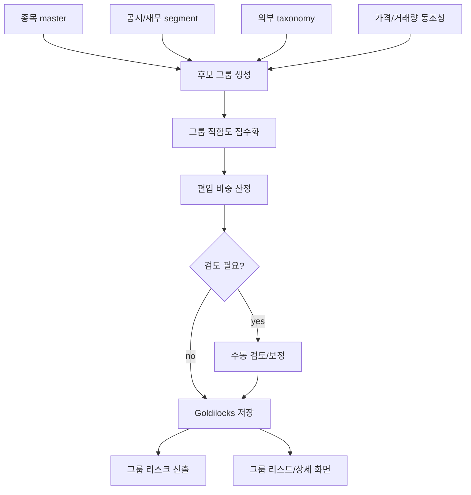

# 11. 사업 그룹 분류 및 그룹 리스크 설계서

작성일: 2026-05-22  
기준 문서:

- `01_quant_auto_trading_requirements_definition_20260522.md`
- `02_overall_system_architecture_design_20260522.md`
- `03_domain_data_model_erd_draft_20260522.md`
- `04_goldilocks_initial_schema_design_20260522.md`
- `10_risk_engine_detailed_requirements_20260522.md`

## 1. 목적

사업 그룹은 국내외에서 비슷한 사업을 수행하는 종목을 하나의 실무적 위험 단위로 묶기 위한 내부 분류 체계다. 표준 산업분류나 거래소 업종만으로는 같은 매출 동인, 원가 구조, 규제 리스크, 공급망 충격, 고객 수요 충격을 충분히 포착하기 어렵다.

이 문서는 사업 그룹의 분류 기준, 종목 매핑 방식, 그룹 리스크 지표, 주문 전 한도 평가, 헤드라인/공시/국제 정세 이벤트 매핑, 클라이언트 표시 요구사항을 정의한다.

## 2. 핵심 원칙

1. 표준 산업분류와 독립  
   GICS, KRX 업종, 거래소 산업분류는 참고값으로 사용하지만 내부 사업 그룹을 대체하지 않는다.

2. 국내외 통합  
   국내 종목과 해외 종목이 같은 사업 충격을 공유하면 같은 `business_group_id`에 매핑한다.

3. 다중 편입 허용  
   한 기업이 여러 사업을 영위하면 여러 사업 그룹에 편입하고, 각 그룹의 편입 비중을 저장한다.

4. 유효기간 관리  
   사업 전환, 분할, 합병, 매출 구성 변화, 상장폐지, ETF 구성 변경에 따라 매핑은 기간을 가진다.

5. 근거 기반 분류  
   매핑에는 출처, 신뢰도, 수동 보정 여부, 편입 비중 산정 근거를 남긴다.

6. 리스크 엔진과 연결  
   그룹 분류는 단순 조회용이 아니라 주문 전 hard gate의 입력으로 사용한다.

7. 이벤트는 보수적으로 사용  
   그룹 헤드라인, 공시, 국제 정세 이벤트는 자동 주문 직접 트리거가 아니라 주문 차단, 경고, 수동 검토, 비중 축소 제안에 사용한다.

## 3. 적용 범위

### 3.1 포함 범위

- 사업 그룹 taxonomy 정의
- 종목과 사업 그룹 매핑
- 국내외 peer 통합
- ETF 구성종목 look-through 기반 그룹 노출 계산
- 그룹별 포트폴리오 노출 산출
- 그룹별 손익, 변동성, VaR, CVaR, 유동성, 상관관계 산출
- 그룹별 헤드라인, 공시, 국제 정세 이벤트 리스크 점수
- 주문 전 그룹 한도 평가
- 그룹 리스트, 그룹 상세, 그룹 변동성 비교 그래프용 데이터 제공

### 3.2 제외 범위

- 외부 뉴스/공시 원문 수집 구현
- 종목별 ML 모델 학습 상세
- 주문 전송 broker adapter 구현
- 세무 신고 자료 생성

## 4. 사업 그룹 개념

### 4.1 정의

사업 그룹은 비슷한 사업 모델, 수요 동인, 원가 동인, 공급망, 고객군, 규제 환경, 기술 사이클을 공유하는 종목 묶음이다.

예시:

| 그룹 코드 예시 | 그룹명 예시 | 주요 충격 요인 |
| --- | --- | --- |
| `MEMORY_SEMI` | 메모리 반도체 | DRAM/NAND 가격, 서버 수요, capex cycle |
| `FOUNDRY` | 파운드리 | 선단 공정 수요, 고객사 재고, 설비 투자 |
| `AI_ACCELERATOR` | AI 반도체 | 데이터센터 투자, HBM 공급, 수출 규제 |
| `BATTERY_MATERIAL` | 2차전지 소재 | 리튬/니켈 가격, EV 수요, 보조금 정책 |
| `POWER_GRID_EQUIP` | 전력망 장비 | 송배전 투자, 구리 가격, 인프라 정책 |
| `CLOUD_INFRA` | 클라우드 인프라 | 데이터센터 capex, AI 워크로드, 전력 비용 |
| `CYBER_SECURITY` | 사이버보안 | 보안 사고, 규제, 기업 IT 지출 |
| `AUTO_OEM` | 자동차 OEM | 금리, 소비 수요, 관세, 리콜 |
| `SHIPBUILDING` | 조선 | 선가, LNG선 수요, 후판 가격 |
| `DEFENSE` | 방산 | 국방 예산, 수출 승인, 지정학 리스크 |
| `BIO_CDMO` | 바이오 CDMO | 위탁생산 수주, 규제 승인, 고객 pipeline |

위 예시는 초기 taxonomy 설계 기준이며, 실제 운영 분류는 검토와 승인 절차를 거쳐 확정한다.

### 4.2 계층 구조

사업 그룹은 2단계 이상 계층을 가질 수 있다.

```text
Technology
  Semiconductor
    Memory Semiconductor
    Foundry
    AI Accelerator
  Software Infrastructure
    Cloud Infrastructure
    Cyber Security

Industrials
  Power Grid Equipment
  Shipbuilding
  Defense
```

Goldilocks의 `business_group.parent_business_group_id`를 사용해 계층을 표현한다.

## 5. 분류 기준

### 5.1 1차 분류 축

| 축 | 설명 |
| --- | --- |
| 매출 품목 | 회사가 실제로 판매하는 제품/서비스 |
| 매출 비중 | 사업 부문별 매출 구성 |
| 고객군 | 주요 고객 산업과 고객 집중도 |
| 원가 동인 | 원자재, 인건비, 에너지, 설비투자 민감도 |
| 수요 동인 | 경기, 기술 사이클, 소비, 정부 투자 |
| 공급망 위치 | 원재료, 부품, 장비, 완제품, 서비스 |
| 규제 노출 | 수출 통제, 보조금, 인허가, 환경 규제 |
| 가격 결정 구조 | commodity price, contract price, subscription, spread |
| 지역 의존도 | 특정 국가/지역 매출 또는 생산 노출 |
| peer 동조성 | 과거 수익률 상관관계와 동시 하락 빈도 |

### 5.2 보조 분류 축

- 표준 산업분류
- 거래소 업종
- 기업 공시 사업부문
- 재무제표 segment
- ETF 편입 분류
- 애널리스트/전문 데이터 제공자 taxonomy
- 회사 IR 자료의 사업 설명
- 공급망/고객사 관계
- 제품 키워드와 기술 키워드

## 6. 종목 매핑 방식

### 6.1 매핑 입력

| 입력 | 사용 목적 |
| --- | --- |
| 종목 master | 거래소, 통화, 국가, 상장 상태 확인 |
| 기업 공시 | 사업 부문, 매출 비중, 주요 계약, 위험 요인 확인 |
| 재무 segment | 편입 비중 산정 |
| 거래소 업종 | 초기 후보 그룹 생성 |
| ETF 구성종목 | look-through 노출 계산 |
| 뉴스/헤드라인 entity map | 이벤트와 그룹 연결 |
| 가격/거래량 시계열 | peer 동조성 검증 |
| 수동 보정 | 자동 분류 오류 수정 |

### 6.2 매핑 출력

Goldilocks `security_business_group_map`에 아래 값을 저장한다.

| 필드 | 설명 |
| --- | --- |
| `security_id` | 종목 식별자 |
| `business_group_id` | 사업 그룹 식별자 |
| `weight` | 해당 종목의 그룹 편입 비중 |
| `mapping_source` | manual, disclosure, provider, model, etf_lookthrough 등 |
| `confidence_score` | 0~1 신뢰도 |
| `manual_override` | 수동 보정 여부 |
| `valid_from` | 매핑 적용 시작 시각 |
| `valid_to` | 매핑 적용 종료 시각 |

### 6.3 편입 비중 산정

기본 우선순위:

1. 회사 공시나 재무제표의 사업 부문별 매출 비중
2. 회사 IR 또는 공식 자료의 사업 구성
3. 신뢰도 높은 데이터 제공자의 segment 분류
4. 내부 분류 모델의 추정치
5. 수동 검토 결과

편입 비중 예시:

```text
security A:
  MEMORY_SEMI weight = 0.70
  FOUNDRY weight = 0.20
  OTHER_TECH weight = 0.10
```

한 종목의 활성 매핑 weight 합계는 원칙적으로 1.0이 되도록 한다. 단, 순수 노출 계산이 아니라 관심 그룹 태깅 목적의 보조 매핑은 별도 `mapping_source`로 분리한다.

### 6.4 신뢰도 등급

| confidence_score | 등급 | 의미 |
| --- | --- | --- |
| 0.90 이상 | high | 공식 공시 또는 수동 검토로 확인 |
| 0.70 이상 0.90 미만 | medium | 신뢰 source 기반이나 일부 추정 포함 |
| 0.50 이상 0.70 미만 | low | 모델 추정 또는 간접 근거 중심 |
| 0.50 미만 | review_required | 리스크 평가에는 제한 사용 |

`review_required` 매핑은 주문 차단 근거로 단독 사용하지 않고 경고 또는 수동 검토 사유로 사용한다.

## 7. 분류 파이프라인



### 7.1 자동 분류 단계

1. 종목의 표준 산업분류와 거래소 업종을 읽는다.
2. 공시와 재무 segment에서 사업 키워드와 매출 비중을 추출한다.
3. 내부 사업 그룹 taxonomy와 키워드/embedding 유사도를 계산한다.
4. 과거 수익률 상관관계와 동시 하락 빈도를 검증한다.
5. 후보 그룹별 confidence score와 weight를 산출한다.
6. 임계값 미달 또는 다중 후보 충돌 건은 수동 검토 queue로 보낸다.

### 7.2 수동 보정 단계

수동 보정은 다음 상황에서 필요하다.

- 신사업 전환이 공시보다 시장에서 먼저 반영되는 경우
- 지주회사, 복합기업, 분할/합병 기업
- 해외 ADR, 중복 상장, 지분회사 노출
- ETF/ETN의 구성종목 변경 지연
- 모델 분류가 표준 산업분류에 과도하게 끌리는 경우

수동 보정 시 기존 매핑을 수정하지 않고 `valid_to`를 설정한 뒤 새 매핑 row를 추가한다.

## 8. 국내외 peer 통합

### 8.1 통합 기준

국내외 종목을 같은 사업 그룹으로 묶는 기준은 다음과 같다.

- 같은 제품 또는 서비스에서 매출이 발생한다.
- 같은 고객군 또는 최종 수요에 노출된다.
- 주요 원재료, 장비, 공급망 제약이 유사하다.
- 규제 또는 정책 충격이 같은 방향으로 전파된다.
- 가격/마진 cycle이 유사하다.
- 과거 시장 충격에서 동시 하락 또는 상관관계 상승이 확인된다.

### 8.2 통화와 거래소 차이 처리

그룹 리스크는 원화 환산 기준과 현지 통화 기준을 모두 보존한다.

| 기준 | 용도 |
| --- | --- |
| 원화 환산 | 포트폴리오 전체 노출, 투자금액 한도, 손익 관리 |
| 현지 통화 | 현지 시장 변동성, 종목 자체 가격 움직임 분석 |
| 기준 통화 normalized | 국내외 peer 비교, 그룹 변동성 비교 그래프 |

환율 최신성이 기준 미달이면 해외 종목이 포함된 그룹 노출과 리스크는 `stale_data`로 표시한다.

## 9. ETF 및 파생 노출

### 9.1 ETF look-through

ETF는 ETF 자체를 하나의 사업 그룹에 넣는 방식만으로는 숨은 집중 리스크를 볼 수 없다. ETF 구성종목을 풀어 각 구성종목의 사업 그룹 weight와 ETF 편입 비중을 곱해 그룹 노출을 계산한다.

```text
etf_group_exposure =
    etf_position_market_value
    * etf_holding_weight
    * underlying_security_business_group_weight
```

### 9.2 ETN과 발행사 노출

ETN은 기초자산 노출과 발행사 신용 노출을 분리한다.

- 기초자산 또는 지수 구성 기준 그룹 노출
- 발행사 금융기관 신용 노출
- 조기상환, 괴리율, 유동성 리스크

ETN 상세 노출은 MVP 후속 범위로 두되, 발행사 노출 경고는 1차 구현에 포함할 수 있다.

## 10. 그룹 노출 산출

### 10.1 직접 보유 노출

```text
direct_group_exposure_krw =
    security_market_value_krw
    * security_business_group_weight
```

### 10.2 주문 후 예상 그룹 노출

```text
post_trade_group_exposure_krw =
    current_group_exposure_krw
    + expected_order_notional_krw * order_security_group_weight
```

매도 주문은 예상 체결 수량만큼 그룹 노출을 줄인다.

### 10.3 그룹 비중

```text
group_weight_pct =
    group_exposure_krw / portfolio_market_value_krw * 100
```

### 10.4 그룹 리스크 기여도

```text
group_risk_contribution =
    group_weight * marginal_risk_contribution
```

MVP에서는 그룹별 VaR 기여도를 historical scenario 방식으로 산출하고, 후속 단계에서 factor model 기반 marginal contribution을 추가한다.

## 11. 그룹 리스크 지표

### 11.1 기본 지표

| 지표 | 설명 | 사용처 |
| --- | --- | --- |
| `GROUP_EXPOSURE_KRW` | 그룹 총 노출 | 대시보드, 주문 전 체크 |
| `GROUP_WEIGHT_PCT` | 포트폴리오 내 그룹 비중 | 한도 체크 |
| `GROUP_UNREALIZED_PNL` | 그룹 미실현손익 | 대시보드 |
| `GROUP_REALIZED_PNL` | 그룹 실현손익 | 성과 분석 |
| `GROUP_VOLATILITY` | 그룹 수익률 변동성 | 위험도/차트 |
| `GROUP_VAR` | 그룹 VaR | 주문 차단 |
| `GROUP_CVAR` | 그룹 CVaR | 주문 차단 |
| `GROUP_MDD` | 그룹 최대낙폭 | 수동 승인 |
| `GROUP_BETA` | 벤치마크 beta | 경고 |
| `GROUP_CORRELATION_STRESS` | 그룹 내부 상관관계 상승 | 경고 |
| `GROUP_LIQUIDITY_SCORE` | 평균 유동성 점수 | 수동 승인 |
| `GROUP_DAYS_TO_EXIT` | 예상 청산 소요일 | 수동 승인 |
| `GROUP_EVENT_RISK_SCORE` | 이벤트 리스크 점수 | 경고/수동 승인 |

### 11.2 그룹 수익률

그룹 수익률은 선택한 가중 방식에 따라 계산한다.

```text
group_return_t =
    sum(security_return_t * group_member_weight_t)
```

지원 가중 방식:

| 방식 | 설명 |
| --- | --- |
| `market_cap_weight` | 시가총액 가중 |
| `portfolio_weight` | 보유 비중 가중 |
| `equal_weight` | 동일 가중 |
| `revenue_segment_weight` | 사업 매출 비중 가중 |

기본값은 리스크 대시보드에서는 `portfolio_weight`, 시장 비교 화면에서는 `market_cap_weight`, peer 동조성 분석에서는 `equal_weight`로 둔다.

### 11.3 그룹 변동성

```text
group_volatility =
    stddev(group_return_window) * sqrt(annualization_factor)
```

기본 window:

- 20거래일
- 60거래일
- 120거래일
- 252거래일

장중 화면에서는 intraday realized volatility를 별도 산출하고, 장마감 후 확정값으로 교체한다.

### 11.4 그룹 VaR/CVaR

```text
group_var =
    percentile(group_pnl_distribution, 1 - confidence)

group_cvar =
    average(losses worse than group_var)
```

기본 confidence는 95%, 99%, horizon은 1거래일, 5거래일, 20거래일이다.

### 11.5 동시 하락 지표

```text
same_direction_down_ratio =
    count(group_members_return < negative_threshold)
    / active_group_member_count
```

그룹 내 다수 종목이 동시에 하락하면 상관관계가 평소보다 낮아도 위험 신호로 본다.

### 11.6 peer 괴리 지표

```text
peer_divergence_zscore =
    (security_return - group_peer_median_return)
    / group_peer_return_stddev
```

개별 종목이 그룹 peer 대비 과도하게 괴리되면 공시, 유동성, 종목 고유 이벤트, 데이터 오류 가능성을 확인한다.

## 12. 그룹 이벤트 리스크

### 12.1 이벤트 유형

| 유형 | 예시 | 그룹 연결 방식 |
| --- | --- | --- |
| 공식 공시 | 실적, 가이던스, 증자, M&A, 소송, 제재 | 공시 entity map과 종목 그룹 매핑 |
| 글로벌 헤드라인 | 정책, 공급망, 수요, 경쟁, 사고 | headline entity/group map |
| 국제 정세 급변 | 전쟁, 제재, 무역 제한, 에너지 차질 | 국가/통화/원자재/섹터/그룹 impact map |
| 매크로 이벤트 | 금리, 환율, 원자재, 경기지표 | factor와 그룹 민감도 |
| 규제 이벤트 | 수출 통제, 보조금, 인허가 | 국가/산업/그룹 taxonomy |

### 12.2 이벤트 점수

```text
group_event_risk_score =
    source_reliability_weight
    * event_severity
    * group_relevance
    * exposure_weight
    * freshness_decay
    * confirmation_factor
```

| 구성요소 | 설명 |
| --- | --- |
| `source_reliability_weight` | 공식 공시/규제기관/전문 정보원 우선 |
| `event_severity` | 정상, 관심, 주의, 위험, 위기 등급 |
| `group_relevance` | 이벤트가 그룹 매출/원가/규제에 미치는 관련도 |
| `exposure_weight` | 해당 그룹의 포트폴리오 노출 |
| `freshness_decay` | 시간이 지날수록 영향 감소 |
| `confirmation_factor` | 다중 출처 확인 여부 |

### 12.3 이벤트 사용 제한

- 이벤트 리스크는 자동 주문을 직접 생성하지 않는다.
- 확인되지 않은 단일 저신뢰 source는 차단 근거로 단독 사용하지 않는다.
- 중대 공식 공시나 규제 이벤트는 주문 전 manual approval 또는 block으로 승격할 수 있다.
- 이벤트 원문은 라이선스 정책 범위 내에서 headline, 요약, metadata, 원문 링크 중심으로 관리한다.

## 13. 그룹 한도 정책

### 13.1 기본 한도 유형

| metric_code | 설명 | 기본 심각도 |
| --- | --- | --- |
| `GROUP_MAX_WEIGHT` | 그룹 최대 비중 | block |
| `GROUP_MAX_LOSS` | 그룹 최대 손실 | block |
| `GROUP_MAX_VAR` | 그룹 VaR 한도 | block |
| `GROUP_MAX_CVAR` | 그룹 CVaR 한도 | block |
| `GROUP_MIN_LIQUIDITY_SCORE` | 그룹 유동성 하한 | manual_approval |
| `GROUP_MAX_DAYS_TO_EXIT` | 그룹 청산 소요일 한도 | manual_approval |
| `GROUP_CORRELATION_STRESS` | 내부 상관관계 급등 | warning |
| `GROUP_PEER_DIVERGENCE` | peer 괴리 | warning |
| `GROUP_EVENT_RISK_SCORE` | 이벤트 리스크 점수 | manual_approval |
| `GROUP_VOL_SPIKE` | 변동성 지수 급등 | warning |

### 13.2 그룹 한도 적용 순서

1. 주문 후 예상 그룹 노출 계산
2. 활성 `risk_limit` 조회
3. 그룹별 metric 산출
4. 한도 초과 여부 판단
5. severity 집계
6. `risk_check_result`에 결과 저장
7. 주문창과 리스크 대시보드에 표시

### 13.3 주문 전 차단 예시

```text
case:
  현재 BATTERY_MATERIAL 그룹 비중 = 18%
  그룹 최대 비중 한도 = 20%
  신규 매수 후 예상 그룹 비중 = 23%

decision:
  RISK-GRP-001 fail
  severity = block
  order submission denied
```

## 14. 그룹 변동성 비교 그래프

### 14.1 요구사항

사용자는 종목 그룹 리스트에서 여러 사업 그룹을 선택하고, 기준일의 그룹 변동성값을 0% 기준으로 정규화해 하나의 그래프에서 비교할 수 있어야 한다.

### 14.2 계산식

```text
normalized_volatility_change_pct =
    (group_volatility_index_t / group_volatility_index_base_date - 1) * 100
```

그룹 변동성 비교의 기본 가중 방식은 `market_cap_weight`다. 사용자는 필요 시 보유 비중 가중, 동일 가중, 매출 비중 가중으로 변경할 수 있다.

### 14.3 그래프 metadata

| 항목 | 표시 필요 |
| --- | --- |
| 기준일 | 필수 |
| 기준 변동성값 | 필수 |
| 현재 변동성값 | 필수 |
| 변동 % | 필수 |
| 산식 버전 | 필수 |
| 편입 종목 기준 | 필수 |
| 가중 방식 | 필수 |
| 통화 기준 | 필수 |
| 거래소/국가 범위 | 필수 |

### 14.4 구성 변경 처리

그룹 구성 변경이 있을 때 비교 기준을 선택할 수 있어야 한다.

| 방식 | 설명 | 기본 사용처 |
| --- | --- | --- |
| `base_date_membership` | 기준일 당시 구성 종목으로 고정 | 순수 변동성 변화 비교 |
| `current_membership` | 현재 구성 종목으로 재계산 | 현재 위험 상태 파악 |
| `point_in_time_membership` | 각 시점의 유효 구성 사용 | 백테스트와 재현 |

MVP 기본값은 `current_membership`으로 둔다. 기준일 당시 구성 기준과 point-in-time 구성 기준은 비교 옵션으로 제공한다.

## 15. 데이터 모델

### 15.1 기존 테이블

| 테이블 | 용도 |
| --- | --- |
| `business_group` | 사업 그룹 master와 계층 |
| `security_business_group_map` | 종목-그룹 매핑, weight, source, confidence, valid period |
| `business_group_factor` | 그룹별 factor와 특성 |
| `business_group_risk_metric` | 그룹 리스크 지표 |
| `business_group_volatility_index` | 그룹 변동성 지수 |
| `business_group_volatility_compare_view` | 비교 그래프용 view |
| `headline_business_group_map` | 헤드라인과 그룹 매핑 |
| `risk_limit` | 그룹 한도 |
| `risk_check_result` | 주문 전 그룹 한도 평가 결과 |

### 15.2 확장 후보 테이블

초기 스키마에는 최소 테이블만 포함되어 있다. 운영성과 재현성을 높이려면 아래 테이블을 후속 확장 후보로 둔다.

#### `business_group_taxonomy_version`

| 컬럼 | 설명 |
| --- | --- |
| `taxonomy_version_id` | taxonomy 버전 |
| `version_name` | 버전명 |
| `effective_from` | 적용 시작 |
| `effective_to` | 적용 종료 |
| `change_reason` | 변경 사유 |
| `approved_by` | 승인자 |

#### `business_group_mapping_evidence`

| 컬럼 | 설명 |
| --- | --- |
| `mapping_evidence_id` | 근거 식별자 |
| `security_business_group_map_id` | 매핑 row |
| `evidence_type` | disclosure, financial_segment, provider, manual_note 등 |
| `source_ref` | 원문 링크 또는 source id |
| `evidence_text_summary` | 라이선스 허용 범위 요약 |
| `asof_at` | 근거 기준 시각 |

#### `business_group_exposure_snapshot`

| 컬럼 | 설명 |
| --- | --- |
| `snapshot_id` | snapshot 식별자 |
| `portfolio_id` | 포트폴리오 |
| `business_group_id` | 사업 그룹 |
| `exposure_krw` | 그룹 노출 |
| `weight_pct` | 포트폴리오 내 비중 |
| `unrealized_pnl_krw` | 미실현손익 |
| `snapshot_at` | 산출 시각 |

#### `business_group_event_risk_signal`

| 컬럼 | 설명 |
| --- | --- |
| `event_risk_signal_id` | 이벤트 리스크 신호 |
| `business_group_id` | 사업 그룹 |
| `event_type` | disclosure, headline, global_risk 등 |
| `event_ref_id` | 이벤트 원천 id |
| `risk_score` | 이벤트 리스크 점수 |
| `severity` | normal, watch, caution, danger, crisis |
| `valid_from` | 적용 시작 |
| `valid_to` | 적용 종료 |

## 16. API 초안

### 16.1 그룹 목록

```http
GET /business-groups
```

응답:

```json
{
  "items": [
    {
      "business_group_id": 10,
      "group_code": "BATTERY_MATERIAL",
      "group_name": "2차전지 소재",
      "parent_business_group_id": 2,
      "active_security_count": 24,
      "portfolio_exposure_krw": 125000000,
      "risk_score": 72.5,
      "limit_status": "warning"
    }
  ]
}
```

### 16.2 그룹 상세

```http
GET /business-groups/{business_group_id}
```

포함 항목:

- 그룹 기본 정보
- 하위 그룹
- 구성 종목
- 국가/거래소/통화 분포
- 편입 비중과 신뢰도
- 포트폴리오 보유 노출
- 그룹 리스크 지표
- 최근 공시/헤드라인/국제 이벤트
- 한도 상태

### 16.3 종목의 그룹 매핑

```http
GET /securities/{security_id}/business-groups
```

### 16.4 그룹 리스크 요약

```http
GET /business-groups/{business_group_id}/risk-summary
```

### 16.5 그룹 변동성 비교

```http
POST /business-groups/volatility-comparison
```

요청:

```json
{
  "business_group_ids": [10, 11, 12],
  "base_date": "2026-05-01",
  "date_from": "2026-05-01",
  "date_to": "2026-05-22",
  "weighting_method": "portfolio_weight",
  "membership_mode": "point_in_time_membership",
  "currency_basis": "KRW"
}
```

응답:

```json
{
  "base_date": "2026-05-01",
  "series": [
    {
      "business_group_id": 10,
      "group_code": "BATTERY_MATERIAL",
      "base_volatility_index": 31.2,
      "points": [
        {
          "date": "2026-05-22",
          "volatility_index": 37.4,
          "change_pct": 19.87
        }
      ]
    }
  ]
}
```

## 17. 클라이언트 화면 요구사항

### 17.1 그룹 리스트

필수 표시:

- 그룹명
- 그룹 코드
- 보유 비중
- 손익
- 리스크 점수
- 변동성 지수
- 한도 상태
- 주요 구성 종목
- 국내외 peer 수
- 최근 이벤트 수

필터:

- 보유 그룹만 보기
- 한도 근접/초과 그룹
- 이벤트 발생 그룹
- 국가/통화/섹터
- 변동성 급등 그룹

### 17.2 그룹 상세

필수 영역:

- 그룹 개요
- 구성 종목 표
- 보유 노출과 비중
- 국가/통화/거래소 분포
- 그룹 수익률과 변동성 차트
- VaR/CVaR와 MDD
- peer 상대성과
- 헤드라인/공시/국제 이벤트 feed
- 한도와 주문 차단 이력

### 17.3 주문창 연계

주문창에서 종목을 선택하면 다음을 표시한다.

- 해당 종목의 사업 그룹
- 주문 후 예상 그룹 비중
- 그룹 한도 잔여 여유
- 그룹 변동성 지수
- 그룹 이벤트 리스크 점수
- 그룹 peer 대비 해당 종목 괴리도
- 그룹 한도 초과 시 차단 또는 수동 승인 필요 사유

## 18. 운영 절차

### 18.1 일일 절차

- 신규 상장/상장폐지 종목 확인
- 종목 master와 사업 그룹 매핑 누락 확인
- 그룹별 노출 snapshot 생성
- 그룹 리스크 metric 산출
- 그룹 이벤트 risk signal 갱신
- 한도 근접 그룹 확인

### 18.2 주간 절차

- 그룹별 구성 변경 검토
- confidence score 낮은 매핑 검토
- 수동 보정 이력 검토
- 헤드라인/공시 이벤트 매핑 오탐 검토
- 그룹 한도 초과/근접 이력 검토

### 18.3 월간 절차

- taxonomy 변경 필요성 검토
- 신규 사업 그룹 생성 또는 통합 검토
- 그룹별 리스크 지표의 예측력 점검
- 사업 그룹별 손익과 위험 기여도 리뷰
- 그룹 변동성 산식과 가중 방식 검토

## 19. 품질 관리

| 검증 항목 | 기준 |
| --- | --- |
| 활성 종목 매핑 누락률 | 운영 대상 종목 0% 목표 |
| weight 합계 오류 | 활성 매핑 합계 1.0 검증 |
| 유효기간 중복 | 동일 종목/그룹의 중복 기간 검출 |
| confidence 낮은 매핑 | review queue 생성 |
| ETF 구성 stale | 구성종목 기준일 표시 및 경고 |
| 이벤트 그룹 매핑 오탐 | source와 entity map 검토 |
| 그룹 변동성 이상치 | 가격 오류와 구성 변경 여부 확인 |

## 20. 테스트 요구사항

### 20.1 단위 테스트

- 한 종목의 다중 그룹 weight 합계 검증
- valid_from/valid_to 기준 point-in-time 매핑 조회
- 직접 보유 그룹 노출 계산
- ETF look-through 그룹 노출 계산
- 주문 후 예상 그룹 비중 계산
- 그룹 최대 비중 한도 초과 판정
- 기준일 대비 그룹 변동성 변화율 계산
- confidence 낮은 매핑의 경고 처리

### 20.2 통합 테스트

- 신규 종목 master 등록 후 사업 그룹 후보 생성
- 공시 segment 기반 편입 비중 산정
- 수동 보정 후 기존 매핑 종료와 신규 매핑 생성
- 그룹 리스크 metric 산출 후 리스크 엔진 주문 차단
- 헤드라인 이벤트가 그룹 risk signal로 연결되는 흐름
- 국제 정세 이벤트가 영향 그룹과 보유 종목으로 표시되는 흐름
- 그룹 변동성 비교 그래프 API와 UI 표시

### 20.3 재현 테스트

- 과거 주문 시점의 사업 그룹 구성을 point-in-time으로 재현해야 한다.
- taxonomy 변경 후에도 과거 그룹 리스크 체크 결과가 바뀌지 않아야 한다.
- 기준일 당시 구성 기준과 현재 구성 기준의 변동성 비교 결과가 구분되어야 한다.

## 21. 성능 요구사항

| 항목 | 목표 |
| --- | --- |
| 그룹 목록 조회 p95 | 500ms 이하 |
| 그룹 상세 조회 p95 | 1초 이하 |
| 주문창 그룹 리스크 조회 p95 | 300ms 이하 |
| 그룹 변동성 비교 조회 p95 | 1초 이하 |
| 장중 그룹 노출 갱신 지연 | 5초 이내 |
| 이벤트 리스크 그룹 반영 지연 | 수신 후 5초 이내 |

## 22. MVP 구현 범위

### 22.1 1차 구현

- `business_group` master 등록
- `security_business_group_map` 기반 종목 매핑
- 수동 보정과 유효기간 관리
- 그룹 노출 snapshot 산출
- 그룹 최대 비중 한도
- 그룹 VaR/CVaR 기본 산출
- 그룹 유동성 점수
- 그룹 헤드라인/공시 이벤트 점수 입력 반영
- 주문창의 주문 후 그룹 비중 표시
- 그룹 리스트와 그룹 상세 기본 API
- 그룹 변동성 비교 API

### 22.2 후속 구현

- taxonomy version 관리
- 매핑 근거 전용 테이블
- ETF 구성종목 자동 look-through 고도화
- 그룹 factor model
- peer divergence 자동 탐지
- 이벤트 리스크 source별 성능 feedback
- 그룹별 stress scenario 자동 생성
- 수동 검토 workflow 화면

## 23. 리스크와 대응

| 리스크 | 대응 |
| --- | --- |
| 표준 산업분류와 내부 분류 충돌 | 내부 분류를 우선하되 표준 분류를 근거로 보존 |
| 다각화 기업의 과도한 단일 그룹 편입 | 매출 비중 기반 다중 편입 |
| 신규 사업 전환 반영 지연 | 공시/IR/헤드라인 변화 감지와 수동 검토 queue |
| 해외 종목 환율 stale | 원화 환산 그룹 노출 stale_data 처리 |
| ETF 구성 데이터 지연 | 구성 기준일 표시와 보수적 경고 |
| 헤드라인 오탐 | 신뢰도, 중복 제거, 다중 출처 확인 |
| taxonomy 변경으로 과거 결과 왜곡 | 유효기간과 taxonomy version 관리 |

## 24. 추적성

| 원 요구사항 | 본 문서 반영 위치 |
| --- | --- |
| FR-SEC-007 | 4, 5, 6 |
| FR-SEC-008 | 6, 15 |
| FR-RISK-009 | 11, 13 |
| FR-RISK-010 | 8, 10 |
| FR-RISK-011 | 11.5, 11.6 |
| FR-RISK-012 | 13 |
| FR-RISK-013 | 12 |
| FR-RISK-014 | 12.3 |
| FR-RISK-017 | 11.6, 17 |
| FR-RISK-018 | 14 |
| FR-RISK-019 | 14 |
| FR-NEWS-003 | 12, 15 |
| FR-NEWS-004 | 12, 17 |
| FR-NEWS-012 | 12 |
| FR-UI-007 | 17.1, 17.2 |
| FR-UI-008 | 17.1 |
| FR-UI-009 | 12, 17.2 |
| FR-UI-019~021 | 14 |

## 25. 미결정 사항

1. 초기 사업 그룹 taxonomy의 확정 목록
2. 그룹별 기본 최대 비중 한도
3. 그룹 VaR/CVaR 산출 방식의 MVP 기준
4. 다각화 기업의 매출 비중이 오래된 경우 보정 방식
5. ETF 구성종목 데이터 provider와 갱신 주기
6. headline source별 그룹 relevance 산정 방식
7. 수동 검토 queue의 승인 권한과 SLA

## 25.1 결정 반영 사항

- 사업 그룹 분류는 표준 산업분류, 내부 사업 유사도 그룹, 수동 보정을 병행한다.
- 사업 그룹 변동성 비교의 기본 가중 방식은 시가총액 가중이다.
- 사업 그룹 구성 변경 처리는 현재 구성 기준을 MVP 기본값으로 한다.
- 그룹별 최대 비중, 최대 손실, 유동성 한도 상세값은 후속 단계에서 다시 확인한다.

## 26. 다음 산출물

다음 문서는 `12_글로벌_헤드라인_수집_및_이벤트_리스크_설계서`로 작성한다. 해당 문서에서는 신뢰도 높은 글로벌 정보원의 수집 adapter, 라이선스 정책, deduplication, entity/group 매핑, 이벤트 리스크 점수화, 클라이언트 실시간 feed를 상세화한다.
