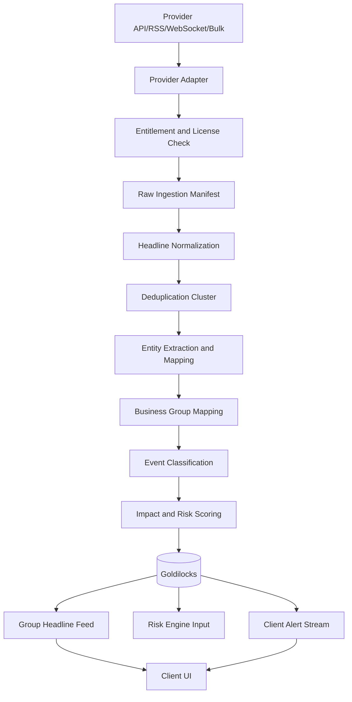

# 12. 글로벌 헤드라인 수집 및 이벤트 리스크 설계서

작성일: 2026-05-22  
기준 문서:

- `01_quant_auto_trading_requirements_definition_20260522.md`
- `02_overall_system_architecture_design_20260522.md`
- `03_domain_data_model_erd_draft_20260522.md`
- `05_data_collection_pipeline_detail_design_20260522.md`
- `10_risk_engine_detailed_requirements_20260522.md`
- `11_business_group_classification_group_risk_design_20260522.md`

## 1. 목적

글로벌 헤드라인 수집 기능은 국내외 종목, 발행회사, ETF 구성종목, 사업 그룹과 관련된 신뢰도 높은 실시간 정보를 수집하고, 이를 이벤트 리스크 점수로 변환해 리스크 엔진과 클라이언트에 제공하기 위한 기능이다.

헤드라인은 매매 판단을 보조하는 정보다. 헤드라인, 공시, 국제 정세 이벤트는 자동 주문을 직접 발생시키지 않고 주문 전 경고, 신규 매수 제한, 수동 검토, 시나리오 테스트 추천, 클라이언트 알림에만 사용한다.

## 2. 설계 원칙

1. 공식/전문 정보원 우선  
   공식 공시, 규제기관, 중앙은행, 거래소, 계약 기반 금융 뉴스의 우선순위를 일반 뉴스나 소셜보다 높게 둔다.

2. 라이선스 준수  
   provider별 저장, 표시, 요약, 재배포 가능 범위를 명시적으로 관리한다. 전문 본문은 계약상 허용되지 않는 한 저장하거나 재표시하지 않는다.

3. 원문 링크와 출처 보존  
   모든 headline event는 source, provider, published_at, received_at, raw_ref, url, license policy를 보존한다.

4. 다중 출처 확인  
   중대 이벤트는 단일 저신뢰 출처만으로 차단하지 않는다. 공식 정보 또는 복수 독립 출처 확인을 통해 확인 상태를 부여한다.

5. 가격 데이터와 분리  
   뉴스/공시/국제 정세 pipeline은 가격 수집 pipeline과 분리하되, 리스크 계산 시점에는 종목/그룹/포트폴리오와 결합한다.

6. 재현 가능성  
   이벤트 리스크 점수는 source rank, event type, entity map, group map, dedup cluster, 모델 버전, 산출 시각을 저장해 과거 주문 전 판단을 재현할 수 있어야 한다.

7. 보수적 자동화  
   AI 번역, 요약, 감성 분석은 보조 값이다. 운영 승인 없이 자동 주문의 직접 트리거로 사용하지 않는다.

## 3. 적용 범위

### 3.1 포함 범위

- provider별 API, RSS, WebSocket, bulk feed 수집 adapter
- 정보원 신뢰도 계층과 source rank 관리
- 라이선스와 entitlement 관리
- headline event 정규화
- 중복, 재송신, 번역 기사, 공시 기반 기사 deduplication
- 종목, 발행회사, ETF 구성종목, 사업 그룹 매핑
- 이벤트 유형 분류
- sentiment와 impact score 산출
- 그룹별 headline feed 생성
- 그룹 이벤트 리스크 점수 산출
- 국제 정세 급변 이벤트 후보 감지
- WebSocket/SSE/polling 기반 클라이언트 전달
- 리스크 엔진 입력 연계
- 수집 지연, provider 장애, 라이선스 만료 관측성

### 3.2 제외 범위

- 전문 뉴스 계약 체결 절차
- 유료 provider별 가격 정책 결정
- 공시 이후 주가 범위 예측 모델의 상세 학습
- 국제 정세 급변 이벤트 클라이언트 화면의 세부 UX 설계

국제 정세 급변 이벤트의 클라이언트 배너, toast, 확인 처리, mute, 심각도별 필터링은 다음 산출물에서 상세화한다.

## 4. 정보원 계층

### 4.1 source tier

| tier | 정보원 유형 | 예시 | 자동 리스크 사용 |
| --- | --- | --- | --- |
| `T0_OFFICIAL` | 공식 공시/규제/거래소/중앙은행 | OpenDART, SEC EDGAR, KRX/KIND, Fed, ECB, OFAC, 거래소 공지 | 사용 가능 |
| `T1_LICENSED_PRO` | 계약 기반 전문 금융 뉴스 | LSEG/Reuters, Bloomberg, FactSet StreetAccount, Dow Jones/Factiva, S&P Global | 계약 범위 내 사용 가능 |
| `T2_COMPANY_OFFICIAL` | 기업 직접 발표 | IR, 보도자료, 실적 발표, 공식 블로그 | 보조 사용 가능 |
| `T3_CURATED_PUBLIC` | 공개 이벤트 데이터/검증 뉴스 집계 | GDELT, 공공 RSS, 정부 공개 feed | 복수 확인 후 사용 |
| `T4_GENERAL_WEB` | 일반 뉴스/소셜/블로그 | 일반 언론, 커뮤니티, SNS | 초기에는 수동 검토 |

### 4.2 2026-05-22 기준 공개 문서로 확인한 정보원 예시

| 정보원 | 확인한 공개 채널 | 설계상 사용 |
| --- | --- | --- |
| SEC EDGAR | `https://data.sec.gov/`, `https://www.sec.gov/edgar/searchedgar/accessing-edgar-data.htm` | 미국 상장사 공시, ticker/CIK 매핑, XBRL 데이터 |
| OpenDART | `https://opendart.fss.or.kr/intro/main.do` | 한국 기업 공시, 보고서 원문, 주요 공시/재무 정보 |
| KRX KIND | `https://kind.krx.co.kr/` | 한국거래소 기업공시 채널 |
| KRX Open API | `https://openapi.krx.co.kr/contents/OPP/MAIN/main/index.cmd` | 국내 시장/거래소 데이터와 일부 거래소 공개 데이터 |
| Federal Reserve RSS | `https://www.federalreserve.gov/feeds/default.htm` | 미국 중앙은행 발표와 통화정책 이벤트 |
| ECB RSS | `https://www.ecb.europa.eu/rss` | 유럽중앙은행 발표와 환율/정책 이벤트 |
| OFAC Recent Actions | `https://ofac.treasury.gov/recent-actions/sanctions-list-updates` | 제재, 수출통제, 지정학 이벤트 확인 |
| LSEG News API | `https://developers.lseg.com/en/api-catalog/refinitiv-data-platform/news-API` | 계약 기반 실시간 금융 뉴스 |
| Bloomberg Data License | `https://professional.bloomberg.com/products/data/data-management/data-license/` | 계약 기반 enterprise 데이터와 뉴스 |
| FactSet StreetAccount | `https://developer.factset.com/recipe-catalog/create-streamlined-and-tailored-news-with-factset-streetaccount` | 계약 기반 기업/시장 뉴스 요약 |
| S&P Global Market Intelligence | `https://www.spglobal.com/market-intelligence/en/solutions/data-delivery` | 계약 기반 데이터, 뉴스, 리서치 feed |
| GDELT DOC 2.0 | `https://blog.gdeltproject.org/gdelt-doc-2-0-api-debuts/` | 공개 글로벌 뉴스 탐색과 보조 이벤트 감지 |

위 목록은 초기 설계 기준의 후보군이다. 실제 운영 사용은 계약, API 약관, redisplay entitlement, 저장 허용 범위, 지연 정책을 검토한 뒤 활성화한다.

## 5. 전체 아키텍처



## 6. Provider adapter 설계

### 6.1 adapter 책임

- provider 인증과 token 갱신
- API, RSS, WebSocket, SFTP, bulk file 수집
- rate limit과 backoff 처리
- published_at과 received_at 분리
- provider sequence 또는 cursor 저장
- raw_ref 기반 idempotency 보장
- entitlement 확인
- provider별 장애와 지연 상태 기록
- 원문 저장 가능 범위 필터링

### 6.2 adapter 공통 인터페이스

```text
fetch_headlines(provider_id, cursor, since_at) -> HeadlineBatch
stream_headlines(provider_id, subscription) -> HeadlineEvent
ack(provider_id, cursor) -> AckResult
healthcheck(provider_id) -> ProviderHealth
refresh_entitlement(provider_id) -> EntitlementStatus
```

### 6.3 수집 방식별 처리

| 방식 | 사용 예 | 처리 기준 |
| --- | --- | --- |
| REST polling | 공시 API, 일부 뉴스 API | cursor와 since_at 저장 |
| RSS/Atom | 중앙은행, 규제기관, 회사 IR | GUID, URL, published_at 기준 dedup |
| WebSocket/SSE | 실시간 뉴스 feed | sequence gap 감지 |
| SFTP/bulk | 대량 이력 데이터 | manifest와 checksum 저장 |
| Cloud delivery | enterprise data feed | bucket event와 ingestion manifest 저장 |

## 7. 라이선스와 entitlement

### 7.1 저장 정책

| 데이터 | 기본 저장 여부 | 비고 |
| --- | --- | --- |
| headline/title | 저장 | provider 약관 확인 필요 |
| metadata | 저장 | source, published_at, url, ticker 등 |
| summary | 기본 미저장 | MVP 저장/표시 범위는 headline과 metadata로 제한 |
| full text | 미저장 | MVP 범위에서 제외 |
| provider raw payload | 기본 미저장 | 디버그용 임시 보관 시 TTL 적용 |
| 원문 링크 | 저장 | UI에서 source 확인용 |
| 번역문 | 기본 미저장 | 후속 단계에서 AI 요약/번역 승인 시 재검토 |

### 7.2 entitlement 필드

| 필드 | 설명 |
| --- | --- |
| `provider_id` | provider 식별자 |
| `license_id` | 계약/라이선스 식별자 |
| `can_store_headline` | headline 저장 가능 여부 |
| `can_store_summary` | 요약 저장 가능 여부 |
| `can_store_full_text` | 전문 저장 가능 여부 |
| `can_redisplay` | 클라이언트 재표시 가능 여부 |
| `display_delay_seconds` | 지연 표시 조건 |
| `allowed_user_scope` | 개인, 내부, 외부, enterprise |
| `expires_at` | 권한 만료 시각 |

### 7.3 권한 위반 방지

- UI는 entitlement가 허용한 필드만 표시한다.
- 전문 표시가 금지된 provider는 headline, metadata, 원문 링크만 노출한다.
- 계약 만료 또는 entitlement 부족 시 해당 source의 신규 표시를 중단한다.
- 수집은 가능하지만 표시 불가인 데이터는 risk score 산출 사용 가능 여부를 별도 플래그로 관리한다.
- 권한 변경은 감사 로그에 남긴다.

## 8. 정규화 스키마

### 8.1 headline event 핵심 필드

| 필드 | 설명 |
| --- | --- |
| `headline_event_id` | 내부 이벤트 id |
| `provider_id` | 수집 provider |
| `source_id` | 실제 원천 매체/기관 |
| `source_rank` | 정보원 신뢰도 rank |
| `source_tier` | T0~T4 |
| `raw_ref` | provider 원본 식별자 |
| `published_at` | 원천 게시 시각 |
| `received_at` | 시스템 수신 시각 |
| `language` | 원문 언어 |
| `headline` | 헤드라인 |
| `summary` | 후속 확장용 요약 필드. MVP에서는 저장/표시하지 않음 |
| `url` | 원문 링크 |
| `event_type` | 분류된 이벤트 유형 |
| `sentiment_score` | -1~1 |
| `impact_score` | 0~100 |
| `confidence_score` | 0~1 |
| `dedup_cluster_id` | 중복 cluster |
| `license_policy_id` | 표시/저장 정책 |
| `processing_status` | received, normalized, mapped, scored, suppressed |

### 8.2 timestamp 원칙

| 시각 | 의미 |
| --- | --- |
| `published_at` | source가 공개한 시각 |
| `provider_received_at` | provider가 수신 또는 배포한 시각 |
| `received_at` | 내부 수집기가 받은 시각 |
| `normalized_at` | 정규화 완료 시각 |
| `available_for_model_at` | 모델과 리스크 엔진에서 사용 가능한 시각 |
| `displayed_at` | 클라이언트에 최초 표시된 시각 |

모델과 백테스트는 `available_for_model_at` 이후 데이터만 사용한다.

## 9. Deduplication 설계

### 9.1 중복 유형

| 유형 | 설명 | 처리 |
| --- | --- | --- |
| exact duplicate | 같은 provider raw_ref 중복 | 한 건만 저장 |
| provider resend | 동일 기사의 수정/재송신 | update revision 연결 |
| cross-provider duplicate | 여러 provider의 같은 사건 보도 | cluster로 묶음 |
| translation duplicate | 번역 기사 | 원문 기준 cluster 연결 |
| disclosure-derived article | 같은 공시 기반 기사 | 공시 event와 연결 |
| rolling update | 속보 후 상세 기사 | primary story와 update chain 관리 |

### 9.2 dedup key

```text
dedup_key_candidates =
    provider_raw_ref
    canonical_url
    normalized_headline_hash
    source + published_at_bucket + entity_set + event_type
    semantic_embedding_similarity
```

### 9.3 cluster 대표 선택

cluster 대표 headline은 아래 우선순위로 선택한다.

1. 공식 공시/규제기관
2. 계약 기반 전문 금융 뉴스
3. 기업 직접 발표
4. 다중 출처에서 가장 먼저 확인된 기사
5. 가장 높은 source_rank

UI에는 cluster 대표 headline과 함께 관련 출처 수, 확인 상태, 원문 링크 목록을 표시한다.

## 10. Entity 및 사업 그룹 매핑

### 10.1 entity 추출 대상

| entity | 예시 |
| --- | --- |
| company | 발행회사, 모회사, 자회사, 경쟁사 |
| security | ticker, ISIN, CUSIP, CIK, LEI, 종목 코드 |
| business_group | 내부 사업 그룹 |
| ETF | ETF와 구성종목 |
| country/region | 국가, 지역, 경제권 |
| currency | USD, KRW, JPY, EUR 등 |
| commodity | oil, LNG, lithium, nickel, copper 등 |
| sector | 표준 산업분류와 내부 섹터 |
| regulator | SEC, FSS, KRX, OFAC, Fed, ECB 등 |

### 10.2 매핑 순서

1. provider가 제공한 ticker/entity id를 내부 `security_master`와 매칭한다.
2. CIK, ISIN, LEI, 거래소 코드, 회사명 alias를 사용해 보조 매칭한다.
3. 종목이 ETF이면 구성종목을 조회해 look-through entity를 확장한다.
4. `security_business_group_map`의 유효기간 기준으로 사업 그룹을 산출한다.
5. 국가, 통화, 원자재, 섹터 impact를 보조 factor로 연결한다.
6. confidence score가 낮으면 review queue로 보낸다.

### 10.3 매핑 confidence

| confidence | 기준 | 처리 |
| --- | --- | --- |
| `high` | provider entity id와 내부 종목 id 직접 매칭 | 자동 반영 |
| `medium` | alias, ticker, 거래소, 국가 조합 매칭 | 자동 반영 후 샘플링 검토 |
| `low` | 텍스트 기반 추정 | 수동 검토 |
| `ambiguous` | 동일 이름/티커 충돌 | 자동 반영 금지 |

## 11. 이벤트 유형 분류

### 11.1 event taxonomy

| event_type | 설명 | 기본 영향 |
| --- | --- | --- |
| `EARNINGS` | 실적 발표, 잠정 실적 | 방향성은 실적 surprise로 판단 |
| `GUIDANCE` | 매출/이익 가이던스 | 강한 가격 영향 |
| `MNA` | 인수합병, 매각, 분할 | 종목별 방향 상이 |
| `CONTRACT_ORDER` | 대규모 수주, 계약 | 긍정 가능 |
| `RECALL_PRODUCT_ISSUE` | 리콜, 품질 문제 | 부정 가능 |
| `LITIGATION` | 소송, 배상, 조사 | 부정 가능 |
| `REGULATION` | 규제, 인허가, 정책 | 그룹 영향 가능 |
| `SANCTION_EXPORT_CONTROL` | 제재, 수출통제 | 중대 리스크 |
| `SUPPLY_CHAIN` | 공급망 차질, 물류, 원자재 | 그룹 영향 가능 |
| `STRIKE_LABOR` | 파업, 노사분규 | 단기 생산 차질 |
| `GEOPOLITICAL` | 군사 충돌, 전쟁, 무역 제한 | 글로벌 리스크 |
| `CYBER_SECURITY` | 해킹, 랜섬웨어, 보안 사고 | 종목/그룹 리스크 |
| `CREDIT_RATING` | 신용등급 변경 | 자금조달 영향 |
| `MANAGEMENT_CHANGE` | CEO/CFO 교체 | 방향성 불확실 |
| `CENTRAL_BANK` | 금리, 긴급 유동성, 통화정책 | 시장/통화 영향 |
| `COMMODITY_SHOCK` | 유가, 가스, 금속 가격 급변 | 관련 그룹 영향 |

### 11.2 분류 방식

- provider taxonomy가 있으면 우선 사용한다.
- 공식 공시 type과 규제기관 category를 우선 적용한다.
- 규칙 기반 키워드 분류와 ML 분류를 병행한다.
- 낮은 confidence는 `UNCLASSIFIED_REVIEW`로 두고 자동 차단에 사용하지 않는다.
- 한 headline은 여러 event_type을 가질 수 있다.

## 12. 이벤트 리스크 점수

### 12.1 기본 산식

```text
headline_event_risk_score =
    source_reliability_weight
    * event_severity_weight
    * entity_relevance_score
    * business_group_relevance_score
    * portfolio_exposure_weight
    * confirmation_factor
    * novelty_factor
    * freshness_decay
    * data_quality_factor
```

0~100 점수로 정규화한다.

### 12.2 구성 요소

| 요소 | 설명 |
| --- | --- |
| `source_reliability_weight` | source tier와 source rank |
| `event_severity_weight` | 이벤트 유형별 위험 강도 |
| `entity_relevance_score` | 종목/회사와 headline 관련도 |
| `business_group_relevance_score` | 그룹 매출/원가/규제와의 관련도 |
| `portfolio_exposure_weight` | 보유 비중과 주문 후 예상 노출 |
| `confirmation_factor` | 독립 출처 확인 수와 공식 확인 여부 |
| `novelty_factor` | 이미 반영된 이벤트인지 신규 이벤트인지 |
| `freshness_decay` | 시간 경과에 따른 영향 감소 |
| `data_quality_factor` | 지연, 언어 처리 오류, 매핑 confidence |

### 12.3 source reliability 기본값

| source_tier | 기본 weight |
| --- | --- |
| `T0_OFFICIAL` | 1.00 |
| `T1_LICENSED_PRO` | 0.90 |
| `T2_COMPANY_OFFICIAL` | 0.80 |
| `T3_CURATED_PUBLIC` | 0.60 |
| `T4_GENERAL_WEB` | 0.30 |

### 12.4 심각도 등급

| score | 등급 | 기본 처리 |
| --- | --- | --- |
| 0~19 | normal | 표시만 |
| 20~39 | watch | 그룹 feed 표시 |
| 40~59 | caution | UI 경고 |
| 60~79 | danger | 수동 검토, 신규 매수 제한 후보 |
| 80~100 | crisis | 주문 전 block 후보, 클라이언트 긴급 알림 |

`crisis`라도 자동 주문 직접 발생은 금지한다. 차단 여부는 리스크 엔진 룰과 확인 상태를 함께 평가한다.

## 13. 확인 상태

| 상태 | 조건 | 사용 정책 |
| --- | --- | --- |
| `unconfirmed` | 단일 출처 또는 낮은 source rank | 자동 차단 금지 |
| `partially_confirmed` | 복수 출처 또는 신뢰 source 1개 | warning/manual approval 가능 |
| `confirmed` | 공식 source 또는 복수 독립 T0/T1 source | manual approval/block 가능 |
| `retracted` | 정정/철회 확인 | 기존 점수 무효화, 감사 로그 |
| `conflicting` | 출처 간 내용 충돌 | 수동 검토 |

확인 상태는 dedup cluster 단위로 계산한다.

## 14. 국제 정세 급변 이벤트 후보 감지

국제 정세 급변 이벤트는 별도 상세 문서에서 클라이언트 노출을 다루지만, headline pipeline은 후보 감지와 기초 점수 산출을 담당한다.

### 14.1 감지 대상

- 전쟁, 군사 충돌, 무력 도발
- 경제 제재와 수출 통제
- 무역 제한, 관세, 수입 금지
- 에너지 공급 차질
- 해상 운송 차질
- 사이버 공격
- 팬데믹 또는 보건 위기
- 중앙은행/정부 긴급 발표
- 대형 자연재해와 인프라 장애

### 14.2 impact map

| impact target | 예시 |
| --- | --- |
| country | 미국, 중국, 한국, 대만, 일본, EU 등 |
| region | 중동, 홍해, 유럽, 동아시아 |
| currency | USD, KRW, JPY, EUR, CNY |
| commodity | oil, LNG, wheat, copper, lithium |
| market | KOSPI, NASDAQ, semiconductor index |
| sector | 반도체, 방산, 항공, 해운, 에너지 |
| business_group | AI 반도체, 조선, 2차전지 소재 등 |
| security | 직접 영향 종목 |

### 14.3 글로벌 이벤트 생성 조건

```text
create_global_risk_event if:
    event_type in high_impact_global_types
    and event_risk_score >= threshold
    and confirmation_status in (partially_confirmed, confirmed)
```

`unconfirmed` 상태는 client feed에는 표시할 수 있지만 긴급 배너와 주문 차단 근거로 사용하지 않는다.

## 15. Goldilocks 데이터 모델

### 15.1 기존 테이블 활용

| 테이블 | 활용 |
| --- | --- |
| `data_provider` | provider master |
| `data_license` | provider별 라이선스와 entitlement |
| `raw_data_manifest` | 원천 수집 manifest |
| `headline_source` | 실제 source와 rank |
| `headline_event` | 정규화된 headline |
| `headline_entity_map` | headline과 종목/회사/entity 연결 |
| `headline_business_group_map` | headline과 사업 그룹 연결 |
| `headline_dedup_cluster` | 중복/재송신 cluster |
| `headline_risk_signal` | 리스크 엔진 입력 신호 |
| `global_risk_event` | 국제 정세 급변 이벤트 |
| `global_risk_event_source` | 이벤트 확인 출처 |
| `global_risk_event_impact` | 영향 국가/시장/통화/그룹/종목 |
| `client_alert` | 클라이언트 알림 |
| `audit_log` | 권한 변경, 수동 검토, 알림 확인 |

### 15.2 확장 후보

#### `headline_processing_run`

| 컬럼 | 설명 |
| --- | --- |
| `processing_run_id` | 처리 run id |
| `provider_id` | provider |
| `started_at` | 시작 시각 |
| `finished_at` | 종료 시각 |
| `status` | success, partial, failed |
| `input_count` | 입력 건수 |
| `normalized_count` | 정규화 건수 |
| `deduped_count` | 중복 처리 건수 |
| `failed_count` | 실패 건수 |

#### `headline_model_version`

| 컬럼 | 설명 |
| --- | --- |
| `headline_model_version_id` | 모델 버전 |
| `model_type` | entity_extraction, classification, sentiment, summary, translation |
| `model_name` | 모델명 |
| `trained_from` | 학습 시작 |
| `trained_to` | 학습 종료 |
| `approved_at` | 운영 승인 시각 |

#### `headline_review_queue`

| 컬럼 | 설명 |
| --- | --- |
| `review_id` | 검토 id |
| `headline_event_id` | headline |
| `reason_code` | ambiguous_entity, low_confidence, license_blocked 등 |
| `assigned_to` | 담당자 |
| `status` | open, resolved, dismissed |
| `decision` | approve, suppress, remap, reclassify |

## 16. API 초안

### 16.1 그룹별 헤드라인 조회

```http
GET /business-groups/{business_group_id}/headlines?severity=caution&limit=50
```

응답:

```json
{
  "items": [
    {
      "headline_event_id": 70001,
      "published_at": "2026-05-22T09:14:10Z",
      "source_name": "SEC EDGAR",
      "source_tier": "T0_OFFICIAL",
      "headline": "Company files 8-K regarding material agreement",
      "event_type": "CONTRACT_ORDER",
      "confirmation_status": "confirmed",
      "impact_score": 68.2,
      "related_security_ids": [2001],
      "related_business_group_ids": [10],
      "dedup_cluster_size": 3,
      "url": "https://example.com/source"
    }
  ]
}
```

### 16.2 실시간 headline stream

```http
GET /stream/headlines
```

전송 방식:

- WebSocket 우선
- SSE 대체
- polling fallback

### 16.3 이벤트 리스크 신호 조회

```http
GET /risk/headline-signals?account_id={account_id}&min_score=40
```

### 16.4 수동 검토 처리

```http
POST /headlines/{headline_event_id}/review
```

요청:

```json
{
  "decision": "remap",
  "event_type": "SANCTION_EXPORT_CONTROL",
  "business_group_ids": [12, 18],
  "comment": "공식 제재 발표와 동일 cluster로 확인"
}
```

### 16.5 클라이언트 알림 확인

```http
POST /client-alerts/{client_alert_id}/ack
```

## 17. 리스크 엔진 연계

### 17.1 headline risk signal

리스크 엔진에는 headline 자체가 아니라 정규화된 risk signal을 전달한다.

| 필드 | 설명 |
| --- | --- |
| `headline_risk_signal_id` | risk signal id |
| `scope` | security, business_group, portfolio, market |
| `target_id` | 대상 id |
| `event_type` | 이벤트 유형 |
| `risk_score` | 0~100 |
| `severity` | normal, watch, caution, danger, crisis |
| `confirmation_status` | unconfirmed, partially_confirmed, confirmed 등 |
| `valid_from` | 적용 시작 |
| `valid_to` | 적용 종료 |
| `source_cluster_id` | 근거 cluster |

### 17.2 리스크 룰 연결

| 리스크 룰 | 입력 |
| --- | --- |
| `RISK-EVT-001` | 사업 그룹별 헤드라인 리스크 점수 |
| `RISK-EVT-002` | 다중 신뢰 출처에서 동일 부정 이벤트 확인 |
| `RISK-EVT-003` | 국제 정세 급변 이벤트 영향 노출 |
| `RISK-EVT-004` | 위험/위기 등급 이벤트 신규 매수 제한 |
| `RISK-DISC-003` | 중대 공시 기반 차단 |

### 17.3 주문 처리 원칙

- `unconfirmed` signal은 주문 차단에 사용하지 않는다.
- `danger` 이상이고 `partially_confirmed` 이상이면 신규 매수 수동 승인 후보가 된다.
- `crisis`이고 `confirmed`이면 신규 매수 block 후보가 된다.
- 매도 주문은 원칙적으로 차단하지 않고, 유동성/가격 제한/중복 주문 룰을 우선한다.
- 기존 보유 비중 축소 제안은 자동 주문이 아니라 추천/알림으로만 표시한다.

## 18. 클라이언트 표시 요구사항

### 18.1 사업 그룹 headline feed

필수 표시:

- headline
- source
- source tier/rank
- published_at
- received_at
- 관련 종목
- 관련 사업 그룹
- event type
- severity
- confirmation status
- dedup cluster size
- 원문 링크
- 라이선스 표시 가능 범위

### 18.2 리스크 대시보드 표시

- 그룹별 이벤트 리스크 점수
- 이벤트 발생 후 가격/거래량/변동성 변화
- 이벤트와 공시 영향 예측 연결
- 신규 매수 제한 또는 수동 승인 필요 상태
- source 장애와 데이터 지연 상태

### 18.3 주문창 표시

주문 대상 종목과 관련 그룹에 최근 중대 headline signal이 있으면 주문창에 표시한다.

표시 항목:

- 최근 중대 headline 수
- 최고 severity
- 관련 event type
- 영향을 받는 사업 그룹
- 주문 후 그룹 노출
- risk engine decision
- 수동 검토 필요 여부

## 19. 번역, 요약, AI 처리

### 19.1 기본 정책

- 원문이 영어, 한국어가 아니면 한국어 요약을 생성할 수 있다.
- 요약은 정보 제공 목적이며 원문 대체물이 아니다.
- MVP에서는 AI 요약을 저장/표시하지 않고 headline과 metadata만 저장/표시한다.
- 후속 단계에서 AI 요약을 허용할 경우 모델 버전, 생성 시각, confidence score를 저장한다.
- 라이선스가 허용하지 않는 전문 기반 요약은 생성, 저장, 표시하지 않는다.
- 낮은 confidence의 entity 추출 결과는 자동 risk score에 제한적으로 반영한다.

### 19.2 저장 필드

| 필드 | 설명 |
| --- | --- |
| `summary_text` | 요약 |
| `summary_language` | 요약 언어 |
| `summary_model_version_id` | 요약 모델 버전 |
| `translation_model_version_id` | 번역 모델 버전 |
| `summary_confidence_score` | 요약 신뢰도 |
| `generated_at` | 생성 시각 |
| `license_allowed` | 저장/표시 가능 여부 |

## 20. 운영과 관측성

### 20.1 provider 상태 지표

| 지표 | 목적 |
| --- | --- |
| provider latency | source 지연 감지 |
| ingestion lag | published_at 대비 received_at 지연 |
| API error rate | 장애 감지 |
| entitlement failure count | 권한 문제 감지 |
| dedup collision rate | dedup 품질 점검 |
| unmapped entity rate | entity mapping 품질 |
| low confidence classification rate | 이벤트 분류 품질 |
| source gap count | WebSocket sequence gap |
| client delivery failure rate | 실시간 feed 품질 |

### 20.2 운영 알림

- provider 장애
- source별 수집 지연
- 라이선스 만료 임박
- entitlement 부족
- dedup 실패율 급등
- 특정 그룹의 event risk score 급등
- 긴급 이벤트 client delivery 실패
- AI 요약/번역 실패율 급등

## 21. 데이터 보존

| 데이터 | 보존 정책 |
| --- | --- |
| headline metadata | 장기 보존 |
| headline text | 계약 범위 내 장기 보존 |
| full text | 기본 미보존, 허용 시 제한 보존 |
| raw payload | 기본 미보존, 디버그 TTL |
| dedup cluster | 장기 보존 |
| risk signal | 장기 보존 |
| client alert ack | 감사 목적 장기 보존 |
| model output | 재현 기간 동안 보존 |

보존 기간과 삭제 정책은 provider 계약과 개인정보/저작권 정책을 우선한다.

## 22. 테스트 요구사항

### 22.1 단위 테스트

- provider raw_ref 중복 제거
- canonical URL 중복 제거
- 번역 기사 cluster 연결
- ticker/entity id 매핑
- alias 충돌 시 ambiguous 처리
- source tier별 reliability weight 계산
- event risk score 계산
- license policy에 따른 UI 필드 masking
- stale provider 상태 감지

### 22.2 통합 테스트

- OpenDART/SEC 공시 수집부터 entity map 생성까지
- RSS feed 수집부터 headline_event 저장까지
- 전문 뉴스 provider adapter mock 수집
- 같은 사건의 다중 provider dedup cluster 생성
- headline_business_group_map 생성
- headline_risk_signal 생성 후 risk engine 주문 경고
- WebSocket/SSE client stream 전달
- entitlement 만료 시 표시 중단

### 22.3 재현 테스트

- 과거 주문 시점의 headline risk signal을 재현할 수 있어야 한다.
- event score 산식 버전 변경 후에도 당시 score가 보존되어야 한다.
- 수정/철회 headline은 원 이벤트와 연결되고 기존 알림의 변경 사유가 남아야 한다.

## 23. 성능 요구사항

| 항목 | 목표 |
| --- | --- |
| headline 수신 후 정규화 p95 | 2초 이하 |
| headline 수신 후 group map p95 | 5초 이하 |
| headline 수신 후 risk signal 생성 p95 | 5초 이하 |
| client stream 전달 p95 | 2초 이하 |
| 그룹 headline feed 조회 p95 | 500ms 이하 |
| dedup cluster 조회 p95 | 500ms 이하 |

공식 공시 API처럼 polling 지연이 큰 source는 provider 특성상 실시간 목표에서 제외하고 source별 SLA를 별도 관리한다.

## 24. MVP 범위

### 24.1 1차 구현

- `headline_source`, `headline_event`, `headline_entity_map`, `headline_business_group_map`, `headline_dedup_cluster` 저장
- OpenDART, SEC EDGAR, 중앙은행/규제기관 RSS adapter
- 계약 provider mock adapter
- source tier와 source rank 관리
- headline metadata와 URL 저장
- full text 미저장 정책
- exact/canonical URL/semantic dedup 1차 구현
- 종목과 사업 그룹 매핑
- event taxonomy 1차 분류
- headline_risk_signal 생성
- 그룹별 headline feed API
- 리스크 엔진 경고 연계
- client SSE stream

### 24.2 후속 구현

- LSEG/Bloomberg/FactSet/Dow Jones/S&P 계약 adapter
- provider별 entitlement 자동 동기화
- AI 요약/번역 품질 평가
- source별 event score calibration
- global_risk_event 자동 생성 고도화
- 수동 검토 workflow 화면
- source별 오탐/미탐 feedback loop
- 실시간 WebSocket gap recovery

## 25. 보안과 컴플라이언스

- provider API key와 token은 secret storage에서 관리한다.
- entitlement 정보는 관리자만 수정할 수 있다.
- full text 접근은 최소 권한과 감사 로그를 적용한다.
- provider 약관 변경 시 risk scoring과 UI 표시 정책을 재검토한다.
- 외부 redisplay가 금지된 데이터는 화면 캡처/다운로드 기능에서도 제외한다.
- 라이선스 위반 가능성이 있으면 해당 source를 `suppressed` 상태로 전환한다.

## 26. 추적성

| 원 요구사항 | 본 문서 반영 위치 |
| --- | --- |
| FR-NEWS-001 | 6 |
| FR-NEWS-002 | 8 |
| FR-NEWS-003 | 10 |
| FR-NEWS-004 | 16, 18 |
| FR-NEWS-005 | 9 |
| FR-NEWS-006 | 11 |
| FR-NEWS-007 | 12 |
| FR-NEWS-008 | 19 |
| FR-NEWS-009 | 20 |
| FR-NEWS-010 | 17 |
| FR-NEWS-011 | 14 |
| FR-NEWS-012 | 14 |
| FR-NEWS-013 | 16 |
| FR-NEWS-014 | 13 |
| FR-NEWS-015 | 2, 17 |
| FR-UI-009 | 18 |
| FR-UI-010 | 7, 18 |
| FR-UI-022~024 | 14, 16 |
| NFR-REL-005 | 16, 23 |
| NFR-OBS-004 | 20 |

## 27. 미결정 사항

1. MVP에서 사용할 공식 공시/규제 source의 정확한 목록
2. LSEG/Bloomberg/FactSet/Dow Jones 등 전문 뉴스 계약 provider의 우선순위와 계약 조건
3. AI 요약/번역 모델의 운영 승인 기준
4. source rank 초기값과 calibration 방식
5. 수동 검토 queue 담당자와 SLA
6. WebSocket과 SSE 중 기본 실시간 전달 방식

## 27.1 결정 반영 사항

- 실시간 헤드라인 provider는 공식 공시와 전문 뉴스 계약 provider를 모두 포함한다.
- 헤드라인 저장/표시 범위는 headline과 metadata로 제한한다.
- 전문 본문과 전문 기반 요약은 MVP에서 저장/표시하지 않는다.
- 국제 정세 급변 이벤트의 긴급 알림 조건에는 사건 발생 후 주식 시장의 5분 평균 거래량이 직전 5거래일 평균 대비 100% 이상 증가하는 조건을 포함한다.

## 28. 다음 산출물

다음 문서는 `13_국제_정세_급변_이벤트_알림_및_클라이언트_노출_설계서`로 작성한다. 해당 문서에서는 위험/위기 등급 이벤트의 클라이언트 배너, toast, 알림 패널, 사용자 확인 처리, mute, 심각도 필터링, 포트폴리오 영향 표시를 상세화한다.
