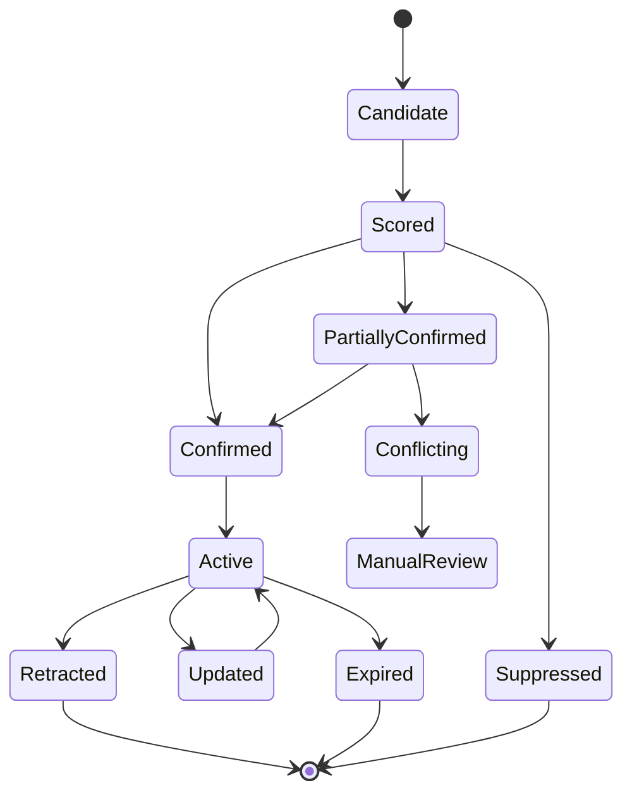

# 13. 국제 정세 급변 이벤트 알림 및 클라이언트 노출 설계서

작성일: 2026-05-22  
기준 문서:

- `01_quant_auto_trading_requirements_definition_20260522.md`
- `02_overall_system_architecture_design_20260522.md`
- `03_domain_data_model_erd_draft_20260522.md`
- `10_risk_engine_detailed_requirements_20260522.md`
- `12_global_headline_collection_event_risk_design_20260522.md`

## 1. 목적

국제 정세 급변 이벤트 알림 기능은 전쟁, 군사 충돌, 제재, 무역 제한, 에너지 공급 차질, 해상 운송 차질, 사이버 공격, 팬데믹, 중앙은행/정부 긴급 발표 같은 시장 충격 이벤트를 감지하고, 클라이언트 프로그램에 실시간으로 노출하기 위한 기능이다.

이 기능은 사용자가 보유 포트폴리오, 관심 종목, 사업 그룹, 국가, 통화, 원자재 노출에 어떤 영향이 있는지 빠르게 파악하도록 돕는다. 이벤트는 자동 주문을 직접 발생시키지 않고, 주문 전 경고, 신규 매수 제한, 수동 검토, 시나리오 테스트 추천, 알림으로만 사용한다.

## 2. 설계 원칙

1. 사용자가 즉시 이해할 수 있는 알림  
   심각도, 확정 상태, 영향 자산, 포트폴리오 영향, 필요한 조치를 한 화면에서 파악할 수 있어야 한다.

2. 주문/조회 기능과 분리  
   실시간 알림 전달 장애가 클라이언트의 핵심 주문/조회 기능을 block하지 않아야 한다.

3. 다중 출처와 확정 상태 표시  
   이벤트는 source rank, 독립 출처 수, 공식 확인 여부, dedup cluster를 기준으로 `unconfirmed`, `partially_confirmed`, `confirmed`, `conflicting`, `retracted` 상태를 가진다.

4. 보수적 리스크 연결  
   확인되지 않은 이벤트는 긴급 배너와 주문 차단 근거로 사용하지 않는다.

5. 사용자의 알림 조작은 감사 대상  
   확인, mute, filter 변경, 수동 검토 이동, 주문창 경고 무시 시도는 모두 감사 로그에 남긴다.

6. point-in-time 재현  
   과거 특정 시점의 이벤트 상태, 영향 자산, 클라이언트 표시 여부, 사용자 확인 상태를 재현할 수 있어야 한다.

## 3. 적용 범위

### 3.1 포함 범위

- `global_risk_event` 생성 후 클라이언트 알림 전파
- 이벤트 심각도와 확인 상태 기준 표시 정책
- 상단 배너, toast, 알림 패널, 리스크 대시보드, 주문창 경고
- WebSocket/SSE/polling 전달 방식
- 연결 장애와 offline 상태 처리
- 사용자 확인, mute, 심각도 필터링
- 영향을 받는 국가, 통화, 시장, 원자재, 섹터, 사업 그룹, 보유 종목 표시
- 예상 포트폴리오 영향 산출
- 리스크 엔진과 주문 전 경고 연계
- 실시간 테스트 모드와 replay 시나리오 연계
- 관측성, 감사 로그, 테스트 요구사항

### 3.2 제외 범위

- 원천 뉴스/공시 수집 adapter 상세
- headline deduplication과 entity mapping 상세
- 국제 정세 이벤트 감지 모델 학습
- 실제 브라우저 UI 디자인 시안

수집과 이벤트 점수화는 12번 문서에서 정의한 headline pipeline을 따른다.

## 4. 공식 정보원과 보조 정보원

12번 문서의 정보원 계층을 사용하되, 국제 정세 급변 이벤트의 클라이언트 긴급 알림에는 공식 채널과 다중 출처 확인을 우선한다.

### 4.1 공식/고신뢰 source 예시

| 범주 | source 예시 | 설계상 사용 |
| --- | --- | --- |
| 공시/거래소 | OpenDART, SEC EDGAR, KRX KIND | 기업/시장 공식 이벤트 |
| 중앙은행 | Federal Reserve RSS, ECB RSS | 금리, 긴급 유동성, 정책 이벤트 |
| 제재/수출통제 | OFAC Recent Actions, UN Security Council sanctions feed | 제재, 수출통제, 지정학 이벤트 |
| 에너지 | EIA petroleum/natural gas releases, IEA 발표 | 에너지 공급 차질과 원자재 충격 |
| 사이버 | CISA advisories, KEV catalog | 사이버 공격과 중요 취약점 |
| 보건 | WHO Disease Outbreak News | 팬데믹/감염병 이벤트 |
| 자연재해 | USGS earthquake feeds, NOAA/NWS/NHC feeds | 지진, 허리케인, 항만/물류 영향 |
| 여행/안보 | U.S. State Department Travel Advisories RSS | 국가별 안전/치안 급변 보조 지표 |
| 글로벌 뉴스 | LSEG/Reuters, Bloomberg, FactSet, Dow Jones, S&P Global | 실시간 교차 확인과 시장 해석 |

### 4.2 공개 문서로 확인한 source URL

| source | URL |
| --- | --- |
| SEC EDGAR Data | `https://data.sec.gov/` |
| OpenDART | `https://opendart.fss.or.kr/intro/main.do` |
| KRX KIND | `https://kind.krx.co.kr/` |
| Federal Reserve RSS | `https://www.federalreserve.gov/feeds/default.htm` |
| ECB RSS | `https://www.ecb.europa.eu/rss` |
| OFAC Recent Actions | `https://ofac.treasury.gov/recent-actions/sanctions-list-updates` |
| UN Security Council Consolidated List | `https://main.un.org/securitycouncil/en/content/un-sc-consolidated-list` |
| U.S. State Department RSS | `https://travel.state.gov/content/travel/en/rss.html` |
| EIA Petroleum | `https://www.eia.gov/petroleum/index.php` |
| USGS Earthquake Feeds | `https://earthquake.usgs.gov/earthquakes/feed/` |
| WHO Disease Outbreak News | `https://www.who.int/emergencies/disease-outbreak-news` |
| CISA Cybersecurity Advisories | `https://www.cisa.gov/news-events/cybersecurity-advisories` |
| GDELT DOC 2.0 | `https://blog.gdeltproject.org/gdelt-doc-2-0-api-debuts/` |

실제 운영 source는 계약, 약관, redisplay entitlement, 호출 제한, 지연 정책을 검토한 뒤 활성화한다.

## 5. 이벤트 생명주기



### 5.1 상태 정의

| 상태 | 의미 | 클라이언트 노출 |
| --- | --- | --- |
| `candidate` | headline pipeline에서 이벤트 후보 생성 | 기본 미노출 |
| `scored` | 기초 risk score 산출 완료 | 알림 패널 후보 |
| `partially_confirmed` | 복수 출처 또는 신뢰 source 1개 확인 | 알림 패널/toast 가능 |
| `confirmed` | 공식 source 또는 독립 T0/T1 복수 확인 | 배너/toast/패널 가능 |
| `conflicting` | source 간 내용 충돌 | 수동 검토 표시 |
| `active` | 사용자에게 표시 중인 유효 이벤트 | 전체 노출 |
| `updated` | 영향 자산, 심각도, 출처 변경 | 기존 알림 update |
| `expired` | 영향 기간 종료 | history로 이동 |
| `retracted` | 정정/철회 | 기존 알림 철회 표시 |
| `suppressed` | 라이선스/품질/운영 정책상 표시 중단 | 운영자만 확인 |

## 6. 심각도 체계

### 6.1 기본 등급

| 등급 | score | 의미 | 기본 UI |
| --- | --- | --- | --- |
| `normal` | 0~19 | 참고 수준 | 알림 패널 history |
| `watch` | 20~39 | 관찰 필요 | 알림 패널 |
| `caution` | 40~59 | 주의 필요 | toast, 패널 강조 |
| `danger` | 60~79 | 주문 전 수동 검토 후보 | 상단 배너, toast, 패널 |
| `crisis` | 80~100 | 긴급 확인 필요 | 고정 상단 배너, 반복 toast, 패널 최상단 |

### 6.2 표시 승격 조건

| 조건 | 처리 |
| --- | --- |
| `confirmed` + `danger` 이상 | 상단 배너 표시 |
| `confirmed` + `crisis` | 고정 상단 배너와 주문창 강제 경고 |
| `partially_confirmed` + `danger` 이상 | toast와 알림 패널, 수동 검토 후보 |
| `unconfirmed` + `crisis` | 알림 패널에 미확인 표시, 긴급 배너 금지 |
| `conflicting` | 운영자 검토 필요 표시, 자동 차단 금지 |
| `retracted` | 기존 알림 철회 표시와 감사 로그 |

### 6.3 심각도 조정 요인

- 보유 포트폴리오 노출이 큰 국가/통화/사업 그룹에 직접 영향
- 주요 시장 개장 중 발생
- 다중 T0/T1 source 확인
- 이벤트 발생 후 가격, 거래량, 변동성 급변
- 유동성 낮은 보유 종목에 영향
- 공시 또는 규제기관 발표와 결합
- 동일 유형 이벤트가 짧은 시간 안에 연속 발생

긴급 알림의 MVP 거래량 트리거는 사건 발생 후 관련 주식 시장 또는 영향 종목군의 5분 평균 거래량이 직전 5거래일 같은 기준의 평균 대비 100% 이상 증가하는 상황으로 둔다. 이 조건은 심각도 승격 신호로 사용하되, `unconfirmed` 이벤트를 단독으로 주문 차단하는 근거로 사용하지 않는다.

## 7. 영향 자산 매핑

### 7.1 impact target

| 대상 | 예시 | 표시 위치 |
| --- | --- | --- |
| 국가/지역 | 한국, 미국, 중국, 대만, 중동, EU | 이벤트 상세, 포트폴리오 영향 |
| 통화 | KRW, USD, JPY, EUR, CNY | FX 노출, 주문창 |
| 시장 | KOSPI, KOSDAQ, NASDAQ, S&P 500 | 리스크 대시보드 |
| 원자재 | oil, LNG, lithium, nickel, copper, wheat | 그룹 영향 |
| 섹터 | 반도체, 에너지, 방산, 해운, 항공 | heatmap |
| 사업 그룹 | AI 반도체, 조선, 2차전지 소재 | 그룹 리스트/상세 |
| 종목 | 보유 종목, 관심 종목, 주문 대상 종목 | 주문창, 종목 상세 |
| 포트폴리오 | 계좌/전략/가상 계좌 | 포트폴리오 요약 |

### 7.2 포트폴리오 영향 계산

```text
portfolio_event_exposure_krw =
    sum(position_market_value_krw * impact_relevance_weight)
```

```text
estimated_portfolio_loss_range =
    portfolio_event_exposure_krw
    * scenario_return_range_by_impact_type
```

초기 구현에서는 과거 유사 이벤트 기반 scenario return range를 사용하고, 후속 단계에서 이벤트 유형별 factor shock model을 추가한다.

### 7.3 영향 표시 기준

| 항목 | 표시 |
| --- | --- |
| 직접 보유 영향 | 원화 평가금액, 비중, 예상 손익 범위 |
| 관심 종목 영향 | 종목명, 사업 그룹, 현재 변동성 |
| 주문 대상 영향 | 주문 후 그룹/국가/통화 노출 변화 |
| ETF 영향 | 구성종목 look-through 기준 노출 |
| 가상 계좌 영향 | simulation badge와 별도 표시 |

## 8. 클라이언트 노출 채널

### 8.1 상단 배너

상단 배너는 `danger` 이상이며 확인 상태가 `partially_confirmed` 이상인 이벤트에 사용한다.

필수 표시:

- 이벤트 제목
- 심각도
- 확정 상태
- 발생 시각
- 영향을 받는 국가/통화/시장/사업 그룹
- 보유 포트폴리오 예상 영향
- 확인 버튼
- 상세 보기 버튼
- mute 버튼

배너 정책:

- `crisis`는 사용자가 확인할 때까지 고정한다.
- `danger`는 확인 전까지 상단에 유지하되, 사용자가 mute할 수 있다.
- `caution` 이하는 기본 배너를 사용하지 않는다.
- 같은 dedup cluster의 update는 기존 배너를 새로고침하고 새 배너를 중복 생성하지 않는다.

### 8.2 Toast

toast는 짧은 실시간 통지를 담당한다.

| 이벤트 | toast 표시 |
| --- | --- |
| 신규 `caution` | 1회 |
| 신규 `danger` | 1회, 클릭 시 상세 |
| 신규 `crisis` | 반복 가능, 확인 시 중단 |
| 기존 이벤트 심각도 상승 | 1회 |
| 이벤트 철회 | 1회 |

toast에는 원문 전문을 표시하지 않는다. headline, source, severity, 영향 그룹 수, 상세 보기만 표시한다.

### 8.3 알림 패널

알림 패널은 모든 국제 정세 이벤트의 기본 목록이다.

필터:

- 심각도
- 확인 상태
- 국가/지역
- 통화
- 시장
- 사업 그룹
- 보유 종목 영향 여부
- 미확인/확인/철회
- 읽음/미확인
- mute 제외/포함

정렬:

- 심각도 우선
- 최신순
- 포트폴리오 예상 영향 큰 순
- 보유 종목 수 많은 순

### 8.4 리스크 대시보드

리스크 대시보드는 이벤트를 포트폴리오 리스크와 결합해 표시한다.

- 국가/통화/사업 그룹별 영향 heatmap
- 이벤트 발생 전후 가격/거래량/변동성 변화
- 이벤트별 예상 손실 범위
- 신규 매수 제한 대상
- 수동 검토 대상 주문 후보
- 관련 시나리오 테스트 실행 버튼

### 8.5 주문창 경고

주문 대상 종목 또는 주문 후 노출될 사업 그룹에 `danger` 이상 이벤트가 있으면 주문창에 경고를 표시한다.

표시 항목:

- 관련 이벤트 제목
- 심각도와 확정 상태
- 영향을 받는 그룹/국가/통화
- 주문 후 예상 노출
- 리스크 엔진 판정
- 수동 승인 필요 여부
- 예상 슬리피지/변동성 변화가 있으면 함께 표시

주문창 경고는 사용자가 닫아도 주문 전 최종 리스크 체크에서 다시 평가한다.

### 8.6 모바일 화면

모바일에서는 정보 밀도를 줄인다.

- `crisis`: 상단 고정 배너
- `danger`: 상단 compact banner
- `caution`: 알림 탭 badge와 toast
- 상세 화면은 영향 자산, 보유 종목, 원문 링크, 사용자 확인 버튼을 우선 배치

## 9. 사용자 조작

### 9.1 확인 처리

사용자는 이벤트 알림을 확인 처리할 수 있다.

저장 항목:

| 필드 | 설명 |
| --- | --- |
| `client_alert_id` | 알림 id |
| `user_id` | 사용자 |
| `ack_status` | acknowledged, dismissed |
| `ack_at` | 확인 시각 |
| `ack_channel` | banner, toast, panel, order_ticket |
| `ack_note` | 선택 메모 |

### 9.2 Mute

mute는 알림 표시를 줄이는 기능이며, 리스크 엔진 평가를 끄지 않는다.

지원 범위:

- 이벤트 단건 mute
- dedup cluster mute
- 국가/지역 mute
- 사업 그룹 mute
- 심각도 이하 mute
- 시간 제한 mute

`crisis` 등급은 기본적으로 완전 mute를 허용하지 않고, 반복 toast만 줄이는 방식으로 처리한다.

### 9.3 필터링

사용자는 알림 패널에서 심각도, 확정 상태, 국가, 통화, 사업 그룹, 보유 영향 여부를 기준으로 필터링할 수 있다.

필터 변경은 사용자 편의 설정으로 저장할 수 있지만, `danger` 이상 기본 알림을 완전히 숨기려면 별도 권한이 필요하다.

### 9.4 수동 검토 이동

이벤트 상세에서 사용자는 관련 주문 후보나 보유 종목을 수동 검토 queue로 보낼 수 있다.

예시:

- 신규 매수 후보 보류
- 기존 보유 축소 검토
- 시나리오 테스트 요청
- source 확인 요청
- 사업 그룹 매핑 재검토 요청

## 10. 실시간 전달 설계

### 10.1 전달 방식

| 방식 | 역할 |
| --- | --- |
| WebSocket | 기본 양방향 실시간 channel |
| SSE | WebSocket 사용 불가 환경의 단방향 fallback |
| Polling | 연결 장애 시 최근 이벤트 조회 |
| Push queue | 서버 내부 pub/sub |

### 10.2 메시지 envelope

```json
{
  "message_type": "global_risk_event.updated",
  "sequence": 102344,
  "sent_at": "2026-05-22T10:10:05+09:00",
  "payload": {
    "global_risk_event_id": 3001,
    "client_alert_id": 9001,
    "severity": "danger",
    "confirmation_status": "confirmed"
  }
}
```

### 10.3 이벤트 메시지 유형

| message_type | 설명 |
| --- | --- |
| `global_risk_event.created` | 신규 이벤트 생성 |
| `global_risk_event.updated` | 심각도, 영향 자산, 출처 변경 |
| `global_risk_event.retracted` | 철회/정정 |
| `client_alert.created` | 사용자 대상 알림 생성 |
| `client_alert.ack_required` | 확인 필요 |
| `client_alert.muted` | mute 반영 |
| `client_alert.expired` | 알림 만료 |

### 10.4 재연결과 누락 복구

- 모든 메시지는 증가하는 `sequence`를 가진다.
- 클라이언트는 마지막 수신 sequence를 저장한다.
- 재연결 시 `GET /global-risk-events/stream/replay?after_sequence={sequence}`로 누락 메시지를 조회한다.
- 서버는 최근 N시간의 메시지 replay buffer를 유지한다.
- replay buffer 밖의 누락은 Goldilocks 기준 최신 상태를 다시 조회한다.

### 10.5 장애 degrade

| 장애 | 처리 |
| --- | --- |
| WebSocket 끊김 | SSE로 전환 |
| SSE 실패 | polling으로 전환 |
| polling 실패 | UI에 실시간 연결 장애 badge 표시 |
| Redis/pub-sub 장애 | Goldilocks polling으로 degrade |
| 알림 전달 실패 | 운영 metric과 retry queue |

알림 channel 장애가 주문/조회 API를 막지 않아야 한다.

## 11. API 초안

### 11.1 실시간 구독

```http
GET /stream/global-risk-events
```

구독 parameter:

| parameter | 설명 |
| --- | --- |
| `min_severity` | caution, danger, crisis |
| `portfolio_id` | 포트폴리오 영향 필터 |
| `include_unconfirmed` | 미확인 포함 여부 |
| `business_group_id` | 사업 그룹 필터 |
| `country_code` | 국가 필터 |

### 11.2 이벤트 목록

```http
GET /global-risk-events?severity=danger&status=active
```

### 11.3 이벤트 상세

```http
GET /global-risk-events/{global_risk_event_id}
```

포함 항목:

- 이벤트 기본 정보
- 심각도와 확인 상태
- 출처 목록
- 영향 국가/통화/시장/원자재/섹터/사업 그룹/종목
- 포트폴리오 영향
- 관련 headline cluster
- 관련 공시 또는 규제 이벤트
- 리스크 엔진 연결 룰
- 사용자 알림 상태

### 11.4 클라이언트 알림 확인

```http
POST /client-alerts/{client_alert_id}/ack
```

요청:

```json
{
  "ack_status": "acknowledged",
  "ack_channel": "banner",
  "ack_note": "주문 후보 보류 처리"
}
```

### 11.5 Mute 설정

```http
POST /client-alert-preferences/mute
```

요청:

```json
{
  "scope": "business_group",
  "target_id": 10,
  "max_severity": "caution",
  "expires_at": "2026-05-22T18:00:00+09:00"
}
```

### 11.6 포트폴리오 영향 조회

```http
GET /global-risk-events/{global_risk_event_id}/portfolio-impact?portfolio_id={portfolio_id}
```

## 12. 데이터 모델

### 12.1 기존 테이블

| 테이블 | 용도 |
| --- | --- |
| `global_risk_event` | 국제 정세 급변 이벤트 master |
| `global_risk_event_source` | 이벤트 확인 출처 |
| `global_risk_event_impact` | 영향 국가/시장/통화/사업 그룹/종목 |
| `headline_dedup_cluster` | 관련 headline cluster |
| `headline_risk_signal` | 리스크 엔진 입력 |
| `client_alert` | 사용자 대상 알림 |
| `client_alert_ack` | 사용자 확인/무시 처리 |
| `risk_check_result` | 주문 전 리스크 체크 결과 |
| `audit_log` | 사용자 조작과 운영 변경 |

### 12.2 확장 후보 테이블

#### `client_alert_preference`

| 컬럼 | 설명 |
| --- | --- |
| `client_alert_preference_id` | preference id |
| `user_id` | 사용자 |
| `scope` | global, country, currency, business_group, security |
| `target_id` | 대상 id |
| `min_severity` | 표시 최소 심각도 |
| `mute_until` | mute 종료 시각 |
| `created_at` | 생성 시각 |
| `updated_at` | 수정 시각 |

#### `global_risk_event_portfolio_impact`

| 컬럼 | 설명 |
| --- | --- |
| `impact_snapshot_id` | snapshot id |
| `global_risk_event_id` | 이벤트 |
| `portfolio_id` | 포트폴리오 |
| `exposure_krw` | 영향 노출 |
| `exposure_pct` | 포트폴리오 비중 |
| `estimated_loss_low_krw` | 예상 손실 하단 |
| `estimated_loss_high_krw` | 예상 손실 상단 |
| `calculated_at` | 계산 시각 |
| `scenario_version_id` | 시나리오 버전 |

#### `global_risk_event_delivery_log`

| 컬럼 | 설명 |
| --- | --- |
| `delivery_log_id` | 전달 로그 |
| `client_alert_id` | 알림 |
| `user_id` | 사용자 |
| `channel` | websocket, sse, polling |
| `delivery_status` | sent, delivered, failed, retried |
| `sequence` | stream sequence |
| `sent_at` | 전송 시각 |
| `delivered_at` | client ack 시각 |

## 13. 리스크 엔진 연계

### 13.1 risk signal 변환

`global_risk_event`는 리스크 엔진에서 직접 평가하지 않고 `headline_risk_signal` 또는 이벤트 risk signal로 정규화해 사용한다.

| 입력 | 리스크 룰 |
| --- | --- |
| 영향 사업 그룹 + severity | `RISK-EVT-001` |
| 공식/다중 출처 확인 | `RISK-EVT-002` |
| 영향 국가/통화/섹터/그룹 노출 | `RISK-EVT-003` |
| confirmed crisis 이벤트 | `RISK-EVT-004` |
| 미확인 source | `RISK-EVT-005` |

### 13.2 주문 전 처리

| 조건 | 기본 처리 |
| --- | --- |
| `confirmed` + `crisis` + 신규 매수 | block 후보 |
| `confirmed` + `danger` + 신규 매수 | manual approval 후보 |
| `partially_confirmed` + `danger` | warning/manual approval |
| `unconfirmed` | warning만 |
| 매도 주문 | 원칙적으로 차단하지 않음 |

### 13.3 주문창 메시지 예시

```text
중동 지역 에너지 공급 차질 이벤트가 확인되었습니다.
영향 대상: oil, LNG, 해운, 항공, 정유
주문 후 ENERGY_REFINING 그룹 노출: 18.4%
리스크 엔진 판정: manual_approval
```

## 14. 실시간 테스트 모드와 시나리오 연계

### 14.1 실시간 테스트 모드

가상 계좌도 live와 같은 국제 정세 이벤트 알림을 받는다. 단, UI에는 `simulation` badge를 표시하고 실제 주문 차단과 가상 주문 차단을 분리해 보여준다.

### 14.2 replay mode

replay mode에서는 과거 이벤트의 `available_for_model_at`, `displayed_at`, `client_alert_ack`를 기준으로 재현한다.

### 14.3 시나리오 테스트 추천

`danger` 이상 이벤트는 자동으로 관련 stress scenario 실행을 추천한다.

예시:

- 제재 확대 시 반도체 수출 제한 scenario
- 원유 공급 차질 시 에너지/항공/화학 shock
- 해상 운송 차질 시 조선/해운/소비재 물류 비용 shock
- 사이버 공격 시 클라우드/사이버보안/금융 인프라 shock

## 15. 감사 로그

다음 항목은 감사 로그에 남긴다.

- 이벤트 생성
- 이벤트 심각도 변경
- 확인 상태 변경
- 영향 자산 변경
- client alert 생성
- 사용자 확인 처리
- dismiss
- mute 설정/해제
- 필터 변경
- 주문창 경고 표시
- 주문창 경고 확인
- 수동 검토 queue 이동
- 이벤트 철회/정정

## 16. 관측성

### 16.1 metric

| 지표 | 목적 |
| --- | --- |
| event detection latency | 후보 감지 지연 |
| confirmation latency | 확인 상태 도달 지연 |
| client delivery latency | 클라이언트 전달 지연 |
| websocket disconnect count | 실시간 연결 품질 |
| polling fallback rate | degrade 빈도 |
| alert ack latency | 사용자 확인 지연 |
| mute rate by severity | 알림 피로도 |
| false positive rate | 오탐 |
| false negative review count | 미탐 |
| order warning conversion | 경고 후 주문 취소/보류 비율 |

### 16.2 운영 알림

- `crisis` 이벤트 생성
- `danger` 이상 이벤트의 클라이언트 전달 실패
- source 확인 상태가 `conflicting`으로 변경
- 사용자 확인 지연
- WebSocket/SSE 장애율 급등
- polling fallback 급증
- 이벤트 영향 계산 실패
- 리스크 엔진 risk signal 생성 실패

## 17. 보안과 권한

- 알림 확인은 인증된 사용자만 수행한다.
- mute 설정은 사용자별로 적용하되, 운영자가 계정 단위 기본 정책을 지정할 수 있다.
- `crisis` 완전 mute는 관리자 권한 없이는 허용하지 않는다.
- source 원문 표시 범위는 provider entitlement를 따른다.
- 알림 전달 로그에는 민감한 계좌 정보를 포함하지 않고 식별자만 저장한다.
- 포트폴리오 영향 상세는 계좌 접근 권한이 있는 사용자에게만 표시한다.

## 18. 테스트 요구사항

### 18.1 단위 테스트

- severity별 UI 노출 정책
- confirmation status별 배너 표시 제한
- `unconfirmed` 이벤트의 주문 차단 금지
- `confirmed crisis` 신규 매수 block 후보 판정
- mute 범위와 만료 처리
- `crisis` 완전 mute 제한
- sequence 누락 감지
- polling fallback 전환
- 포트폴리오 영향 계산
- 사용자 확인 로그 저장

### 18.2 통합 테스트

- headline risk signal에서 `global_risk_event` 생성
- `global_risk_event`에서 `client_alert` 생성
- WebSocket 전달 후 client ack 저장
- WebSocket 장애 시 SSE/polling 전환
- 이벤트 update가 기존 배너를 갱신하는 흐름
- 이벤트 철회 시 기존 알림 철회 표시
- 주문창에서 관련 이벤트 경고 표시
- 리스크 엔진이 이벤트 기반 manual approval을 반환하는 흐름
- 실시간 테스트 모드에서 live와 같은 이벤트를 받되 simulation badge가 표시되는 흐름

### 18.3 재현 테스트

- 과거 특정 시점의 알림 표시 여부 재현
- 이벤트 update 전/후 포트폴리오 영향 snapshot 재현
- 사용자 mute 설정이 당시 알림 표시 여부에 미친 영향 재현
- replay mode에서 과거 시점 이후 이벤트를 참조하지 않는지 검증

## 19. 성능 요구사항

| 항목 | 목표 |
| --- | --- |
| 이벤트 생성 후 client alert 생성 p95 | 1초 이하 |
| client alert 생성 후 WebSocket 전송 p95 | 1초 이하 |
| WebSocket 실패 감지 후 SSE 전환 | 5초 이하 |
| SSE 실패 후 polling 전환 | 10초 이하 |
| 이벤트 상세 조회 p95 | 500ms 이하 |
| 포트폴리오 영향 조회 p95 | 1초 이하 |
| ack 저장 p95 | 300ms 이하 |

## 20. UX 정책 상세

### 20.1 반복 알림 제한

| 조건 | 반복 정책 |
| --- | --- |
| 동일 이벤트 같은 severity | 반복 없음 |
| severity 상승 | 재알림 |
| 영향 보유 종목 추가 | 재알림 |
| `crisis` 미확인 상태 지속 | 일정 간격 반복 |
| 사용자가 확인 완료 | 반복 중단 |
| 사용자가 mute | 정책 범위 내 반복 중단 |

### 20.2 색상/표기 정책

실제 UI 색상은 Web UI 설계서에서 확정하되, 의미 체계는 아래와 같이 둔다.

| 등급 | 표기 |
| --- | --- |
| normal | 회색 계열 |
| watch | 파란색 계열 |
| caution | 노란색 계열 |
| danger | 주황색 계열 |
| crisis | 붉은색 계열 |

색상만으로 정보를 전달하지 않고 텍스트 label과 icon을 함께 제공한다.

### 20.3 빈 상태와 장애 상태

- 국제 정세 이벤트가 없으면 "현재 표시할 급변 이벤트 없음" 상태를 표시한다.
- 실시간 연결 장애 시 "실시간 알림 연결 재시도 중" 상태를 표시한다.
- source 장애 시 해당 source 이름과 마지막 정상 수신 시각을 운영 화면에 표시한다.

## 21. MVP 범위

### 21.1 1차 구현

- `global_risk_event`, `global_risk_event_source`, `global_risk_event_impact` 조회
- `client_alert`, `client_alert_ack` 저장
- `danger`/`crisis` 상단 배너
- toast
- 알림 패널
- 확인 처리
- 시간 제한 mute
- 심각도 필터
- WebSocket/SSE/polling fallback
- 포트폴리오 영향 요약
- 주문창 이벤트 경고
- 실시간 테스트 모드 simulation badge

### 21.2 후속 구현

- source별 신뢰도 calibration
- 포트폴리오 영향 factor shock model
- 사용자별 알림 추천 정책
- 모바일 push notification
- 알림 피로도 분석
- 수동 검토 workflow 화면
- 이벤트 기반 자동 scenario 생성
- 다국어 알림 요약

## 22. 리스크와 대응

| 리스크 | 대응 |
| --- | --- |
| 미확인 이벤트로 과도한 공포 유발 | 확인 상태 명확 표시, 미확인 배너 제한 |
| 알림 피로도 | severity 필터, mute, 반복 제한 |
| 중요한 이벤트 미전달 | WebSocket/SSE/polling fallback, delivery log |
| provider 장애 | source 상태 표시, 다중 source |
| 라이선스 위반 | entitlement 기반 표시 필드 제한 |
| 포트폴리오 영향 오판 | 산식 버전, scenario range, confidence 표시 |
| 주문창 경고 무시 | 최종 리스크 체크 hard gate |
| 과거 재현 실패 | sequence, snapshot, ack log 저장 |

## 23. 추적성

| 원 요구사항 | 본 문서 반영 위치 |
| --- | --- |
| FR-NEWS-010 | 13, 14 |
| FR-NEWS-011 | 4, 5, 14 |
| FR-NEWS-012 | 6, 7 |
| FR-NEWS-013 | 10, 11 |
| FR-NEWS-014 | 5, 6 |
| FR-NEWS-015 | 2, 13 |
| FR-UI-022 | 8, 10 |
| FR-UI-023 | 7, 8 |
| FR-UI-024 | 9, 15 |
| NFR-REL-005 | 10 |
| NFR-OBS-004 | 16 |

## 24. 구현 기본 결정 사항

1. `danger` threshold는 70점, `crisis` threshold는 85점으로 한다.
2. 공식 확인은 공식 source 1개 또는 tier1 전문 뉴스 2개 이상의 독립 확인으로 인정한다.
3. `crisis` 반복 toast 간격은 5분, 같은 event 최대 6회로 한다.
4. mute 최대 허용 시간은 danger 30분, crisis 10분이다.
5. 포트폴리오 영향 scenario return range는 caution -3%, danger -7%, crisis -12%를 초기값으로 둔다.
6. 모바일 push notification은 MVP에서 제외하고 내부망 Web/PWA 알림만 제공한다.
7. 운영자 수동 검토 SLA는 crisis 5분, danger 15분, caution 1시간이다.
8. delivery replay buffer 보존 시간은 24시간이다.

## 24.1 결정 반영 사항

- 국제 정세 급변 긴급 알림의 MVP 거래량 트리거는 사건 발생 후 관련 주식 시장 또는 영향 종목군의 5분 평균 거래량이 직전 5거래일 평균 대비 100% 이상 증가하는 상황이다.
- 이 거래량 트리거는 클라이언트 긴급 알림과 심각도 승격에 사용하되, 확인되지 않은 이벤트의 단독 주문 차단 근거로 사용하지 않는다.

## 25. 다음 산출물

다음 문서는 `14_사용자_지정_종목_ML_분석_및_예측_관리_설계서`로 작성한다. 해당 문서에서는 사용자가 지정한 종목의 머신러닝 분석 작업, 모델 버전 관리, 주가/거래량/변동성/위험도 예측, 예측 결과 표시와 운영 관리를 상세화한다.
