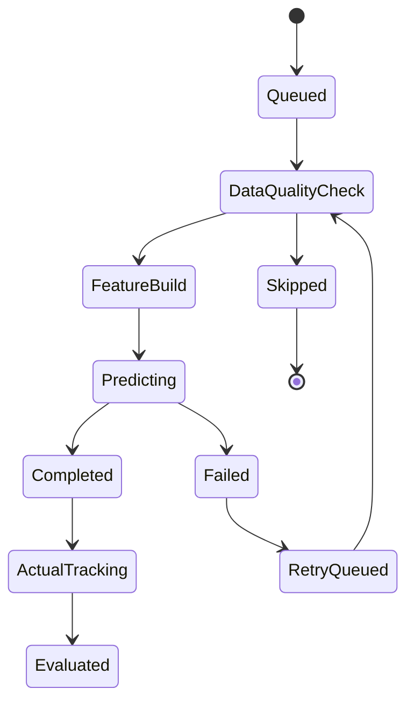

# 14. 사용자 지정 종목 ML 분석 및 예측 관리 설계서

작성일: 2026-05-22  
기준 문서:

- `01_quant_auto_trading_requirements_definition_20260522.md`
- `02_overall_system_architecture_design_20260522.md`
- `03_domain_data_model_erd_draft_20260522.md`
- `04_goldilocks_initial_schema_design_20260522.md`
- `05_data_collection_pipeline_detail_design_20260522.md`
- `10_risk_engine_detailed_requirements_20260522.md`
- `13_global_risk_event_alert_client_exposure_design_20260522.md`

## 1. 목적

이 문서는 사용자가 지정한 종목에 대해 머신러닝 분석 작업을 생성, 실행, 추적하고 주가, 거래량, 변동성, 위험도 예측 결과를 관리하는 구조를 정의한다.

사용자 지정 종목 ML 기능은 자동 주문의 직접 트리거가 아니다. 예측 결과는 분석 리포트, 주문창 사전 분석, 리스크 경고, 수동 검토 입력으로 사용한다.

## 2. 적용 범위

### 2.1 포함 범위

- 사용자 지정 종목 목록과 분석 작업 관리
- 국내와 미국 종목 동시 지원
- 1일, 1주, 1개월, 3개월 horizon 예측
- 종목별 fine-tuning 모델 관리
- 가격 범위, 거래량, 변동성, 위험도 예측
- 예측값, 신뢰구간, 주요 feature, 모델 버전 표시
- 예측 후 실제값 수집과 오차 평가
- 데이터 품질, 모델 상태, 재학습 필요 여부 관리
- 주문창, 리스크 대시보드, 종목 상세 화면 연동

### 2.2 제외 범위

- 자동 매매 전략 자체의 매수/매도 의사결정
- 브로커 주문 전송
- 옵션 implied volatility 기반 정교 산식
- 외부 모바일 push 세부 구현

## 3. 설계 원칙

1. 예측은 범위와 확률로 표현한다.  
   단일 목표가보다 하한, 중앙값, 상한, 손실 확률, 변동성 확대 확률을 우선한다.

2. 모델과 데이터의 시점을 분리한다.  
   학습 데이터 cutoff, 예측 생성 시각, 예측 적용 가능 시각을 반드시 기록한다.

3. 종목별 fine-tuning은 공통 모델 위에서 수행한다.  
   공통 base model을 먼저 만들고, 종목별 데이터가 충분할 때만 종목별 fine-tuning을 허용한다.

4. 예측 실패는 조용히 숨기지 않는다.  
   데이터 지연, feature 결측, 모델 오류, 신뢰도 부족은 화면과 리스크 체크에 명확히 전달한다.

5. point-in-time 재현을 보장한다.  
   과거 어느 시점에 어떤 모델과 feature로 어떤 예측이 표시되었는지 재현할 수 있어야 한다.

## 4. 사용자 흐름

```text
사용자 종목 선택
  -> 분석 horizon 선택
  -> 분석 작업 생성
  -> 데이터 품질 검사
  -> feature 생성
  -> base model 예측
  -> 종목별 fine-tuning 모델 예측
  -> 예측 결과 저장
  -> UI 표시 / 주문창 preview / 리스크 엔진 전달
  -> 실제값 도착 후 오차 평가
```

## 5. 분석 대상 관리

### 5.1 사용자 watchlist

`user_watchlist`는 사용자가 분석 대상으로 지정한 종목 묶음이다.

필수 속성:

| 필드 | 설명 |
| --- | --- |
| `watchlist_id` | watchlist 식별자 |
| `user_id` | 사용자 |
| `name` | 목록 이름 |
| `scope` | 관심, 보유, 후보, 사업 그룹, 수동 |
| `market_scope` | KR, US, BOTH |
| `is_active` | 활성 여부 |

### 5.2 분석 대상 종목

분석 대상은 `security_master` 기준으로 관리한다.

필수 속성:

| 필드 | 설명 |
| --- | --- |
| `security_id` | 종목 식별자 |
| `market_code` | KRX, NASDAQ, NYSE 등 |
| `currency` | KRW, USD |
| `business_group_id` | 내부 사업 유사도 그룹 |
| `source_reason` | 사용자 수동 선택, 보유 종목, 신호 후보 등 |
| `added_at` | 추가 시각 |

## 6. 분석 작업 모델

### 6.1 작업 단위

`ml_analysis_job`은 종목, horizon, 모델 버전, feature set, 실행 모드를 묶는 작업 단위다.

| 필드 | 설명 |
| --- | --- |
| `job_id` | 작업 식별자 |
| `watchlist_id` | 사용자 지정 목록 |
| `security_id` | 분석 종목 |
| `prediction_horizon` | `1d`, `1w`, `1m`, `3m`, 사용자 지정 |
| `target_type` | price, volume, volatility, risk |
| `model_version_id` | 적용 모델 버전 |
| `feature_set_id` | feature set 버전 |
| `training_cutoff_at` | 학습 데이터 cutoff |
| `requested_at` | 요청 시각 |
| `started_at` | 시작 시각 |
| `completed_at` | 완료 시각 |
| `status` | queued, running, completed, failed, skipped |
| `failure_reason` | 실패 사유 |

### 6.2 작업 생성 정책

- 기본 horizon은 1일, 1주, 1개월, 3개월이다.
- 사용자는 horizon을 추가할 수 있지만, 운영 기본 dashboard에는 MVP horizon을 우선 표시한다.
- 동일 종목, 동일 horizon, 동일 feature cutoff 작업이 이미 성공했으면 재사용한다.
- 실시간 주문창 preview는 가장 최근 유효 예측을 사용하되, tick 변경에 따른 현재가 보정은 주문창 분석 서비스에서 수행한다.

### 6.3 작업 상태 전이



## 7. 모델 구성

### 7.1 모델 계층

| 계층 | 목적 | 예시 |
| --- | --- | --- |
| 공통 base model | 시장 전체 패턴 학습 | gradient boosting, temporal CNN, tree ensemble |
| 시장별 모델 | 국내/미국 시장 구조 보정 | KR model, US model |
| 사업 그룹 모델 | peer group 반응 보정 | 반도체, 2차전지, 금융 |
| 종목별 fine-tuned model | 특정 종목 패턴 보정 | user-selected security model |

### 7.2 종목별 fine-tuning 적용 조건

종목별 fine-tuning은 아래 조건을 만족할 때 적용한다.

| 조건 | MVP 기준 |
| --- | --- |
| 최소 가격 이력 | 2년 이상 일봉 |
| 최소 거래량 이력 | 2년 이상 |
| 결측률 | 핵심 feature 기준 5% 이하 |
| 거래정지/상장폐지 이벤트 | 학습 window에서 별도 마스킹 |
| 최근 데이터 지연 | 예측 시점 기준 허용 지연 이내 |

조건을 만족하지 못하면 공통 base model 또는 사업 그룹 모델을 사용하고 `fine_tuning_status=not_applicable`로 기록한다.

### 7.3 모델 버전

`model_version`은 다음 정보를 가진다.

| 필드 | 설명 |
| --- | --- |
| `model_version_id` | 모델 버전 |
| `model_family` | tree, linear, sequence, ensemble 등 |
| `market_scope` | KR, US, BOTH |
| `target_type` | price, volume, volatility, risk |
| `horizon` | 예측 horizon |
| `training_data_from` | 학습 시작일 |
| `training_data_to` | 학습 종료일 |
| `feature_set_hash` | feature 구성 hash |
| `artifact_uri` | 모델 artifact 경로 |
| `metrics_json` | 검증 성능 |
| `status` | candidate, active, retired, blocked |

## 8. Feature 설계

### 8.1 가격 feature

- 수익률: 1일, 5일, 20일, 60일, 120일
- 이동평균 괴리율
- 고저가 range
- gap return
- 시장 대비 초과수익률
- 사업 그룹 대비 초과수익률
- 최근 drawdown

### 8.2 거래량 feature

- 평균 거래량과 평균 거래대금
- 거래량 z-score
- 회전율
- 가격 변동 대비 거래량 변화
- 저유동성 flag
- 주문금액 대비 평균 거래대금 비율

저유동성 판정은 평균 거래대금 기준을 MVP 기본값으로 사용한다.

### 8.3 변동성 feature

- 실현 변동성
- EWMA 변동성
- 장중 range 기반 변동성
- 사업 그룹 변동성
- 시장 지수 변동성
- 변동성 급등 빈도

옵션 implied volatility와 ML 기반 예측 변동성 포함 여부는 후속 확인 항목이다.

### 8.4 리스크 feature

- 종목별 위험도 지수
- 사업 그룹 리스크 점수
- 헤드라인/공시 이벤트 점수
- 국제 정세 이벤트 영향 점수
- VaR, CVaR proxy
- MDD와 회복 기간
- 환율 민감도

## 9. 예측 결과 구조

### 9.1 공통 필드

`ml_prediction_result`는 예측 결과의 공통 저장소다.

| 필드 | 설명 |
| --- | --- |
| `prediction_id` | 예측 식별자 |
| `job_id` | 분석 작업 |
| `security_id` | 종목 |
| `target_type` | price, volume, volatility, risk |
| `horizon` | 1d, 1w, 1m, 3m |
| `base_value` | 예측 기준 현재값 |
| `predicted_at` | 예측 생성 시각 |
| `valid_from` | 적용 시작 시각 |
| `valid_to` | 적용 종료 시각 |
| `model_version_id` | 모델 버전 |
| `feature_set_id` | feature set |
| `quality_status` | ok, degraded, blocked |
| `confidence_score` | 0~100 |

### 9.2 가격 예측

가격 예측은 범위로 저장한다.

| 필드 | 설명 |
| --- | --- |
| `price_lower` | 예상 하한 |
| `price_median` | 예상 중앙값 |
| `price_upper` | 예상 상한 |
| `return_lower_pct` | 예상 수익률 하한 |
| `return_median_pct` | 예상 수익률 중앙값 |
| `return_upper_pct` | 예상 수익률 상한 |
| `prob_loss` | 손실 확률 |
| `prob_large_loss` | 큰 손실 확률 |

### 9.3 거래량 예측

| 필드 | 설명 |
| --- | --- |
| `volume_expected` | 예상 거래량 |
| `turnover_expected` | 예상 거래대금 |
| `volume_range_lower` | 거래량 하한 |
| `volume_range_upper` | 거래량 상한 |
| `liquidity_score` | 0~100 |
| `low_liquidity_flag` | 평균 거래대금 기준 저유동성 여부 |

### 9.4 변동성 예측

| 필드 | 설명 |
| --- | --- |
| `volatility_expected` | 예상 변동성 |
| `volatility_lower` | 변동성 하한 |
| `volatility_upper` | 변동성 상한 |
| `volatility_spike_prob` | 변동성 급등 확률 |
| `formula_version_id` | 변동성 산식 버전 |

### 9.5 위험도 예측

위험도는 0~100 점수로 관리한다.

| 필드 | 설명 |
| --- | --- |
| `risk_score_expected` | 예상 위험도 |
| `risk_score_lower` | 위험도 하한 |
| `risk_score_upper` | 위험도 상한 |
| `risk_level` | normal, watch, caution, danger, crisis |
| `risk_driver_json` | 위험 기여 요인 |
| `risk_event_refs` | 관련 공시/헤드라인/국제 이벤트 참조 |

## 10. 실제값 수집과 성능 평가

### 10.1 실제값 매핑

`ml_prediction_actual`은 horizon이 지난 뒤 예측 결과와 실제 결과를 연결한다.

| 필드 | 설명 |
| --- | --- |
| `prediction_id` | 예측 결과 |
| `actual_observed_at` | 실제값 관측 시각 |
| `actual_price` | 실제 가격 |
| `actual_volume` | 실제 거래량 |
| `actual_volatility` | 실제 변동성 |
| `actual_risk_score` | 실제 위험도 |
| `error_value` | 오차 |
| `error_pct` | 오차율 |
| `interval_hit_flag` | 실제값이 예측 범위 안에 있었는지 |

### 10.2 성능 지표

| 대상 | 기본 지표 |
| --- | --- |
| 가격 범위 | interval hit rate, pinball loss, 방향 정확도 |
| 거래량 | MAPE, z-score hit rate, 급증 탐지 recall |
| 변동성 | RMSE, spike precision/recall |
| 위험도 | calibration, level transition accuracy |

### 10.3 성능 저하 탐지

성능 저하 조건:

- 최근 20개 예측의 interval hit rate가 하한 미만
- 같은 방향 오류가 연속 발생
- 변동성 급등 구간에서 과소예측 반복
- 데이터 품질 degraded 상태가 반복
- fine-tuned model이 base model보다 지속적으로 낮은 성능

성능 저하 시 `model_version.status=blocked` 또는 `requires_retrain` 상태로 전환한다.

## 11. UI 표시 요구사항

### 11.1 종목 ML 분석 화면

탭 구성:

| 탭 | 표시 항목 |
| --- | --- |
| 가격 | horizon별 예상 가격 범위, 손실 확률, 실제 추적 |
| 거래량 | 예상 거래량/거래대금, 저유동성 flag, 체결 위험 |
| 변동성 | 예상 변동성, 급등 확률, 변동성 지수 연결 |
| 위험도 | 0~100 위험 점수, 위험 level, 주요 driver |
| 모델 | 모델 버전, feature set, 성능, 데이터 품질 |

### 11.2 표시 원칙

- 예측 생성 시각과 적용 모델 버전을 항상 표시한다.
- 예측 범위는 차트와 표를 함께 제공한다.
- 데이터 지연이나 모델 오류가 있으면 예측값 대신 상태를 표시한다.
- 자동 주문 직접 근거가 아님을 화면 정책으로 반영한다.

## 12. 주문창 연동

주문창은 현재가와 주문 수량을 기준으로 가장 최근 유효 예측을 가져온다.

주문창에 제공하는 값:

- horizon별 가격 하한, 중앙값, 상한
- 손실 확률
- 예상 손익 범위
- 변동성 급등 확률
- 위험도 점수와 level
- 모델 버전과 예측 시각
- 최근 예측 오차 요약

실시간 tick마다 주문창 preview는 갱신되지만, ML 모델 자체를 매 tick 재학습하지 않는다. tick 갱신은 현재가 기준 재스케일링과 리스크 재계산에 사용한다.

## 13. 리스크 엔진 연동

리스크 엔진은 ML 예측을 다음 목적으로 사용한다.

| 입력 | 사용 목적 |
| --- | --- |
| 손실 확률 | 주문 전 경고와 수동 확인 |
| 변동성 급등 확률 | 주문 전 리스크 점수 가산 |
| 위험도 score | 종목별 위험 level 판단 |
| 거래량 예측 | 저유동성/슬리피지 판단 보조 |
| 예측 신뢰도 | 낮은 신뢰도일 때 표시 중단 |

ML 예측만으로 자동 주문을 생성하거나 주문 차단을 단독 결정하지 않는다. 단, 리스크 한도와 결합한 hard gate는 가능하다.

## 14. 배치와 스케줄

| 작업 | 주기 |
| --- | --- |
| 일봉 기반 feature 생성 | 장 종료 후 |
| horizon별 예측 생성 | 장 종료 후와 장 시작 전 |
| 주문창 preview 입력 갱신 | 최신 유효 예측 변경 시 |
| 실제값 수집 | horizon 도래 후 |
| 성능 평가 | 매일 |
| 재학습 후보 탐지 | 매주 |
| 종목별 fine-tuning | 데이터 충분성과 drift 조건 충족 시 |

## 15. 장애와 fallback

| 상황 | 처리 |
| --- | --- |
| 가격 데이터 지연 | 예측 표시 중단, 데이터 지연 badge |
| feature 결측 | degraded 표시, 핵심 feature 결측이면 작업 skip |
| 모델 artifact 없음 | base model fallback |
| fine-tuning 실패 | 공통/그룹 모델 사용 |
| 예측 confidence 낮음 | 주문창 경고, 자동 주문 근거 제외 |
| 실제값 수집 실패 | 평가 pending 상태 유지 |

## 16. 보안과 감사

감사 로그 대상:

- 사용자의 분석 대상 추가/삭제
- 분석 작업 수동 실행
- 모델 버전 active 전환
- fine-tuning 실행과 실패
- 예측 결과 주문창 표시
- 낮은 신뢰도 경고 무시

모델 artifact와 feature snapshot은 접근 권한을 분리한다. 운영 UI에서 모델 파일 직접 다운로드는 기본 제공하지 않는다.

## 17. 테스트 요구사항

| 테스트 | 검증 항목 |
| --- | --- |
| 작업 생성 테스트 | 1일/1주/1개월/3개월 horizon 생성 |
| point-in-time 테스트 | 미래 데이터 누수 방지 |
| feature 결측 테스트 | skip/degraded 처리 |
| fine-tuning fallback 테스트 | 실패 시 base model 사용 |
| 예측 저장 테스트 | 가격/거래량/변동성/위험도 결과 분리 |
| 실제값 매핑 테스트 | horizon 도래 후 오차 계산 |
| 주문창 연동 테스트 | 유효 예측과 상태 표시 |
| 리스크 연동 테스트 | 위험도/손실확률 전달 |

## 18. 미결정 사항

1. 종목별 fine-tuning의 최소 데이터 기간과 성능 기준 최종값
2. 모델 family의 MVP 우선순위
3. 사용자 지정 horizon의 허용 범위
4. drift 탐지 threshold
5. 모델 artifact 저장소 경로와 보존 기간
6. 예측 confidence 점수 산식

## 19. 다음 산출물

다음 문서는 `15_종목별_변동성_위험도_지수_산식_및_차트_설계서`로 작성한다. 해당 문서에서는 VIX 유사 종목별 변동성 지수, 0~100 위험도 지수, 산식 버전 관리, 그래프 표시와 알림 연계를 상세화한다.
