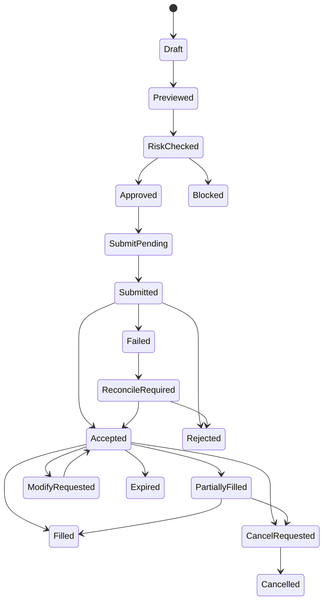

# 21. 브로커 API 연동 및 주문 상태 기계 설계

작성일: 2026-05-22  
기준 문서:

- `01_quant_auto_trading_requirements_definition_20260522.md`
- `02_overall_system_architecture_design_20260522.md`
- `06_trade_ledger_fifo_realized_pnl_design_20260522.md`
- `10_risk_engine_detailed_requirements_20260522.md`
- `17_order_ticket_realtime_price_range_pretrade_analysis_design_20260522.md`
- `20_docker_compose_development_environment_design_20260522.md`

## 1. 목적

이 문서는 초기 실거래 broker adapter로 한국투자증권 Open API를 사용하기 위한 연동 구조와 주문 상태 기계를 정의한다.

별도 해외 broker API는 초기 범위에서 사용하지 않는다. 미국 주식 거래도 한국투자증권 Open API가 지원하는 범위 안에서 처리한다.

## 2. 적용 범위

### 2.1 포함 범위

- 한국투자증권 Open API adapter
- 국내/미국 주식 주문 가능 범위
- 주문 후보와 주문 요청
- 주문 전 리스크 체크
- 주문 접수, 정정, 취소, 체결 상태
- 부분체결과 완전체결
- idempotency key
- retry와 reconciliation
- kill switch
- paper/simulation adapter 분리

### 2.2 제외 범위

- 별도 해외 broker API
- 키움/LS증권 adapter 구현
- 브로커 HTS 수준의 전체 기능
- 고빈도 주문

## 3. 설계 원칙

1. adapter 경계 밖으로 broker field를 흘리지 않는다.  
   내부 주문 모델과 브로커 API field mapping은 adapter에서 처리한다.

2. 모든 주문은 리스크 엔진을 통과한다.  
   주문 후보 생성과 실제 전송 사이의 hard gate다.

3. idempotency를 보장한다.  
   네트워크 retry가 중복 주문을 만들면 안 된다.

4. 상태는 event 기반으로 저장한다.  
   원본 broker 응답과 내부 상태 전이를 모두 감사 가능하게 남긴다.

5. kill switch가 최우선이다.  
   kill switch 활성화 시 신규 주문 전송을 차단하고 가능한 취소 정책을 수행한다.

## 4. 브로커 adapter 인터페이스

공통 인터페이스:

```text
get_account()
get_positions()
get_buying_power()
get_orderable_markets()
place_order(order_request)
cancel_order(order_id)
modify_order(order_id, patch)
get_order_status(order_id)
stream_order_events()
get_executions(from_ts, to_ts)
```

한국투자증권 adapter는 내부 표준 모델로 응답을 정규화한다.

## 5. 주문 가능 시간

자동 주문은 거래소와 한국투자증권 Open API가 주문 가능으로 반환하는 모든 거래 시간에 허용한다.

단, 다음 hard gate가 모두 통과해야 한다.

- live mode enabled
- kill switch off
- broker session valid
- market orderable
- risk check passed
- 주문금액 1건 최대 1,000,000,000원 이하
- 단일 종목 투자금액 한도 통과

## 6. 주문 상태 모델

### 6.1 상태 목록

| 상태 | 설명 |
| --- | --- |
| `draft` | 주문 후보 |
| `previewed` | 주문창 preview 완료 |
| `risk_checked` | 리스크 체크 완료 |
| `approved` | 수동/자동 승인 완료 |
| `submit_pending` | broker 전송 대기 |
| `submitted` | broker 전송 완료 |
| `accepted` | broker 접수 |
| `partially_filled` | 부분체결 |
| `filled` | 완전체결 |
| `cancel_requested` | 취소 요청 |
| `cancelled` | 취소 완료 |
| `modify_requested` | 정정 요청 |
| `rejected` | 거부 |
| `expired` | 만료 |
| `failed` | 내부 실패 |
| `blocked` | 리스크/kill switch 차단 |

### 6.2 상태 전이



## 7. 주문 요청 모델

`order_request` 필수 필드:

| 필드 | 설명 |
| --- | --- |
| `order_request_id` | 내부 주문 ID |
| `idempotency_key` | 중복 방지 key |
| `account_id` | 계좌 |
| `security_id` | 종목 |
| `market_code` | 거래소/시장 |
| `side` | buy/sell |
| `order_type` | market/limit |
| `price` | 가격 |
| `quantity` | 수량 |
| `order_amount_krw` | 원화 환산 |
| `mode` | live/paper/simulation |
| `preview_id` | 주문창 preview |
| `risk_check_result_id` | 리스크 체크 |
| `status` | 상태 |
| `broker_order_id` | broker 주문번호 |

## 8. idempotency

idempotency key 생성 입력:

- account_id
- security_id
- side
- order_type
- price
- quantity
- client_order_intent_id
- created trading date

동일 key가 이미 `submit_pending` 이후 상태이면 새 주문을 만들지 않는다. broker 응답이 불명확하면 `reconcile_required`로 전환한다.

## 9. 주문 전 리스크 체크

필수 체크:

- 단일 종목 투자금액 100,000원~1,000,000,000원
- 자동 주문 1건 최대 1,000,000,000원
- 현금/증거금
- 보유 수량
- 주문 가능 시간
- 거래 가능 상품
- 중복 주문
- 가격 괴리
- 평균 거래대금 기준 저유동성
- 주문금액/20거래일 평균 거래대금 5% 한도
- 저유동성 3배 슬리피지
- 사업 그룹/섹터/통화 한도
- 공시/헤드라인/국제 정세 이벤트
- broker/API 장애

리스크 체크 실패는 `blocked`로 저장한다.

## 10. 체결 처리

broker 체결 이벤트는 `execution`으로 저장하고 `transaction_ledger`에 반영한다.

처리 흐름:

```text
broker execution event
  -> duplicate check
  -> execution 저장
  -> order status 갱신
  -> transaction_ledger posting
  -> position_lot/FIFO match
  -> realized/unrealized pnl 갱신
  -> tax estimate 갱신
  -> client event publish
```

매수 체결은 `position_lot`을 생성하고, 매도 체결은 FIFO 기준으로 lot을 소진한다.

## 11. 정정과 취소

정정/취소 원칙:

- 원 주문의 상태와 broker 허용 여부를 먼저 확인한다.
- 부분체결 후 취소는 미체결 잔량만 대상으로 한다.
- 정정/취소 요청도 idempotency key를 가진다.
- broker 응답 불명확 시 reconciliation 대상이 된다.

## 12. reconciliation

대사 대상:

- open orders
- executions
- positions
- cash
- rejected/expired orders

대사 주기:

| 대상 | 주기 |
| --- | --- |
| 주문 상태 | 장중 1분 또는 이벤트 수신 |
| 체결 | 장중 1분, 장 종료 후 |
| 잔고 | 장 시작 전, 장 종료 후, 주문 후 |
| 현금 | 장 시작 전, 장 종료 후, 주문 후 |

불일치 발견 시:

- `reconcile_required` flag
- 신규 주문 제한 가능
- 운영 알림
- 감사 로그 기록

## 13. kill switch

kill switch 종류:

| 종류 | 효과 |
| --- | --- |
| global | 모든 신규 주문 차단 |
| account | 특정 계좌 신규 주문 차단 |
| strategy | 특정 전략 주문 차단 |
| security | 특정 종목 주문 차단 |
| market | 특정 시장 주문 차단 |

kill switch 활성화 시 신규 주문은 즉시 `blocked`가 된다. 기존 주문 취소 여부는 운영 정책으로 선택하되, 위험한 일괄 취소는 별도 확인을 요구한다.

## 14. paper와 simulation 분리

| 모드 | adapter | 특징 |
| --- | --- | --- |
| live | Korea Investment adapter | 실제 주문 |
| paper | paper adapter | 실시간 시세 기반 가상 체결 |
| simulation | simulation adapter | replay/가상 계좌 |

simulation 주문은 실제 broker API로 전송하지 않는다.

## 15. 오류 처리

| 오류 | 처리 |
| --- | --- |
| 인증 실패 | live 주문 차단, 알림 |
| rate limit | retry with backoff, 주문 제한 |
| timeout | idempotency 기반 상태 확인 |
| broker reject | rejected 저장, 사유 표시 |
| 중복 응답 | duplicate ignore |
| 체결 누락 | reconciliation |
| Goldilocks 장애 | 신규 주문 차단 |

## 16. 감사 로그

기록 대상:

- 주문 후보 생성
- 주문창 preview
- 리스크 체크
- 수동 승인
- broker 전송
- broker 응답
- 상태 전이
- 정정/취소
- kill switch 변경
- reconciliation 결과

## 17. 테스트 요구사항

| 테스트 | 검증 |
| --- | --- |
| idempotency | retry 중복 주문 방지 |
| 상태 전이 | 부분체결/취소/거부 |
| 리스크 차단 | 금액 한도, 저유동성 |
| kill switch | 신규 주문 즉시 차단 |
| broker timeout | reconciliation |
| simulation | broker 미전송 |
| FIFO posting | 체결 후 lot 매칭 |
| 세금 갱신 | 해외 매도 예상세액 |

## 18. 구현 기본 결정 사항

1. MVP live 주문 가능 범위는 한국투자증권 Open API가 orderable로 반환하는 현금계좌 국내/미국 상장 주식과 ETF로 제한한다.
2. 장중 reconciliation 주기는 1분, 장 종료 후 1회 full reconciliation으로 한다.
3. retry는 1초, 2초, 4초 exponential backoff 3회와 idempotency key를 사용한다.
4. kill switch는 기본적으로 신규 주문만 차단하고, 미체결 주문 일괄 취소는 별도 `cancel_open_orders=true` 수동 명령에서만 수행한다.
5. 실거래 자동 주문은 strategy whitelist, 일일 운영 enable, risk pass, kill switch off 조건을 모두 만족해야 하며 최초 30건은 수동 승인 후 전송한다.

## 19. 다음 산출물

다음 문서는 `22_DB_백업_복구_정책_및_운영_절차_설계서`로 작성한다. 해당 문서에서는 매주 토요일 10:00 KST Goldilocks 정기 백업, `/home/jhkim5/backup_sp` 저장, 복구 검증, 운영 알림을 상세화한다.
